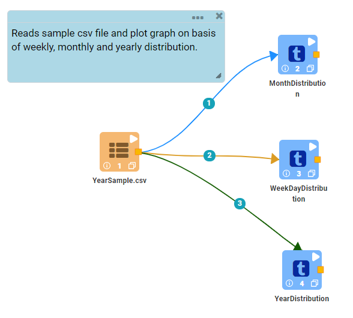
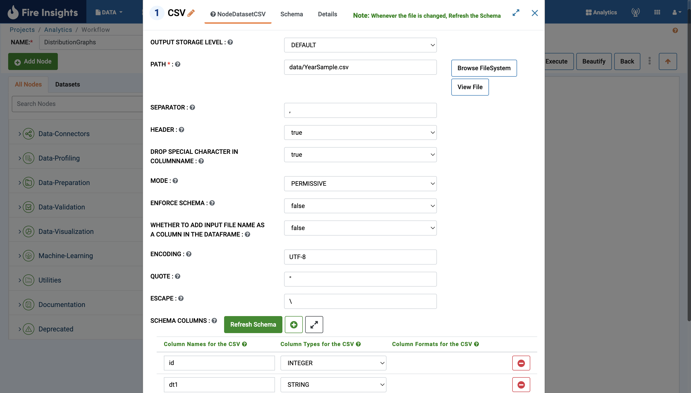
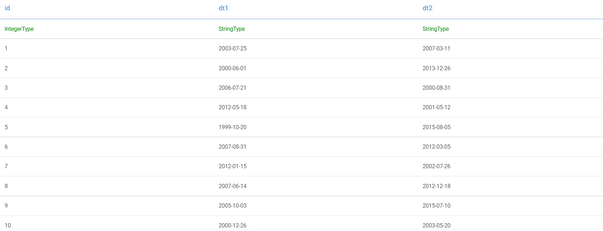
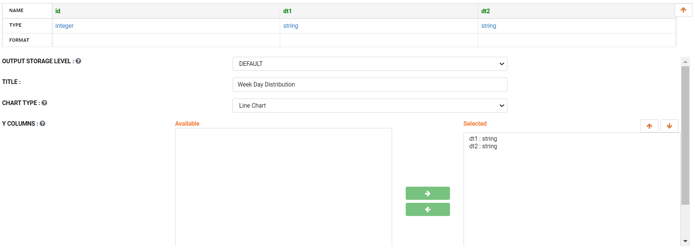
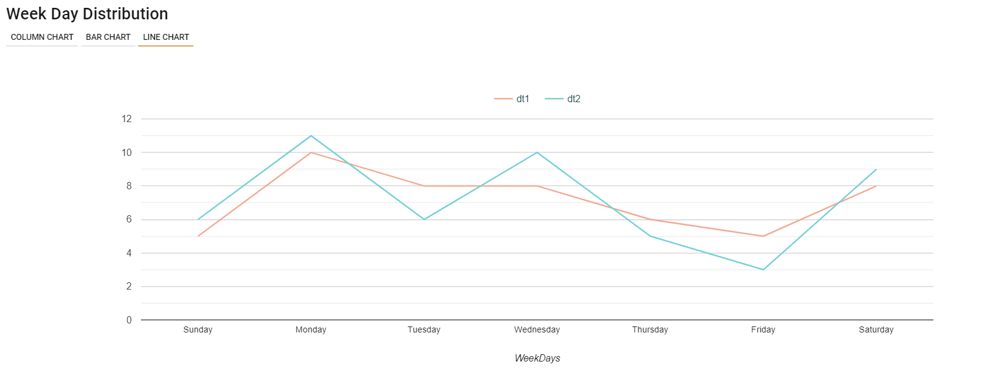
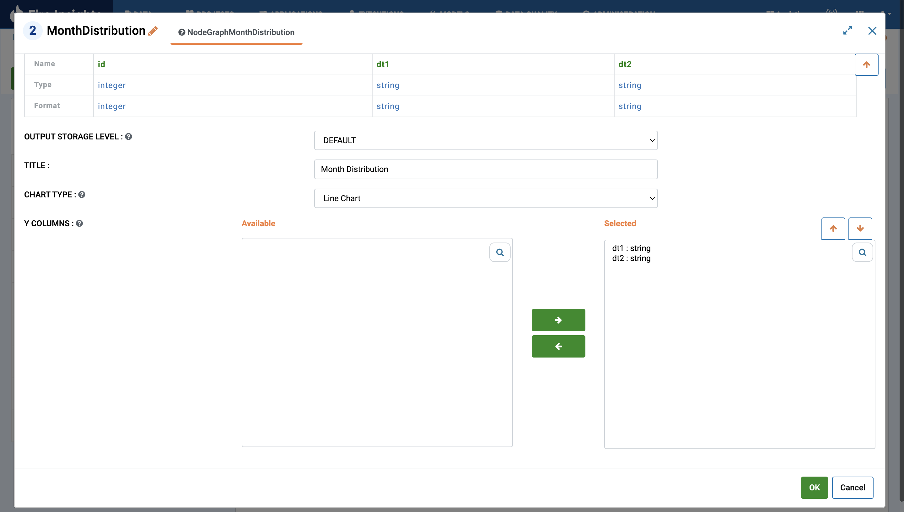
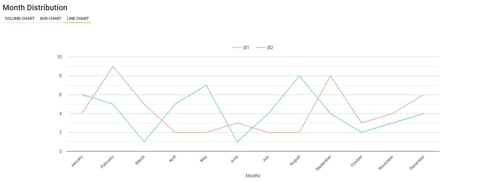
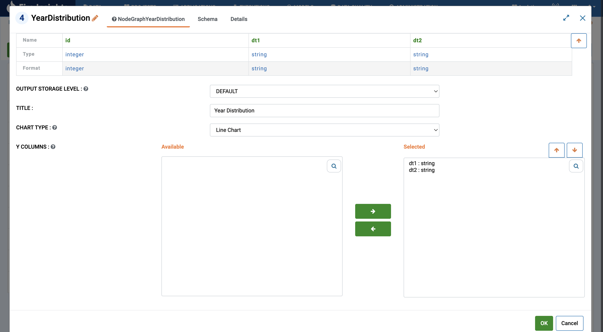

Distribution Graphs
===================

This workflow reads a CSV file. It then plots graphs of distribution of data by Week, Month & Year.

Workflow
-------

The below workflow:

* Reads a CSV file.
* Distribution of data by Week.
* Distribution of data by Month.
* Distribution of data by Year.

   
Reading CSV file
---------------------

It reads CSV files.

Processor Configuration
^^^^^^^^^^^^^^^^^^

   
Processor Output
^^^^^^

   
Distribution of data by Week
----------------------------

It plots graphs of distribution of data by Week using GraphWeekDistribution Node.

Processor Configuration
^^^^^^^^^^^^^^^^^^

   
Processor Output
^^^^^^

   
Distribution of data by Month
-----------------------------

It plots graphs of distribution of data by month using GraphMonthDistribution Node.

Processor Configuration
^^^^^^^^^^^^^^^^^^

   
Processor Output
^^^^^^
   

   
Distribution of data by Year
----------------------------

It plots graphs of distribution of data by year using GraphYearDistribution Node.

Processor Configuration
^^^^^^^^^^^^^^^^^^

   
Processor Output
^^^^^^

.. figure:: ../../_assets/tutorials/analytics/distribution-graphs/15.PNG
   :alt: Distribution Graphs
   :width: 80%   
