Data Exploration of Housing Data
=========================

This workflow shows how to explore the Housing Dataset from Kaggle with Sparkflows.

Workflow
--------
The below workflow: 

* Reads the Housing dataset
* Calculates summary statistics for important variables
* Creates a histogram to show the distribution of the Sale Price variable
* Creates a graph to show the relationship between Sale Price and Basement Square Footage
* Creates a matrix to show the correlation between important variables
* Flags outliers in Ground Living Area and graphs the results

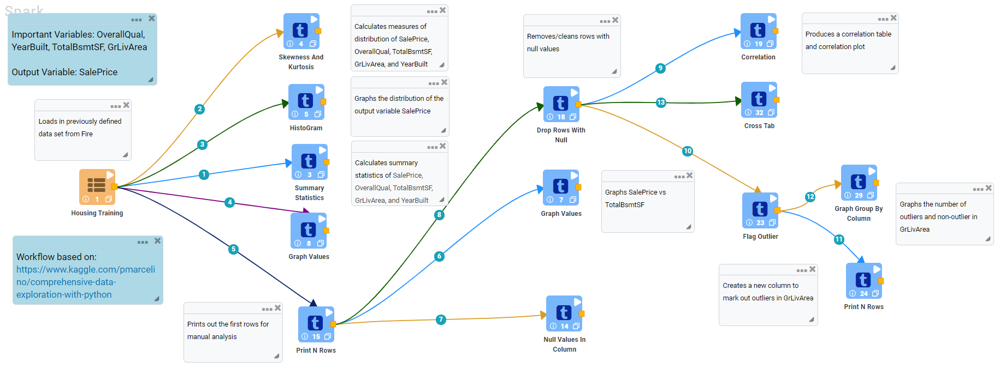
   
Reading Housing Dataset
---------------------

``DatasetStructured`` Processor creates a Dataframe of your dataset named ``Housing Training`` by reading data from HDFS, HIVE etc. which have been defined earlier in Fire by using the Dataset feature.

Processor Output
^^^^^^^^^^^^^^^^^^

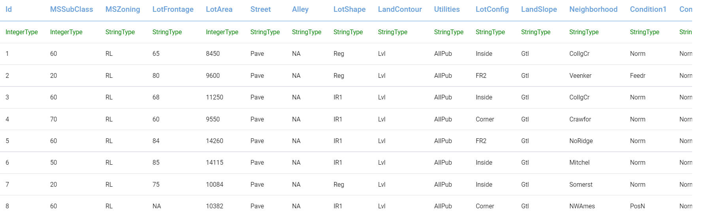
   

Calculate Summary Statistics
----------------
``Summary Statistics`` Processor calculates summary statistics for the selected variables.

Processor Configuration
^^^^^^^^^^^^^^^^^^

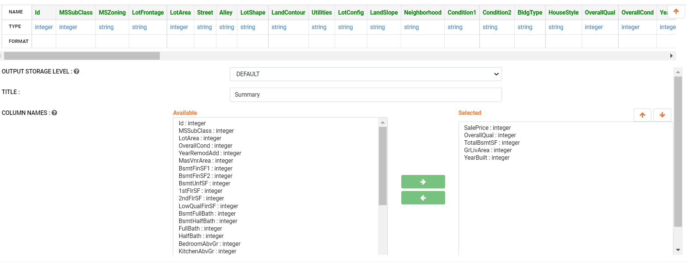
   
Processor Output
^^^^^^

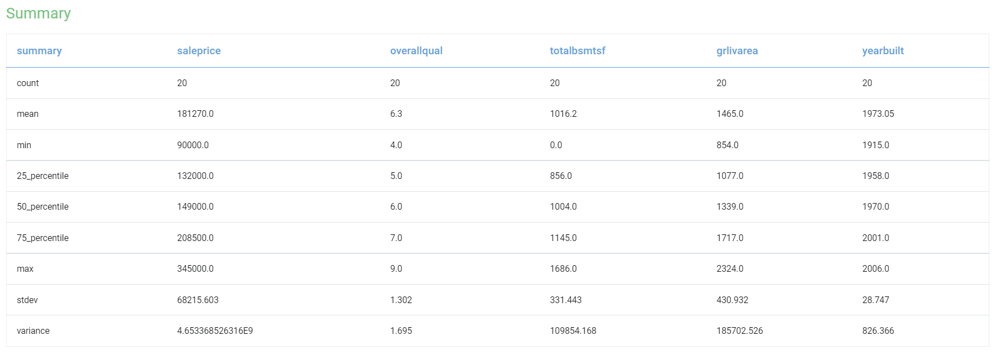

Create Histogram Graph
----------------
``HistoGram`` Processor creates a histogram to show distribution by count of Sale Price.

Processor Configuration
^^^^^^^^^^^^^^^^^^

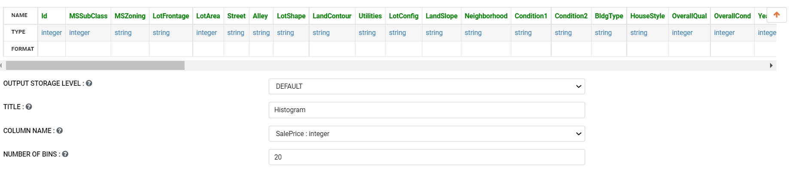
   
Processor Output
^^^^^^

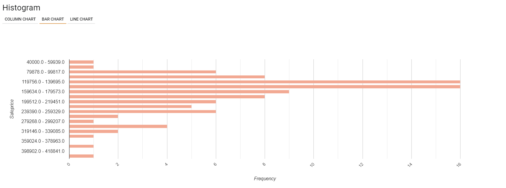
   
Graph Values
---------------------

``Graph Values`` Processor graphs the relationship between Sale Price and Basement Sqaure Footage.

Processor Configuration
^^^^^^^^^^^^^^^^^^

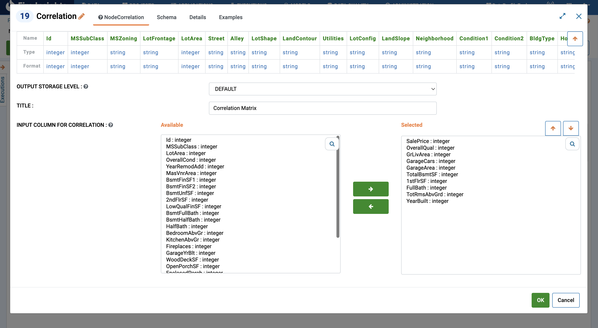

   
Processor Output
^^^^^^

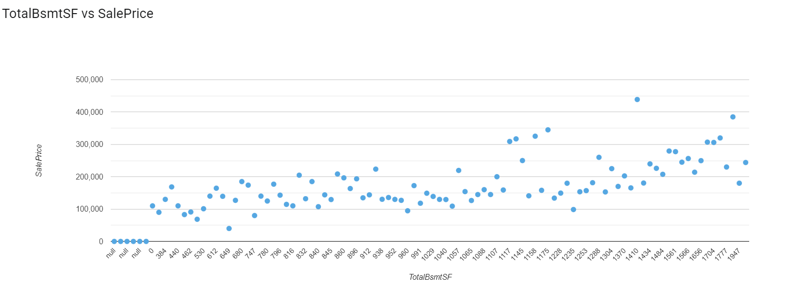

Plot Correlation Matrix
---------------

``Correlation`` Processor creates a correlation matrix of selected variables and plots the results.

Processor Configuration
^^^^^^^^^^^^^^^^^^

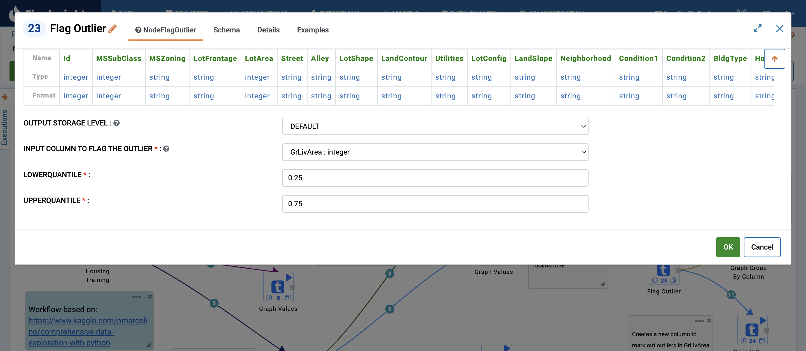

   
Processor Output
^^^^^^

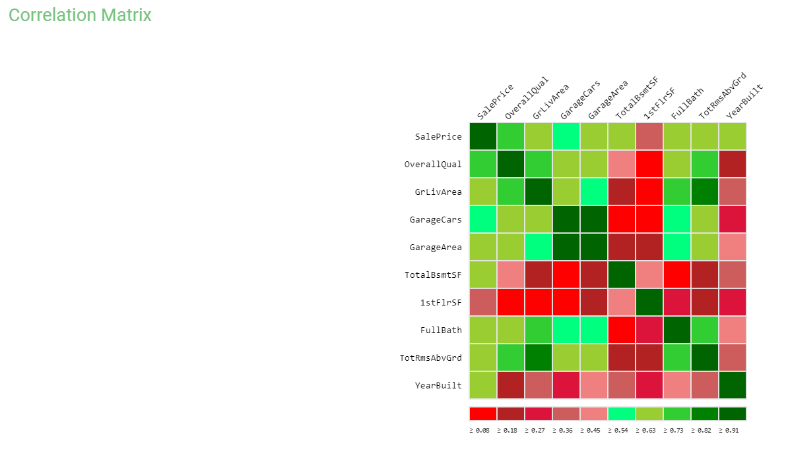

Flag Outliers and Create Graph
----------------
``Flag Outlier`` Processor creates a new flag column to mark outliers and ``Graph Group by Column`` Processor graphs the count in each category.

Processor Configuration
^^^^^^^^^^^^^^^^^^

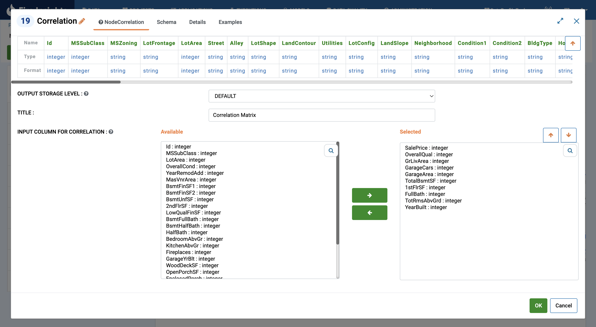
   
Processor Output
^^^^^^

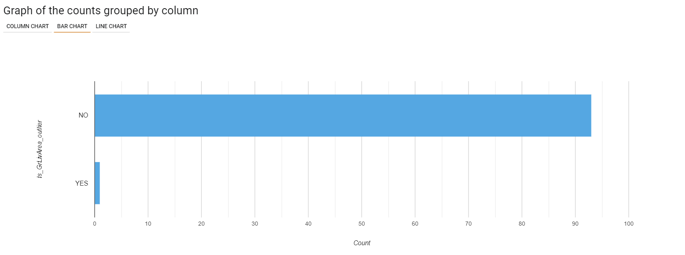
   
   
