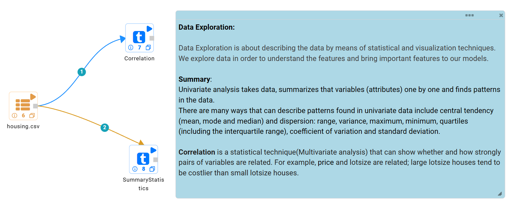
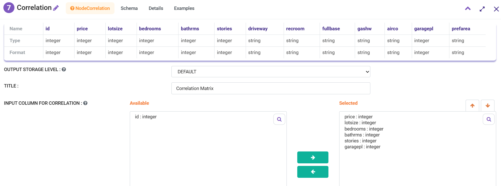
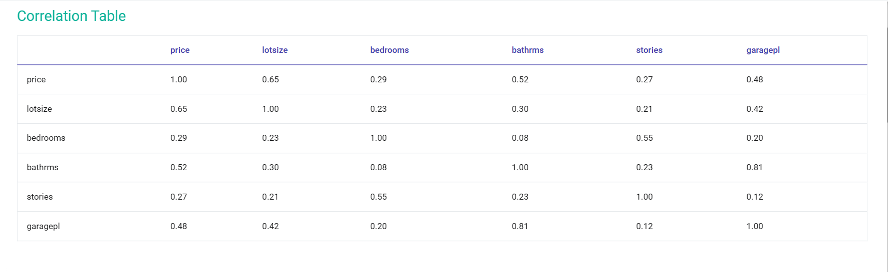
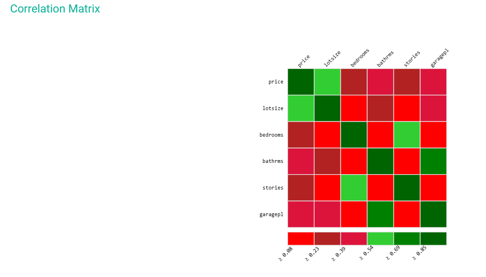
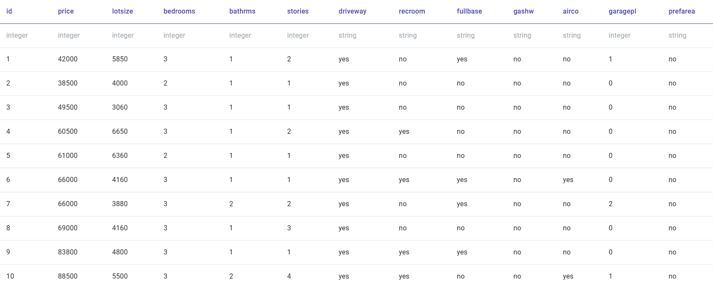
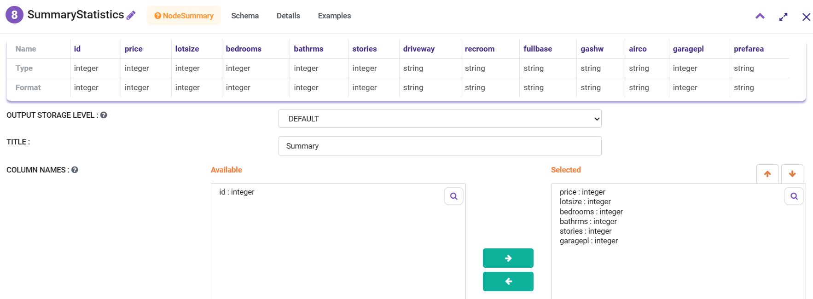
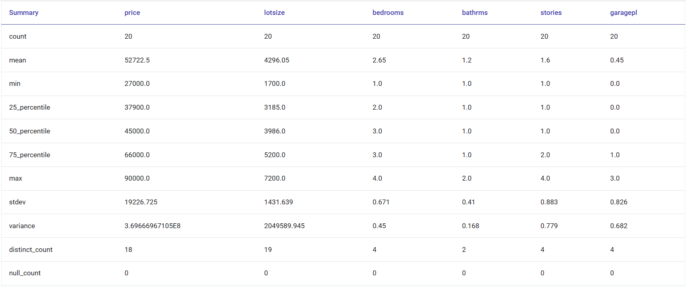

Profiling and Correlation
=============

This workflow reads in a dataset. It then creates the correlation analysis and summary statistics.

Workflow
-------

Below is the workflow. It does the following:

* Reads data from a dataset.
* Perform correlation analysis of the required columns.
* Provide summary statistics of the dataset.

   
Performing Correlation analysis
---------------------

``Correlation`` processor performs correlation analysis on the selected columns as shown below. 

Processor Configuration
^^^^^^^^^^^^^^^^^^

   
Processor Output - Correlation matrix
^^^^^^

Processor Output - Correlation Matrix Heat Map
^^^^^^

Processor Output - Sample Rows of Input Dataset
^^^^^^

   
Summary Statistics
------------

``Summary`` processor provides summary statistics of the input dataset.

Summary statistics provides useful information about sample data. For e.g. measures of spread.

It provides a table with number of non-null entries (count), mean, standard deviation, and minimum and maximum value for each numerical column.

Processor Configuration
^^^^^^^^^^^^^^^^^^

Processor Output: Summary Statistics
^^^^^^

  
Processor Output: Sample Rows of Input Dataset
^^^^^^

