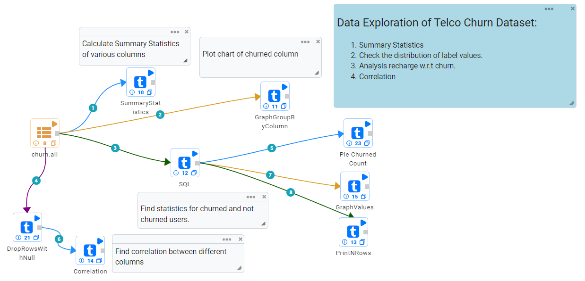
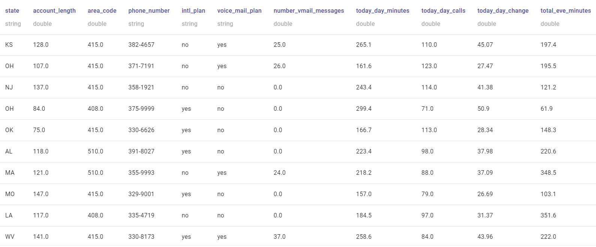
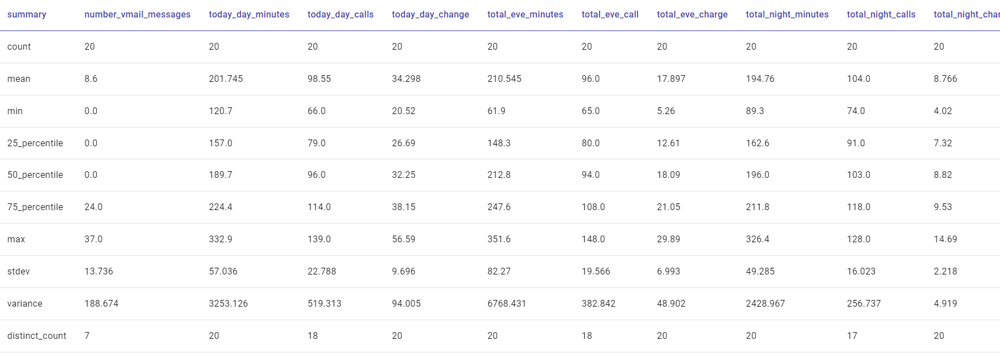
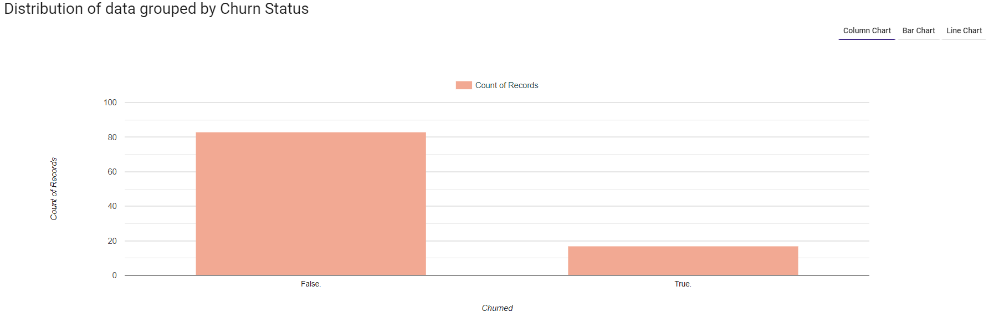
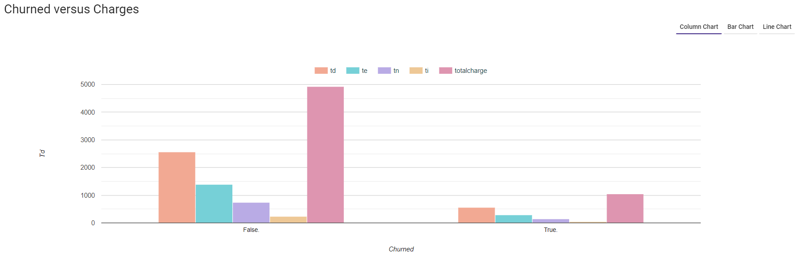
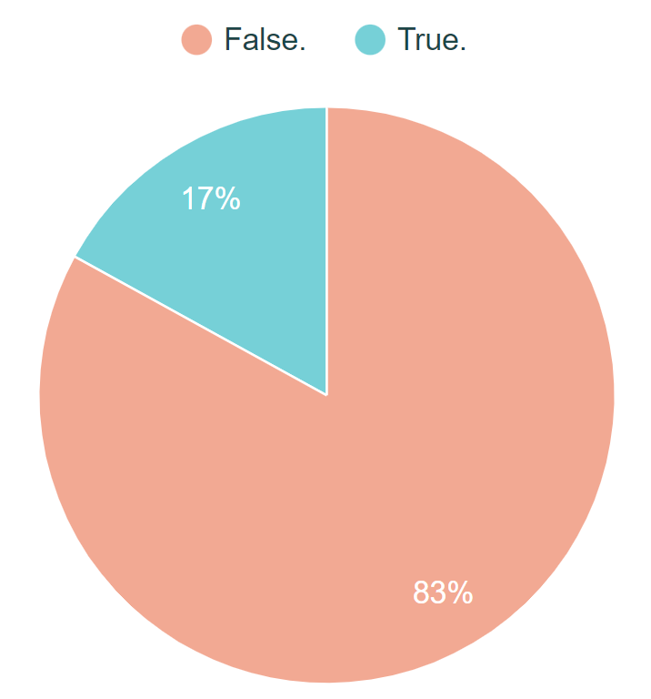
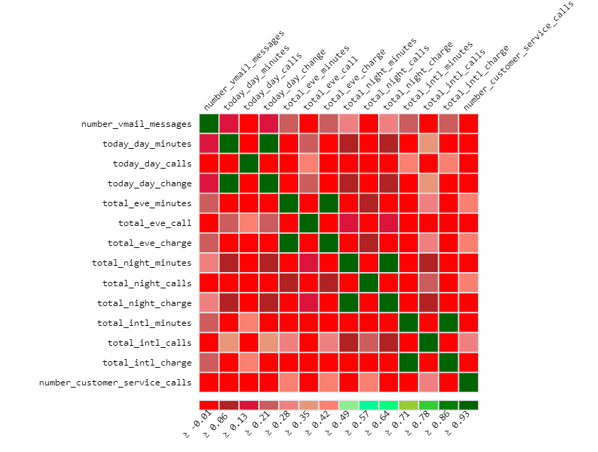

Telco Churn Data Exploration
============================

Data Profiling is extremely helpful in understanding the data. Fire Insights provides a number of processors for users to profile their data.

Workflow for Data Profiling
----------------------------

Below is a workflow which profiles the Telco Churn dataset.

   
Input Telco Churn Data
---------------------

The input dataset looks like below:

   
Workflow Execution Result
-------------------------

When the above workflow is executed, it produces the below results. A good thing about Fire Insights is that the Data Profiling runs in a distributed fashion. So, whatever be the number of records in the input dataset, it scales seamlessly.

Summary Statistics
-------------------

   
Counts by Churned Column
-------------------------

   
Graph of counts of various attributes for Churned and Not Churned customers
-----------------------------------------------------------------------------

   
Percentage distribution of label values
---------

   

Correlation Matrix
--------------------

 

   
   

