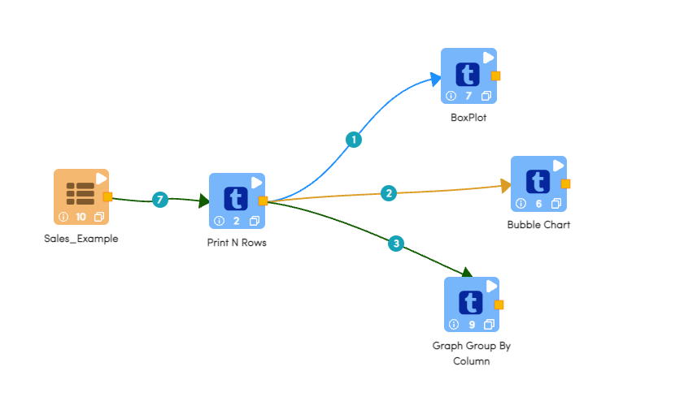
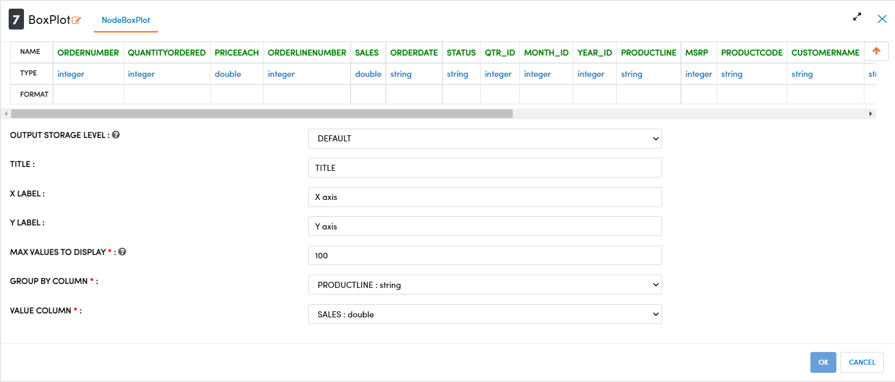
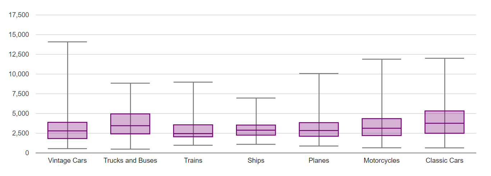
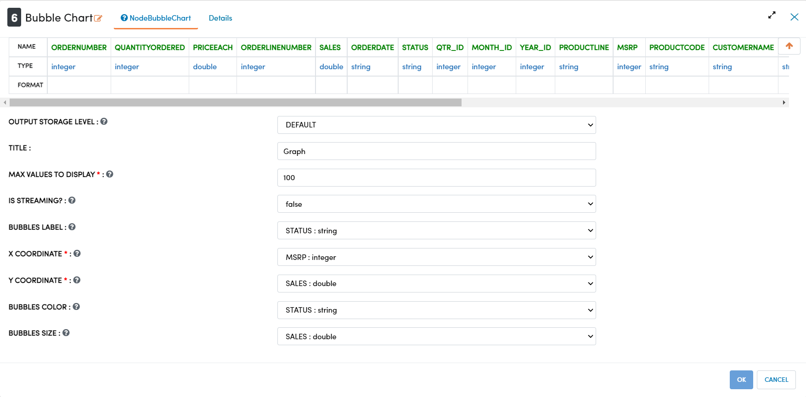
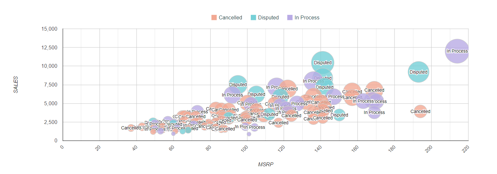
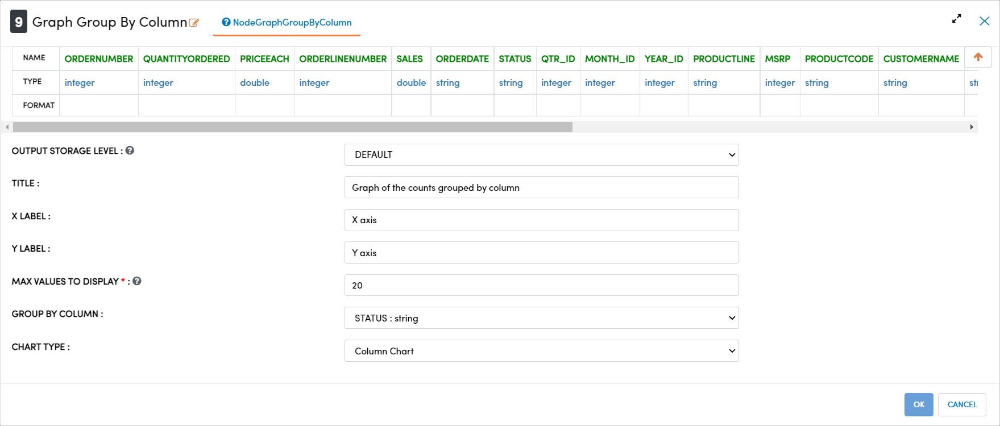
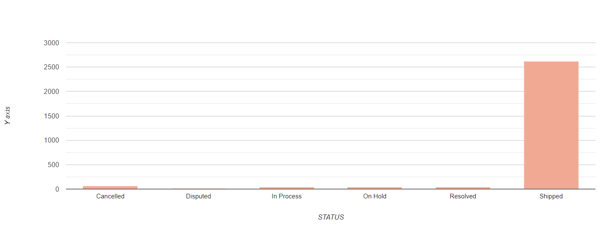

Data Visualizations
====================

This tutorial will cover how to explore data using different types of graphs and charts that can capture different or more in-depth information than basic graphs. Specifically, this tutorial will cover how to create box-plots, bubble charts, and graph group by column. The data used in this tutorials is sales data provided by an online retailer. The original data can be found here: https://www.kaggle.com/kyanyoga/sample-sales-data

.. contents::
   :depth: 2

Visualizing Sales Data
-------------------------

The below workflow: 

* Creates a box-plot of sales revenue
* Creates a bubble chart labelled by order status
* Creates a graph of the count of different order status

   

Graphing Distribution of Sales Revenue
-----------------------------------

We use the ``BoxPlot`` processor to chart the distribution of a selected variable. This node also has the option to group by a different variable. In this case we are grouping sales by the ProductLine to show to distribution of sales in each category.  

Processor Configuration
^^^^^^^^^^^^^^^^^^^^^^^^^

   
Processor Output
^^^^^^^^^^^^^^^^^

   
Graphing MSRP vs Sale Labelled by Status
-----------------------

We use the ``Bubble Chart`` node to create a scattergram, with point's size and color determined by additional variables. By creating bubbles instead of points, we can display more information in a single chart.  

Processor Configuration
^^^^^^^^^^^^^^^^^^^^^^^^^

   
Processor Output
^^^^^^^^^^^^^^^^^

Graphing Count of Orders by Status
------------------------

We use the ``Graph Group by Column`` processor to visually gauge the profile of our data. In this case we can visually inspect the status of orders to make sure orders are being processed and shipped properly with no bottle-necks. 

Processor Configuration
^^^^^^^^^^^^^^^^^^^^^^^^^

   
Processor Output
^^^^^^^^^^^^^^^^^

  
