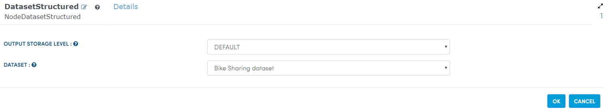

Bike Rental Prediction
======================

This workflow reads in a dataset.It then Predicts the number of bikes to be rented in any given hour.

Workflow
-------

Below is the workflow. It does the following:

* Reads data from a sample dataset.
* Extracts hour from time using datatype timestamp.
* Calculates Count to datatype double.
* Assembles features for modelling.
* Calculates vectorindexer.
* Splits it.
* GBTRegression.
* Prediction.
* RegressionEvaluator.

.. figure:: ../../_assets/tutorials/machine-learning/bike-rental-prediction/1.png
   :alt: Bike Rental Prediction
   :width: 60%

Reading from Dataset
---------------------

It reads sample Dataset file.

Processor Configuration
^^^^^^^^^^^^^^^^^^

   
Processor Output
^^^^^^

.. figure:: ../../_assets/tutorials/machine-learning/bike-rental-prediction/2a.png
   :alt: Bike Rental Prediction
   :width: 60%
   
Extract hour from time using datatype timestamp
------------------------------------------------

It Extracts hour from time using datatype timestamp using DateTimeFieldExtract Node.

Processor Configuration
^^^^^^^^^^^^^^^^^^

.. figure:: ../../_assets/tutorials/machine-learning/bike-rental-prediction/3.PNG
   :alt: Bike Rental Prediction
   :width: 60%
   
Processor Output
^^^^^^

.. figure:: ../../_assets/tutorials/machine-learning/bike-rental-prediction/3a.PNG
   :alt: Bike Rental Prediction
   :width: 60%
   
Calculate Count to datatype double
-----------------------------------

It Calculates cast the Count field to datatype double using CastColumnType Node.

Processor Configuration
^^^^^^^^^^^^^^^^^^

.. figure:: ../../_assets/tutorials/machine-learning/bike-rental-prediction/4.PNG
   :alt: Bike Rental Prediction
   :width: 60%
   
Processor Output
^^^^^^

.. figure:: ../../_assets/tutorials/machine-learning/bike-rental-prediction/4a.PNG
   :alt: Bike Rental Prediction
   :width: 60%

Assemble features for modelling
---------------------------------

It Assembles features columns into a feature vector using VectorAssembler Node.

Processor Configuration
^^^^^^^^^^^^^^^^^^

.. figure:: ../../_assets/tutorials/machine-learning/bike-rental-prediction/5.PNG
   :alt: Bike Rental Prediction
   :width: 60%
   
Processor Output
^^^^^^

.. figure:: ../../_assets/tutorials/machine-learning/bike-rental-prediction/5a.PNG
   :alt: Bike Rental Prediction
   :width: 60%

Calculate vectorindexer
-----------------------

It identifies categorical features and index them using vectorindexer Node. 

Processor Configuration
^^^^^^^^^^^^^^^^^^

.. figure:: ../../_assets/tutorials/machine-learning/bike-rental-prediction/6.PNG
   :alt: Bike Rental Prediction
   :width: 60%
   
Processor Output
^^^^^^

.. figure:: ../../_assets/tutorials/machine-learning/bike-rental-prediction/6a.PNG
   :alt: Bike Rental Prediction
   :width: 60%
   
Split it
---------

It will split our dataset into seperate training and test sets using split Node.

Processor Configuration
^^^^^^^^^^^^^^^^^^

.. figure:: ../../_assets/tutorials/machine-learning/bike-rental-prediction/7.PNG
   :alt: Bike Rental Prediction
   :width: 60%
   
Processor Output
^^^^^^

.. figure:: ../../_assets/tutorials/machine-learning/bike-rental-prediction/7a.PNG
   :alt: Bike Rental Prediction
   :width: 60%
   
GBTRegression
--------------

It validates held out test sets in order to know about high confidence using GBTRegression Node.

Processor Configuration
^^^^^^^^^^^^^^^^^^

.. figure:: ../../_assets/tutorials/machine-learning/bike-rental-prediction/8.PNG
   :alt: Bike Rental Prediction
   :width: 60%
   
   
Prediction
-----------

It will make prediction on future data using Prediction Node.

Processor Configuration
^^^^^^^^^^^^^^^^^^

.. figure:: ../../_assets/tutorials/machine-learning/bike-rental-prediction/9.PNG
   :alt: Bike Rental Prediction
   :width: 60%
   

RegressionEvaluator
-------------------

It validates held out test sets in order to know about high confidence using RegressionEvaluator Node.

Processor Configuration
^^^^^^^^^^^^^^^^^^

.. figure:: ../../_assets/tutorials/machine-learning/bike-rental-prediction/10.PNG
   :alt: Bike Rental Prediction
   :width: 60%
   
   
