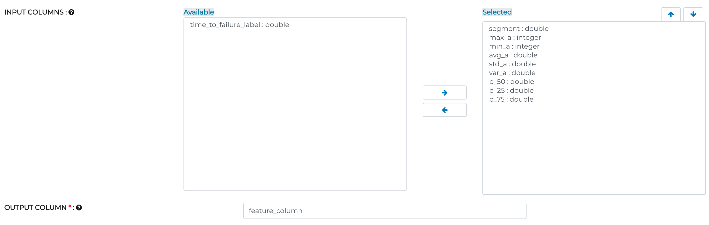
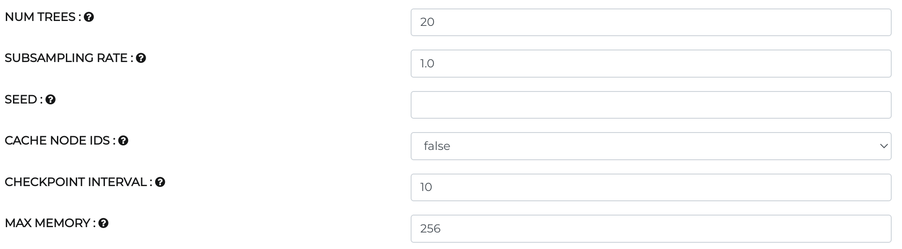
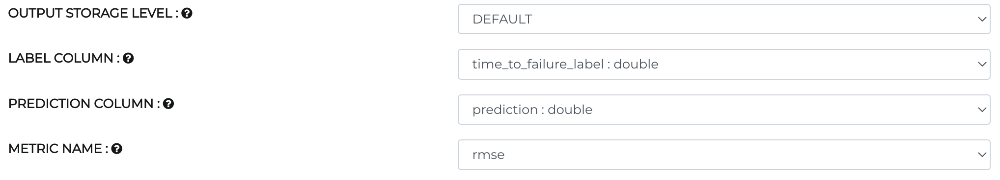

Earthquake Prediction
=====================

Objective
---------
As the motivation behind earthquake prediction is to empower crisis measures to decrease demise and devastation, inability to give notice of a significant earthquake that happens, or possibly a satisfactory assessment of the hazard, can bring about legitimate risk, or even political cleansing.

Dataset
-------

Data set contains 2 columns as follows:-

Acoustic_data - Acoustic wave reading

Time_to_failure - Time remaining before the next earthquake

.. figure:: ../../_assets/tutorials/machine-learning/earthquake_prediction/earthquake_data.png
   :alt: Stock Forecasting
   :align: center
   :width: 100%

Random Forest Regression Workflow for Earthquake Prediction
-----------------------------------------------------------
Random Forest Regression model belongs to family of bagging regression. It is a supervised learning model that uses ensemble learning method for regression. Ensemble learning method is a technique that combines predictions from multiple models to make prediction accurately than a single model.

Features of Random Forest:-

* Aggregates many decision trees
* Prevents overfitting

.. figure:: ../../_assets/tutorials/machine-learning/earthquake_prediction/earthquake_flow.png
   :alt: Stock Forecasting
   :align: center
   :width: 100%

Prepare data for modeling
--------------------------

Follow workflow arrow

* **Arrow 1**- ZipWithIndex to create new feature column as ID

* **Arrow 2**- Group data to create new feature column as key obtained by ID divided by length of data 

.. figure:: ../../_assets/tutorials/machine-learning/earthquake_prediction/group_data.png
   :alt: Stock Forecasting
   :align: center
   :width: 100%

* **Arrow 3**- Feature engineering to group by data on key to create all statistical measures as new feature

.. figure:: ../../_assets/tutorials/machine-learning/earthquake_prediction/feature_eng.png
   :alt: Stock Forecasting
   :align: center
   :width: 100%

* **Arrow 4** - Merge multiple columns to create feature vector

   

Data modeling
-------------

* Before we create Random Forest Regression model, split data(80:20) into train and test for performance evaluation.

Random Forest Regression
++++++++++++++++++++++++

* Set feature vector corresponding to label(time_to_failure_label)
* set number of features for each split node of tree
* For regression the measure of impurity is variance
* In random forests, the impurity decrease from each feature can be averaged across trees to determine the final importance of the variable.
* The maxBins signifies the maximum number of bins used for splitting the features, where the suggested value is 100 to get better results.
* The maxDepth is the maximum depth of the tree (for example, depth 0 means one leaf node, depth 1 means one internal node plus two leaf nodes).
* Information gain is calculated by comparing the entropy of the dataset before and after a transformation.

.. figure:: ../../_assets/tutorials/machine-learning/earthquake_prediction/random_forest_regression.png
   :alt: Stock Forecasting
   :align: center
   :width: 100%
   

Model evaluation
----------------

* Multiple ways to evaluate regression model such as R square, Root mean square error(rmse), mean square error(mse)

