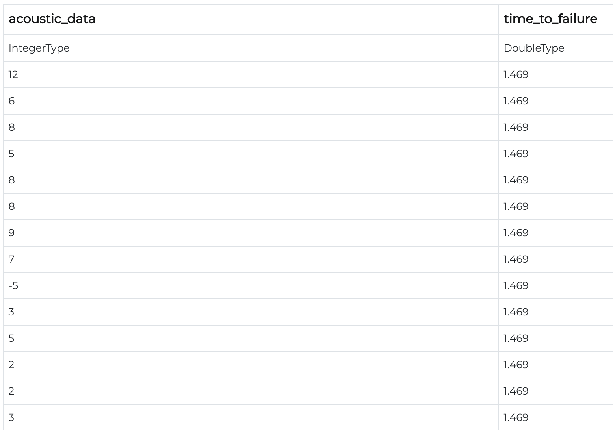
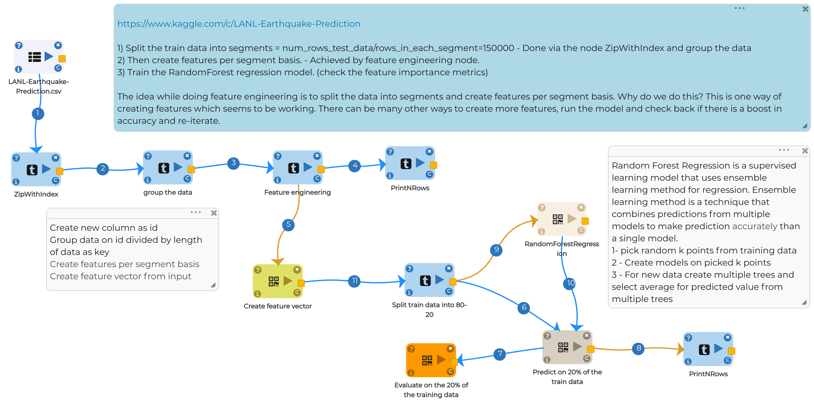
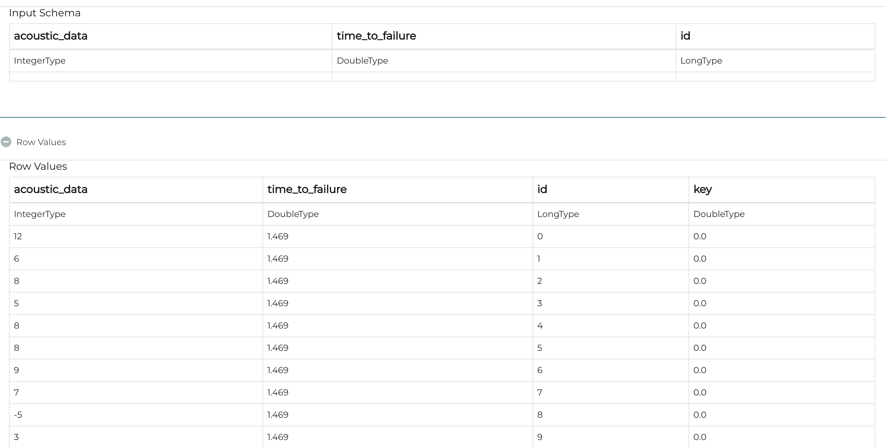

Earthquake Prediction
=====================

Objective
---------
As the motivation behind earthquake prediction is to empower crisis measures to decrease demise and devastation, inability to give notice of a significant earthquake that happens, or possibly a satisfactory assessment of the hazard, can bring about legitimate risk, or even political cleansing.

Dataset
-------

Data set contains 2 columns as follows:-

Acoustic_data - Acoustic wave reading

Time_to_failure - Time remaining before the next earthquake

Random Forest Regression Workflow for Earthquake Prediction
---------------------------------------------------------
Random Forest Regression model belongs to family of bagging regression. It is a supervised learning model that uses ensemble learning method for regression. Ensemble learning method is a technique that combines predictions from multiple models to make prediction accurately than a single model.

Features of Random Forest:-

* Aggregates many decision trees
* Prevents overfitting

Prepare data for modeling
--------------------------

Follow workflow arrow

1- ZipWithIndex to create new feature column as ID

2- Group data to create new feature column as ID divided by length of data

