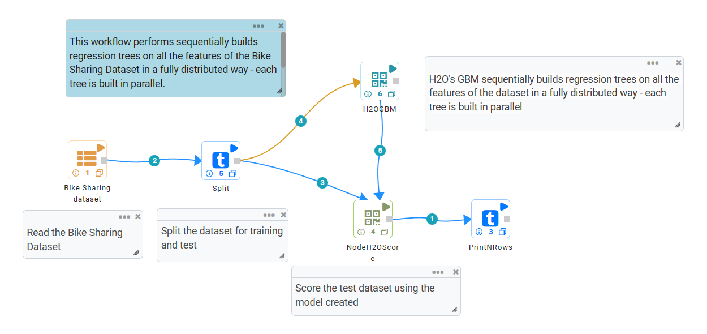
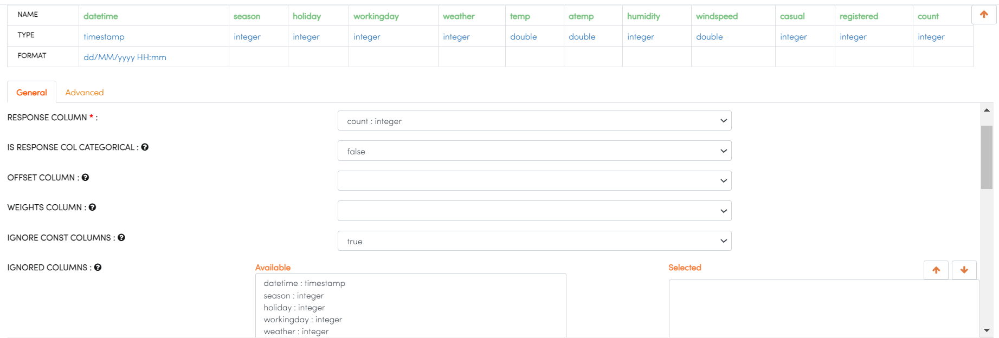
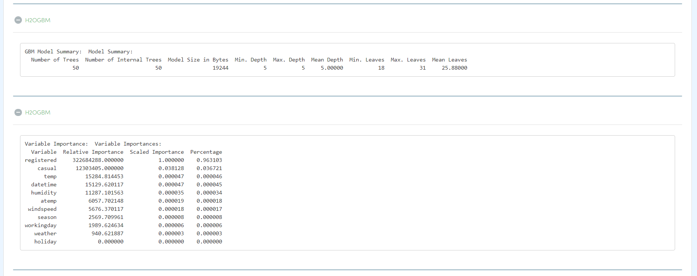
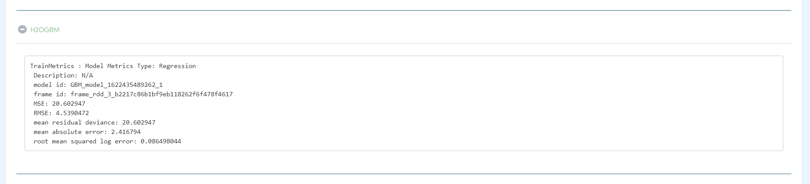
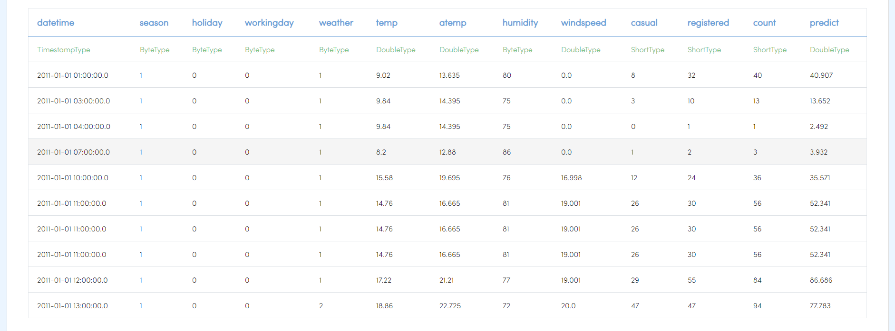

H2O GBM
========

This workflow performs sequentially builds regression trees on all the features of the Bike Sharing dataset in a fully distributed way - each tree is built in parallel. It uses H2O’s GBM. 
   
Workflow
-------

The below workflow:

* Reads the Bike Sharing dataset.
* Splits the dataset for training and test.
* Performs sequentially builds regression trees using H2O GBM.
* Scores the test dataset using the model created.
* Prints the results.

H2O GBM Configuration
---------------------

* select RESPONSE COLUMN.
* select RESPONSE COL CATEGORICAL : it specifies a response column type (numeric or categorical) Separates the Classification and Regression.
* select IGNORE CONST COLUMNS : Specify whether to ignore constant training columns.
* select IGNORED COLUMNS : Specify the column or columns to be excluded from the model.

Results
---------------------

Once the above workflow is getting executed, below details can be seen on execution page.

   

   

