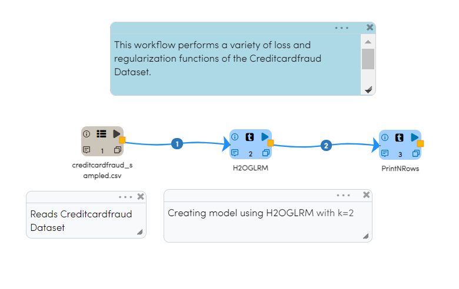
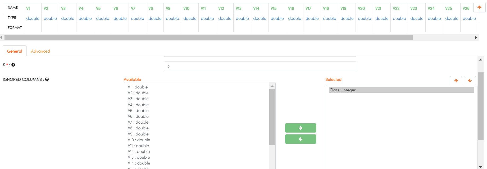
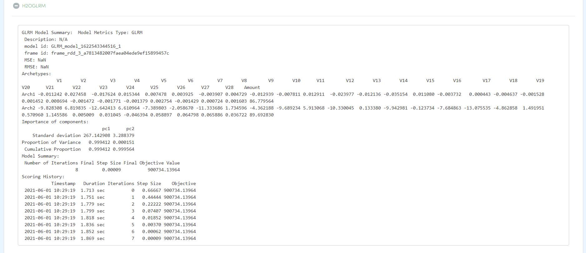
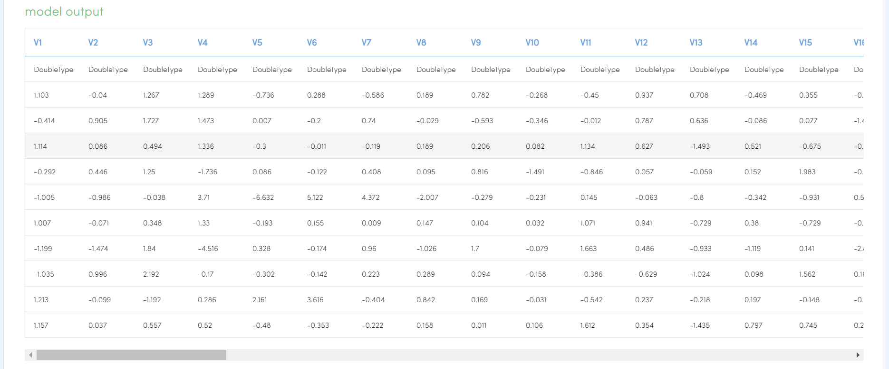

H2O GLRM
==========

This workflow performs reconstructing missing values and identifying important features in heterogeneous with Creditcardfraud dataset. It uses H2O’s GLRM.

Workflow
-------

The below workflow:

* Reads the Creditcardfraud dataset.
* Performs reconstructing missing values and identifying important features in heterogeneous and create model using H2O GLRM.
* Prints the results.

H2O GLRM Configuration
---------------------

* select K (Specify the rank of matrix approximation) : 2
* select IGNORED COLUMNS (Specify the column or columns to be excluded from the model): Class
* select IGNORE CONST COLS (Specify whether to ignore constant training columns) : true

Results
---------------------

Once the above workflow is getting Executed, Below details can be seen on Execution page.

   

