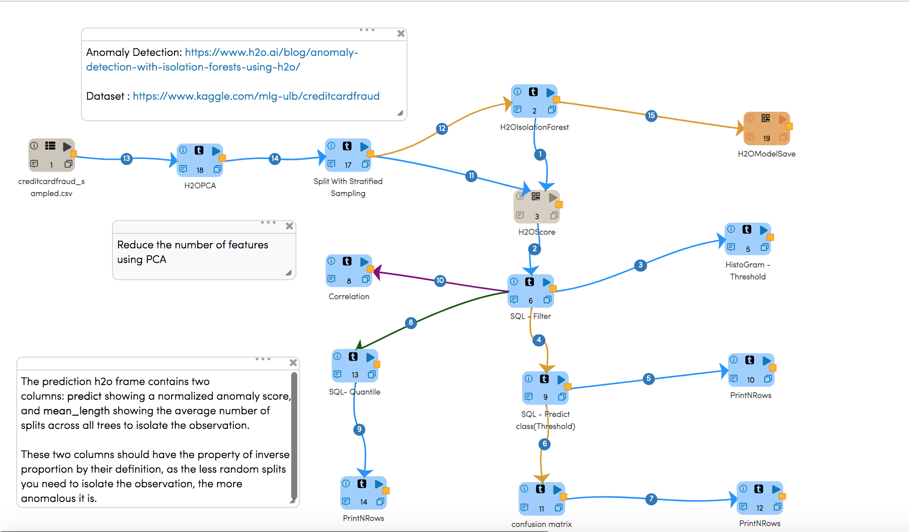
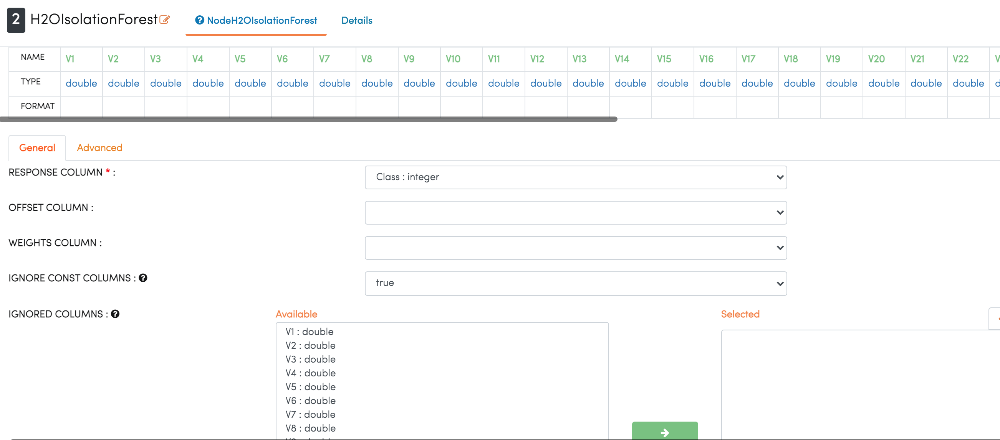
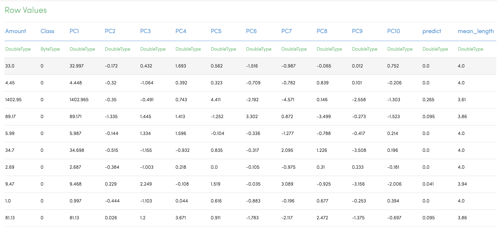
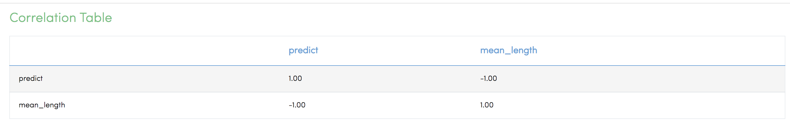
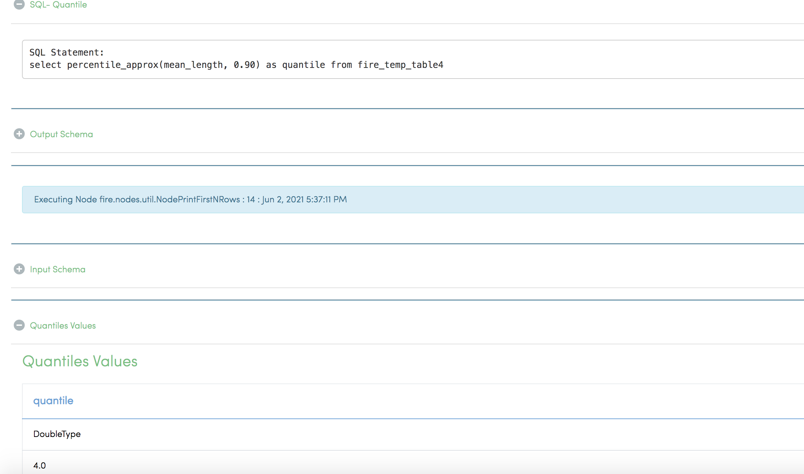
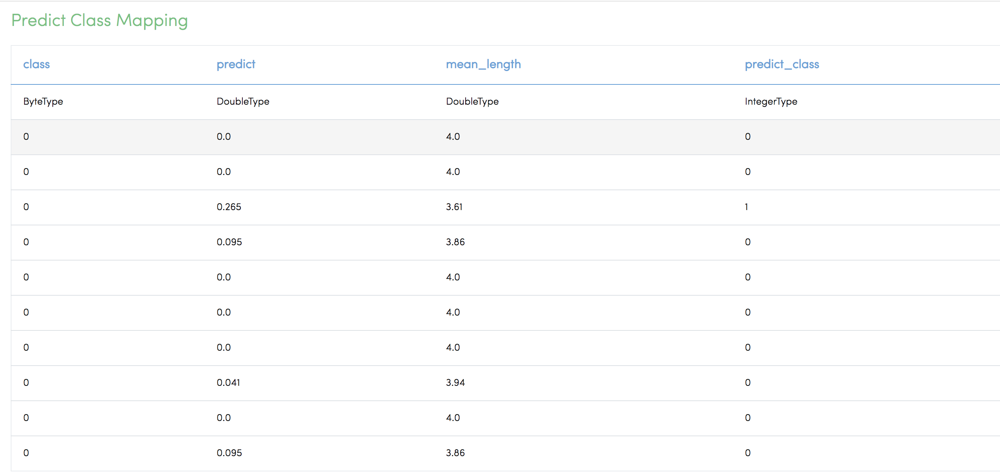

H2O Isolation Forest
======================

This workflow performs Anomaly Detection with Isolation Forests using H2O of credit card fraud sample dataset.

Anomaly detection is a common data science problem where the goal is to identify odd or suspicious observations, events, or items in our data that might be indicative of some issues in our data collection process (such as broken sensors, typos in collected forms, etc.) or unexpected events like security breaches, server failures, and so on.

Anomaly Detection: https://www.h2o.ai/blog/anomaly-detection-with-isolation-forests-using-h2o/

Dataset : https://www.kaggle.com/mlg-ulb/creditcardfraud

Workflow
-------

The below workflow:

* **ReadCSV** - Read the creditcardfraud_sampled CSV dataset.
* **H2OPCA** - Reduce the number of features using PCA.
* **Split With Stratified Sampling** - Split With Stratified Sampling, returns a stratified sample without replacement based on the fraction given on each stratum.
* **H2OIsolationForest** - Isolation Forest, identifies anomalies or outliers, isolates observations by randomly selecting a feature and then randomly selecting a split value between the maximum and minimum values of that selected feature. This split depends on how long it takes to separate the points.
* **H2OModelSave** - Saves an H2O binary ML Model.
* **H2OScore** - To Enable the test metrics.
* **SQL-Filter** - Receives an input DataFrame, creates a temporary table on top of that DataFrame. Filter the required columns.
* **Correlation** - The prediction H20 frame contains two columns: predict showing a normalized anomaly score and mean_length showing the average number of splits across all trees to isolate the observation. These two columns should have the property of inverse proportion by their definition, as the fewer random splits you need to isolate the observation, the more anomalous it is. 

   
   
IsolationForest Configuration
-----------------------------

  
  
IsolationForest Summary
-----------------------
.. figure:: ../../../_assets/tutorials/machine-learning/H20-IsolationForest/1a.png
   :alt: H2O IsolationForest
   :width: 70%
  
  

Sample Prediction
------------------

Predict & mean_length are output fields from model.

Inspecting Predictions
----------------------
We can see that the prediction output contains two columns: predict showing a normalized anomaly score, and mean_length showing the average number of splits across all trees to isolate the observation.

These two columns should have the property of inverse proportion by their definition, as the less random splits you need to isolate the observation, the more anomalous it is. We can easily check that.

Predicting Anomalies using Quantile
------------------------------------

As we formulated this problem in an unsupervised fashion, how do we go from the average number of splits or anomaly score to the actual predictions? Using a threshold! If we have an idea about the relative number of outliers in our dataset, we can find the corresponding quantile value of the score and use it as a threshold for our predictions.

Predict the anomalous class
---------------------------
Use the threshold to predict the anomalous class.

