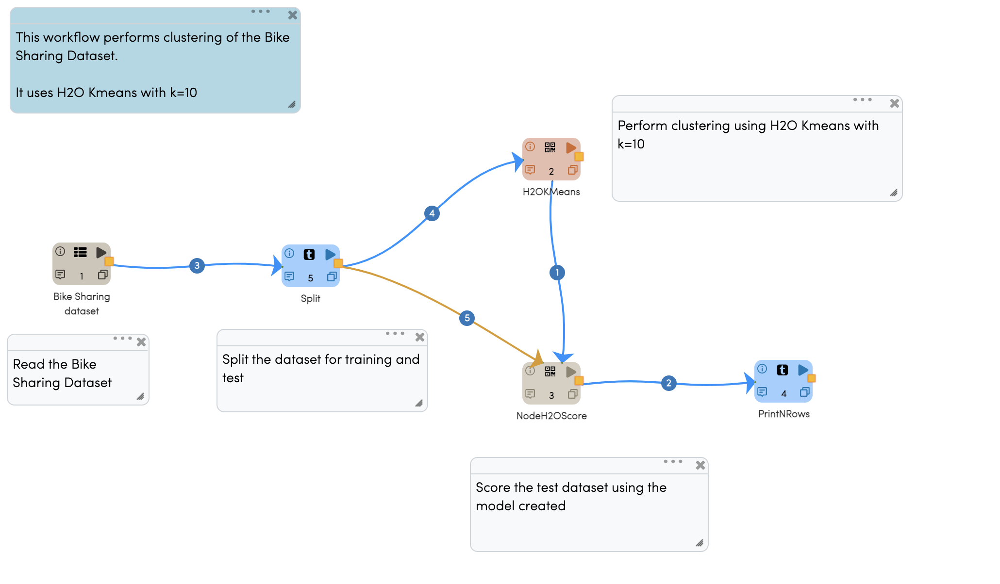
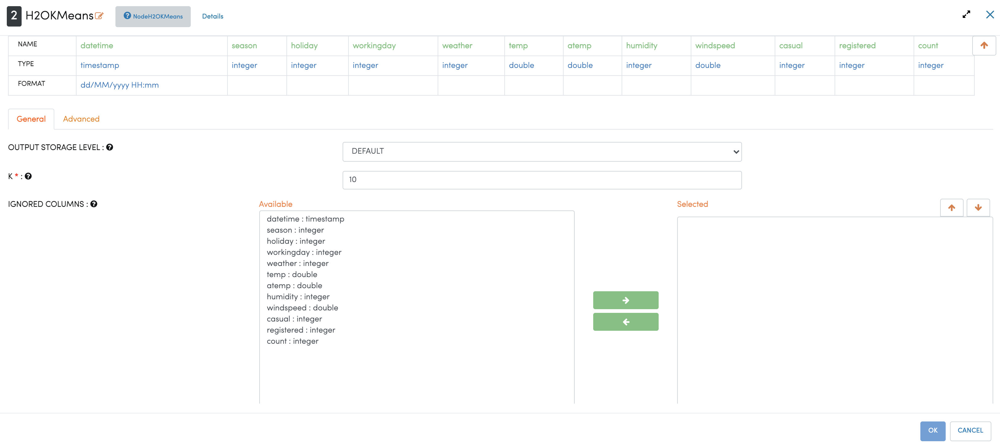
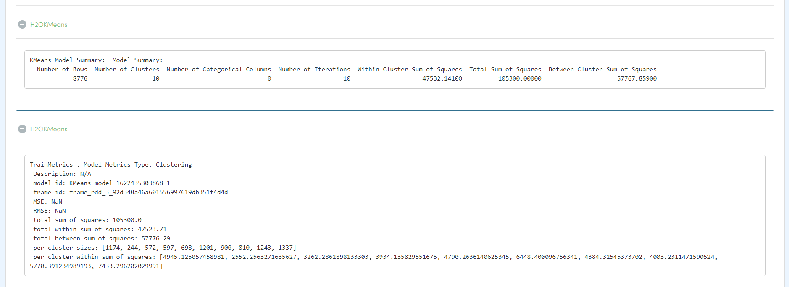

H2O K-Means
=====================

This workflow performs clustering of the Bike Sharing Dataset. It uses H2O Kmeans with k=10
   
Workflow
-------

The below workflow:

* Read the Bike Sharing Dataset.
* Split the dataset for training and test.
* Perform clustering using H2O Kmeans with k=10.
* Score the test dataset using the model created.
* Print the results.

H2O KMeans Clustering Configuration
---------------------

Results
---------------------

