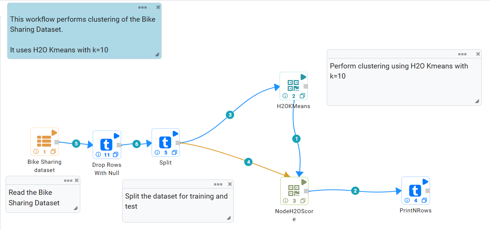
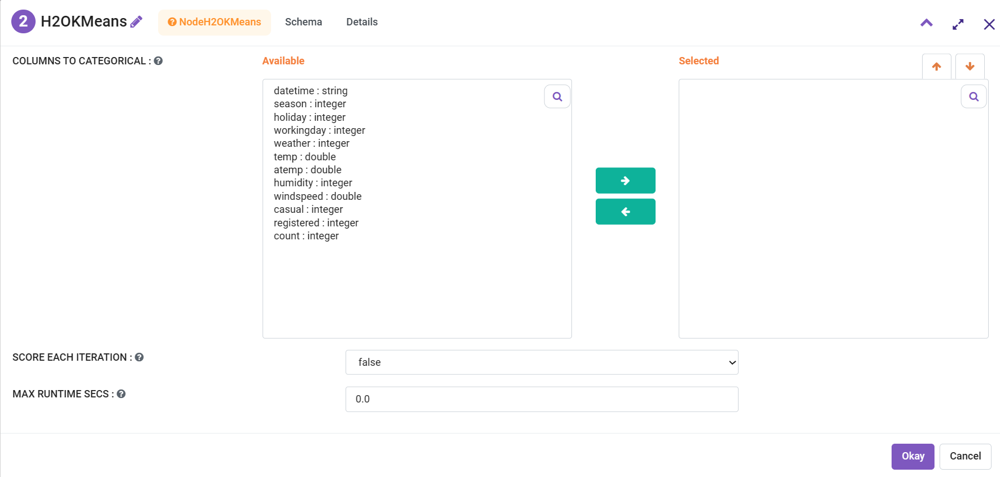
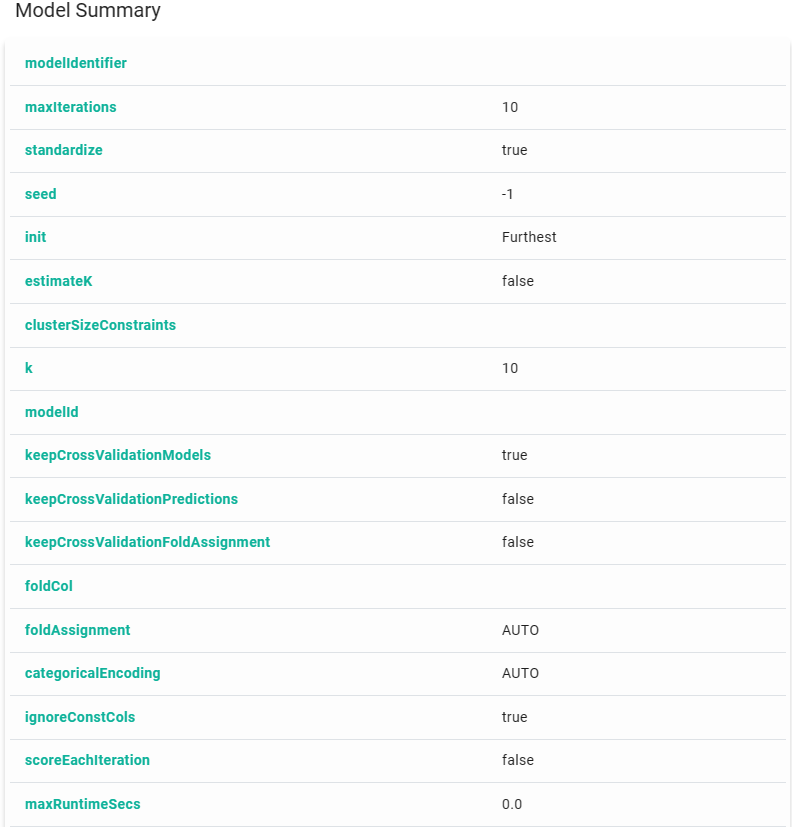
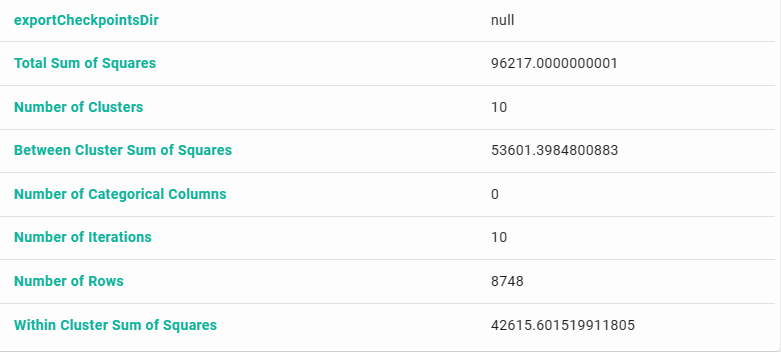
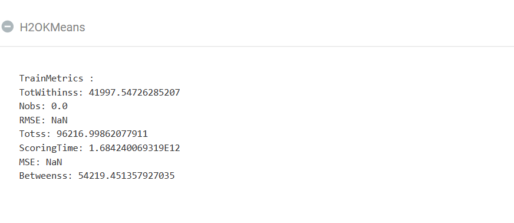

H2O K-means
=====================

This workflow performs clustering of the Bike Sharing dataset. It uses H2O K-means with k=10.
   
Workflow
-------

The below workflow:

* Reads the Bike Sharing dataset.
* Splits the dataset for training and test.
* Performs clustering using H2O Kmeans with k=10.
* Scores the test dataset using the model created.
* Prints the results.

H2O K-means Clustering Configuration
---------------------

Results
---------------------

   

