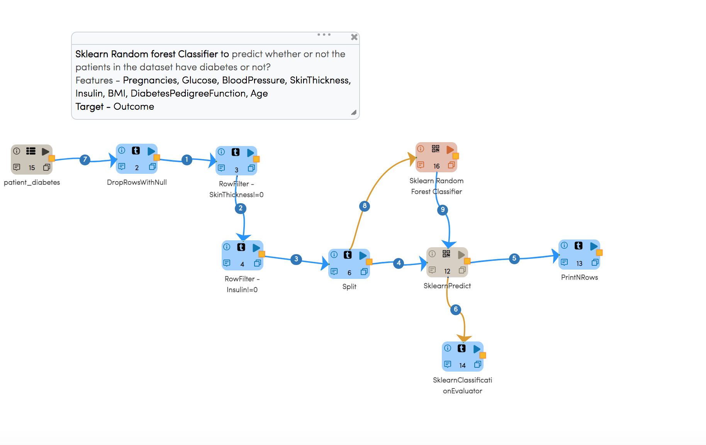
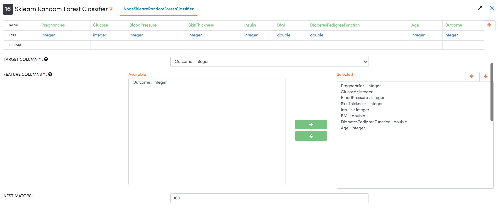
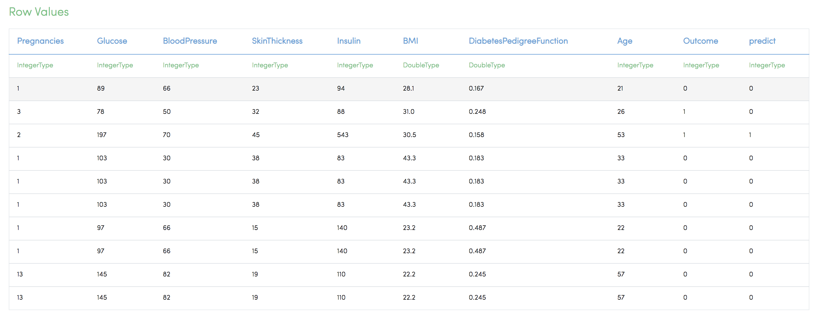
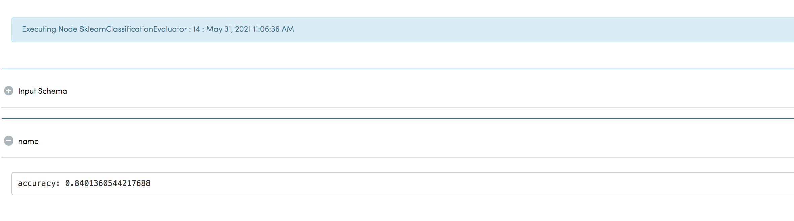

Diabetes Classification
=============================================

This workflow performs Diabetes Classification with RandomForestClassification node.
   
Workflow
-------

Random Forest Configuration
---------------------
   
Below is the configuration for the Random Forest Classification nodes in the workflow.

Result
---------------------

Below is the output of executing the Random Forest Classfication Node.

* Outcome is the target column
* All of the columns except Outcome have been selected as the Feature Columns.

   
   

