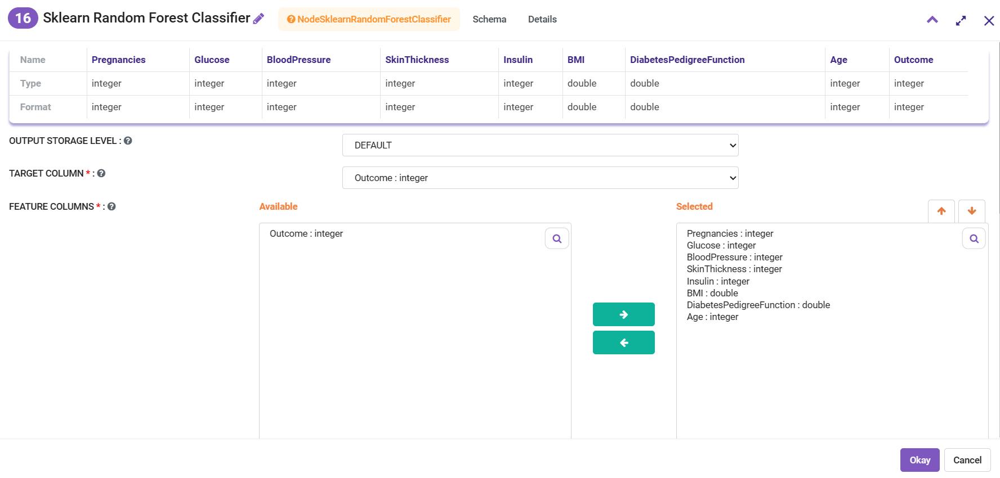
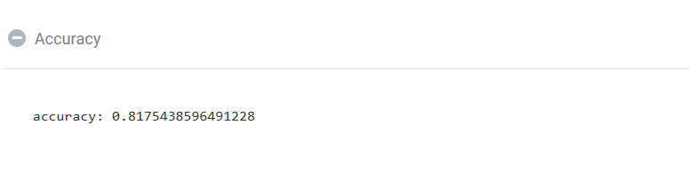

Diabetes Classification
=============================================

This workflow performs Diabetes Classification with RandomForestClassification node.
   
Workflow
-------

.. figure:: ../../../_assets/tutorials/machine-learning/diabetes-classification-rf/diabetes-workflow.png
   :alt: DiabetesClassification
   :width: 70%

Random Forest Configuration
---------------------
   
Below is the configuration for the Random Forest Classification nodes in the workflow.

* Outcome is the target column.
* All of the columns except Outcome have been selected as the Feature Columns.

Result
---------------------

Below is the output of the Predict Node.

* The column Predict captures the result of the Predicitons.
* We see that the accuracy of the model is .84. It is computed by the SklearnClassificationEvaluator Node.

.. figure:: ../../../_assets/tutorials/machine-learning/diabetes-classification-rf/result-row-values.png
   :alt: DiabetesClassification
   :width: 70%

   
   

