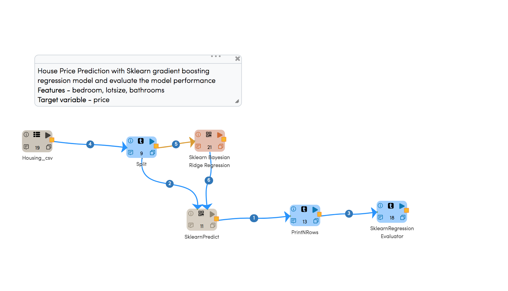
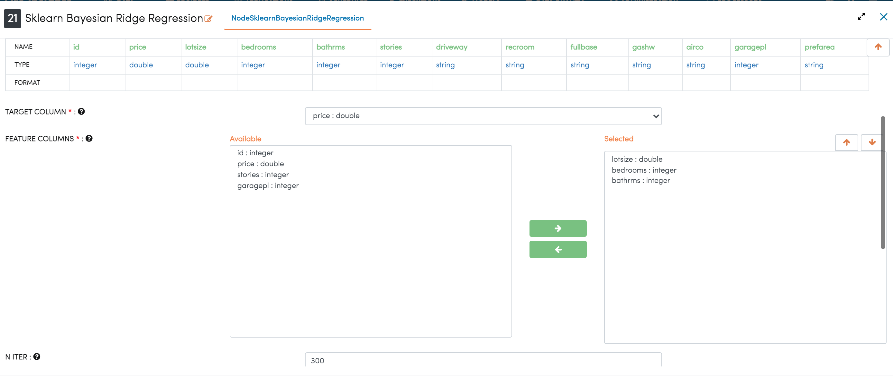
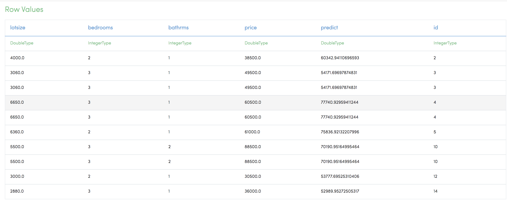
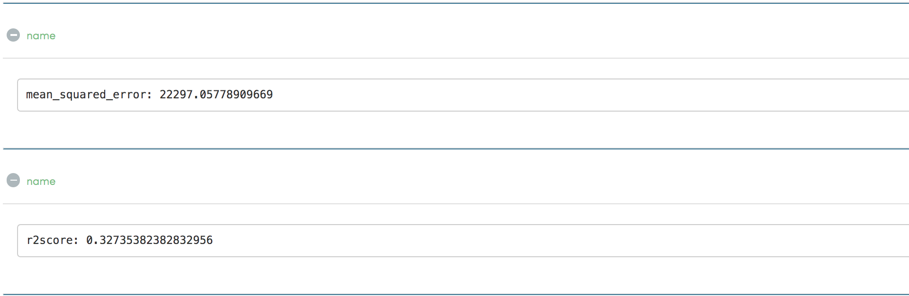

House Price
=============================================

House Price Prediction with Sklearn gradient boosting regression model and evaluate the model performance.

- Features - Bedroom, lotsize, bathrooms.
- Target variable - Price.
   
Workflow
-------

Ridge Regression Configuration
-----------------------------
   

Result
---------------------
Once the above workflow gets executed, below details can be seen on Execution page.

Metrics
-----------

   
   

