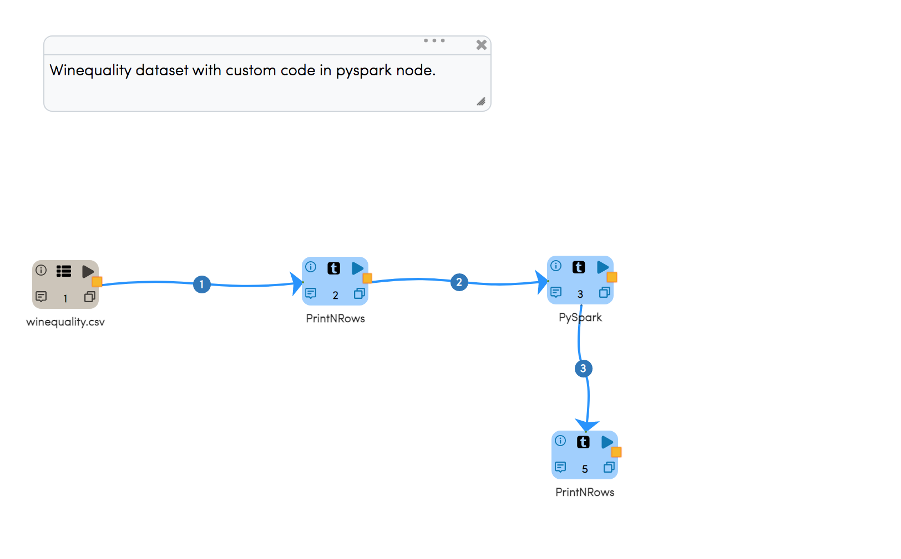
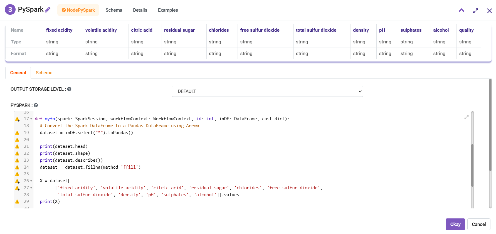
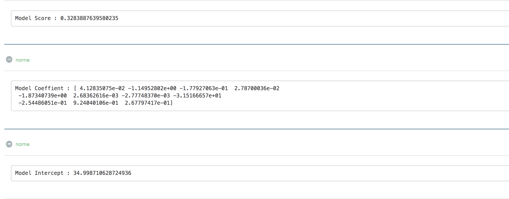
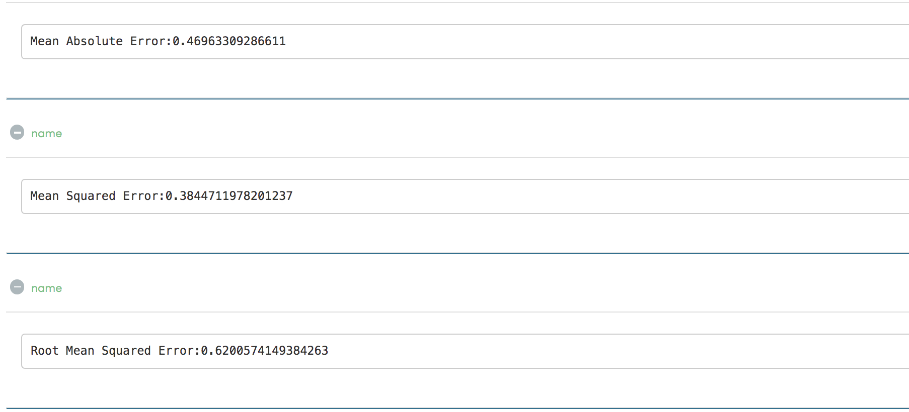

Wine Quality with Custom Code in PySpark Node
=============================================

This workflow performs building the custom model in PySpark node.
   
Workflow
-------

Custom Code
---------------------

   
   
   
Code in PySpark Node
---------------------
::

      from pyspark.sql.types import StringType
      from pyspark.sql.functions import *
      from pyspark.sql import *

      import numpy as np
      import pandas as pd

      from sklearn.linear_model import LinearRegression
      from sklearn import datasets
      from sklearn.model_selection import train_test_split
      from sklearn import metrics

      from joblib import dump, load

      from fire.workflowcontext import *

      def myfn(spark: SparkSession, workflowContext: WorkflowContext, id: int, inDF: DataFrame, cust_dict):
        # Convert the Spark DataFrame to a Pandas DataFrame using Arrow
        dataset = inDF.select("*").toPandas()

        print(dataset.head)
        print(dataset.shape)
        print(dataset.describe())
        dataset = dataset.fillna(method='ffill')

        X = dataset[
              ['fixed acidity', 'volatile acidity', 'citric acid', 'residual sugar', 'chlorides', 'free sulfur dioxide',
               'total sulfur dioxide', 'density', 'pH', 'sulphates', 'alcohol']].values
        print(X)

        y = dataset['quality'].values
        print(y)

        X_train, X_test, y_train, y_test = train_test_split(X, y, test_size=0.2, random_state=0)

        # There are three steps to model something with sklearn
        # 1. Set up the model
        model = LinearRegression()
        # 2. Use fit
        ft = model.fit(X_train, y_train)
        print(ft)
        # 3. Check the score
        scr = model.score(X_test, y_test)
        workflowContext.outStr(id, "Model Score : " + str(scr))

        # 4. Print model
        workflowContext.outStr(id, "Model Coeffient : " + str(model.coef_))
        workflowContext.outStr(id, "Model Intercept : " + str(model.intercept_))

        # 5. Predict test data
        y_pred = model.predict(X_test)

        # 6. See difference between actual and predicted value
        df = pd.DataFrame({'Actual': y_test, 'Predicted': y_pred})
        df1 = df.head(25)
        workflowContext.outPandasDataframe(id, "Actual - Predicted : ", df1, 10, True)

        # 7. Evaluate the performance
        workflowContext.outStr(id, "Mean Absolute Error:" + str(metrics.mean_absolute_error(y_test, y_pred)))
        workflowContext.outStr(id, "Mean Squared Error:" + str(metrics.mean_squared_error(y_test, y_pred)))
        workflowContext.outStr(id, "Root Mean Squared Error:" + str(np.sqrt(metrics.mean_squared_error(y_test, y_pred))))

        return inDF
    

Result
---------------------

   
   
