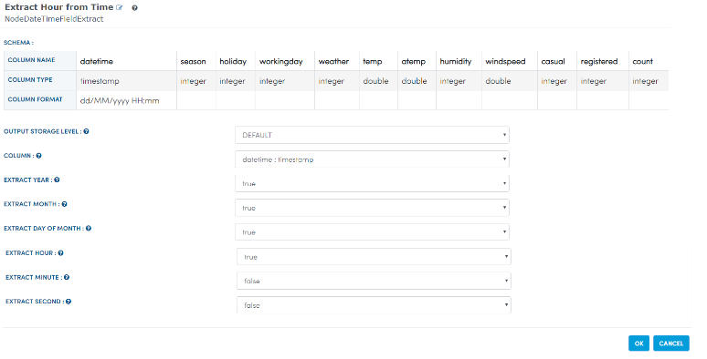
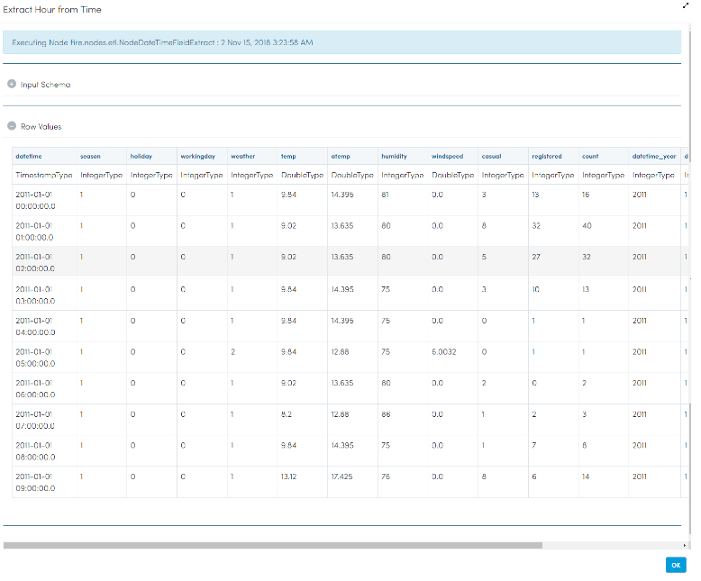
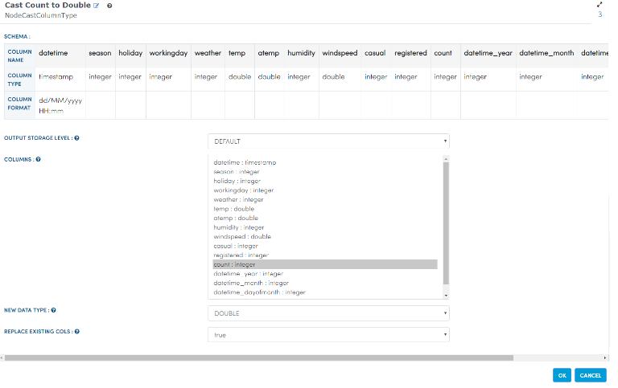
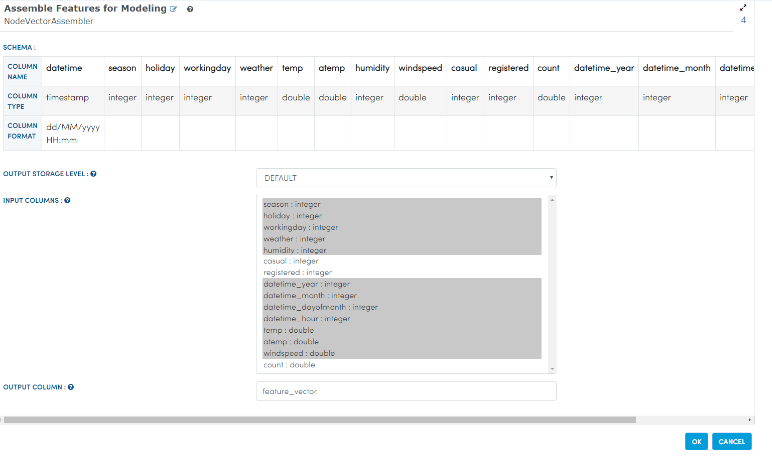
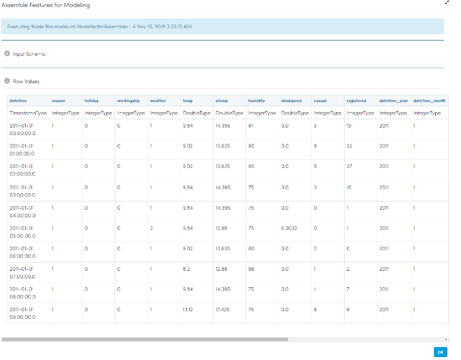
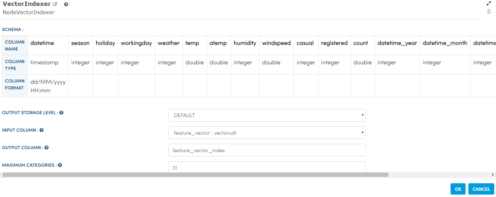
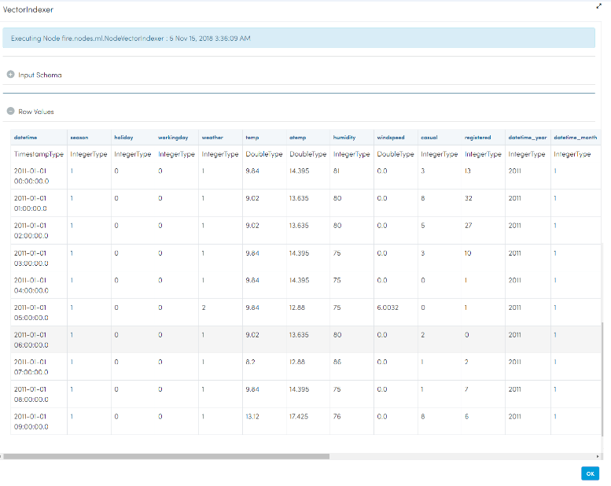
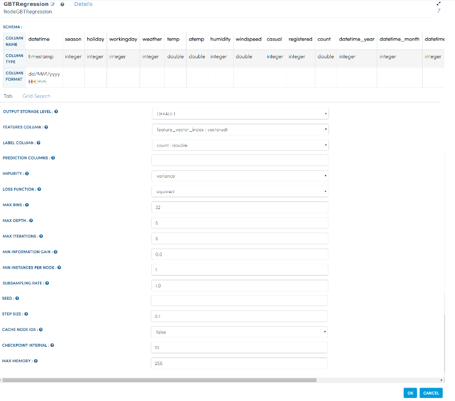

Bike Rental Prediction
======================

This workflow reads in a dataset and then it predicts the number of bikes to be rented in any given hour.

Workflow
-------

The below workflow:

* Reads data from a sample dataset.
* Extracts hour from time using datatype Timestamp.
* Calculates Count to datatype double.
* Assembles features for modelling.
* Calculates VectorIndexer.
* Splits the dataset.
* Uses GBTRegression Node.
* Makes prediction on future data.
* Uses RegressionEvaluator Node.

.. figure:: ../../../_assets/tutorials/machine-learning/bike-rental-prediction/1.png
   :alt: Bike Rental Prediction
   :width: 65%

Reading from Dataset
---------------------

It reads the sample Dataset File.

Processor Configuration
^^^^^^^^^^^^^^^^^^

.. figure:: ../../../_assets/tutorials/machine-learning/bike-rental-prediction/2.png
   :alt: Bike Rental Prediction
   :width: 65%
   
Processor Output
^^^^^^

.. figure:: ../../../_assets/tutorials/machine-learning/bike-rental-prediction/2a.png
   :alt: Bike Rental Prediction
   :width: 65%
   
Extract Hour from Time using Datatype Timestamp
------------------------------------------------

It extracts hour from the timestamp column using the DateTimeFieldExtract Node.

Processor Configuration
^^^^^^^^^^^^^^^^^^

   
Processor Output
^^^^^^

   
Cast Count to Double type
-----------------------------------

It casts count field to double using the CastColumnType Node.

Processor Configuration
^^^^^^^^^^^^^^^^^^

   
Processor Output
^^^^^^

.. figure:: ../../../_assets/tutorials/machine-learning/bike-rental-prediction/4a.png
   :alt: Bike Rental Prediction
   :width: 65%

Assemble Features for Modelling
---------------------------------

It assembles the columns to be used in model building into a feature vector using the VectorAssembler Node.

Processor Configuration
^^^^^^^^^^^^^^^^^^

   
Processor Output
^^^^^^

Calculate VectorIndexer
-----------------------

It identifies the categorical features and then index them using the VectorIndexer Node. 

Processor Configuration
^^^^^^^^^^^^^^^^^^

   
Processor Output
^^^^^^

   
Split it
---------

It will split the dataset into separate training and test sets using the Split Node.

Processor Configuration
^^^^^^^^^^^^^^^^^^

.. figure:: ../../../_assets/tutorials/machine-learning/bike-rental-prediction/7.png
   :alt: Bike Rental Prediction
   :width: 65%
   
   
GBTRegression
--------------

It validates held out test sets in order to know about high confidence using the GBTRegression Node.

Processor Configuration
^^^^^^^^^^^^^^^^^^

   
   
Prediction
-----------

It will make prediction on the future data using the Prediction Node.

Processor Configuration
^^^^^^^^^^^^^^^^^^

.. figure:: ../../../_assets/tutorials/machine-learning/bike-rental-prediction/9.png
   :alt: Bike Rental Prediction
   :width: 65%
   

RegressionEvaluator
-------------------

It validates held out test sets in order to know about high confidence using the RegressionEvaluator Node.

Processor Configuration
^^^^^^^^^^^^^^^^^^

.. figure:: ../../../_assets/tutorials/machine-learning/bike-rental-prediction/10.png
   :alt: Bike Rental Prediction
   :width: 65%
   
   
