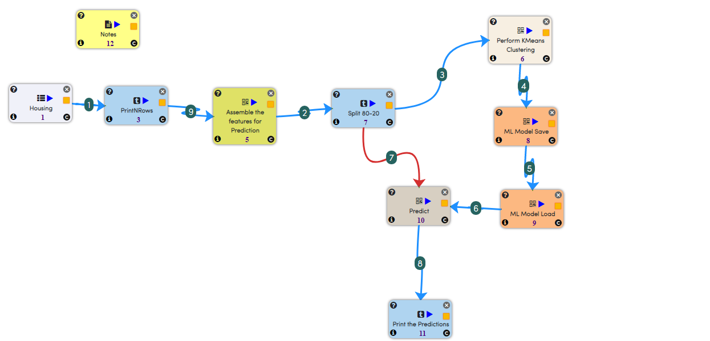
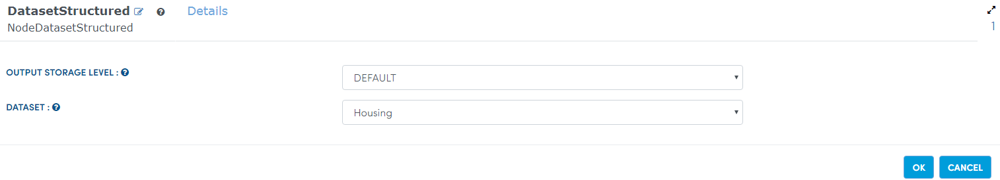
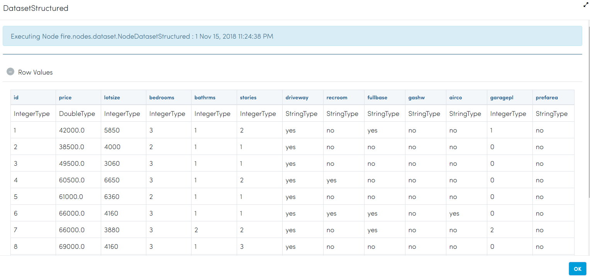
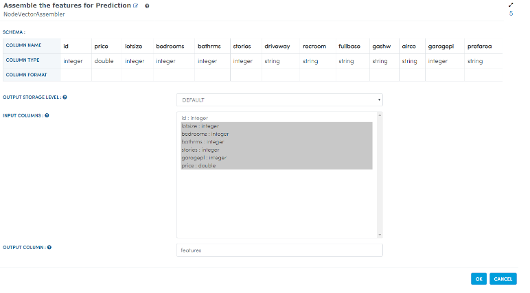
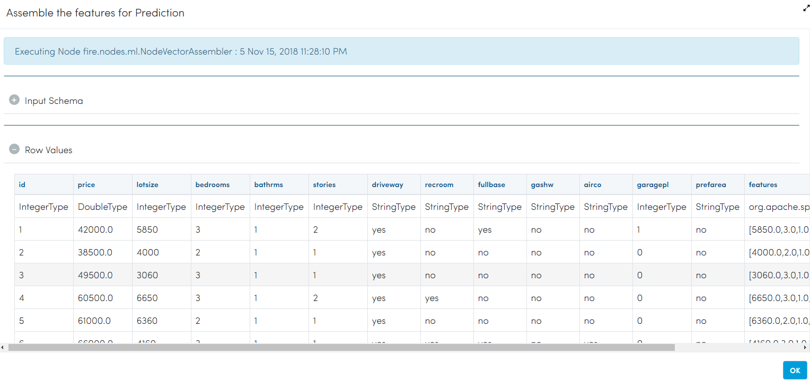
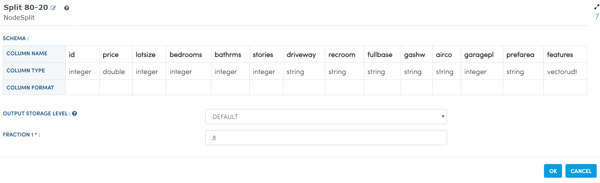
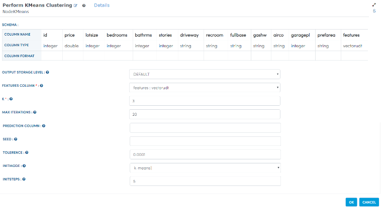
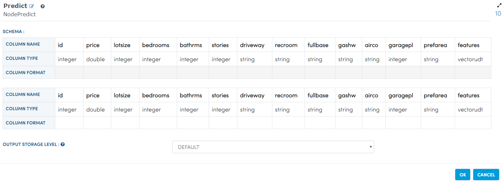
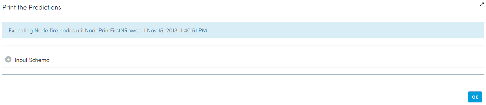

Clustering Houses
=================

Here, we have a housing dataset available to us. We need to cluster the houses in the best possible way.

We will perform the clustering using K-means algorithm availabe in Apache Spark ML.

Dataset
-------

The dataset is a Housing dataset containing column like price, number of bedrooms, number of bathrooms, etc.

* Bedrooms : Number of bedrooms in the house.
* Price : The price at which the house was sold.

Workflow
-------

Below is the workflow for creating a K-means model for clustering the houses. It does the following:

* Reads data from a sample dataset.
* Prints the result.
* Assembles the features for prediction.
* Splits it.
* Perform K-means Clustering.
* Prediction.
* Prints the prediction result.

Reading from Dataset
---------------------

First we read in the Housing Dataset using the ``Read CSV`` node.

Below are the parameters which we use:

   
After reading, the ``Read CSV`` node, output looks like below:

   
Assemble the features for predictions
-------------------------------------

Next, we assemble the features we want to use in the KMeans Clustering. We use the ``Vector Assembler`` node for it.

More details for Vector Assembler in Apache Spark ML can be found here : https://spark.apache.org/docs/latest/ml-features.html#vectorassembler

   
The output of the Vector Assembler node looks like below:

   
Split it
---------

It splits features of prediction using Split Node.

Processor Configuration
^^^^^^^^^^^^^^^^^^

   
Perform KMeans Clustering
-------------------------

It performs K-means Clustering on the Housing Dataset using K-means Node.

Processor Configuration
^^^^^^^^^^^^^^^^^^

   
   
Prediction
-----------

It predicts features updated using Predict Node.

Processor Configuration
^^^^^^^^^^^^^^^^^^

   
   
Print the prediction results
-----------------------------

It prints the prediction results.

