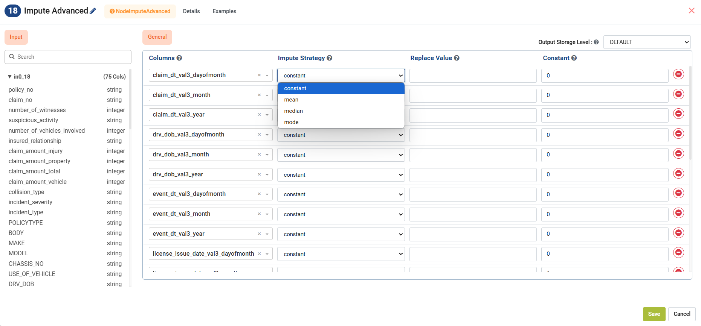

Imputing Missing Data
=====================

**Imputing values** is the process of generating data points to fill in missing values or null values in a data set. The **Impute node** in Sparkflows handles missing data by replacing null values with either **mean values** or **constants** — a common and effective strategy to prepare your dataset for modeling. 

There are four ways of imputing data in Sparkflows. You can impute with a constant value or a statistic of the selected columns, specifically the **Constant**, **Mean**, **Median** or **Mode**. 

Depending on the selection, the null values in the columns will be imputed with either the constant value specified by user or it calculates the mean, median or mode based on data available in the column and fills in the data points.

