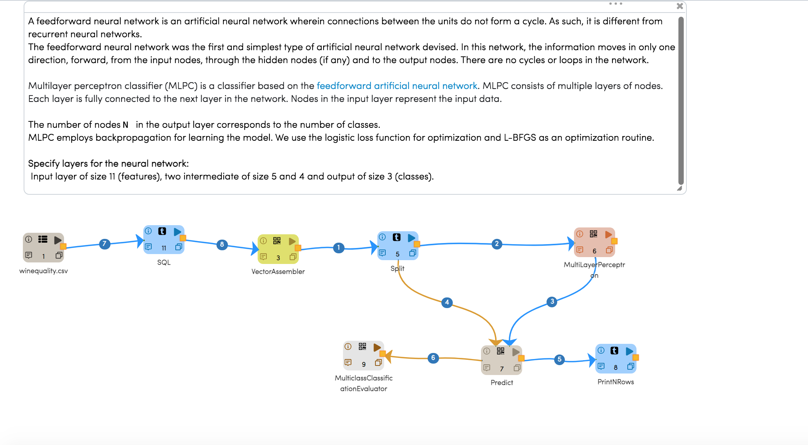
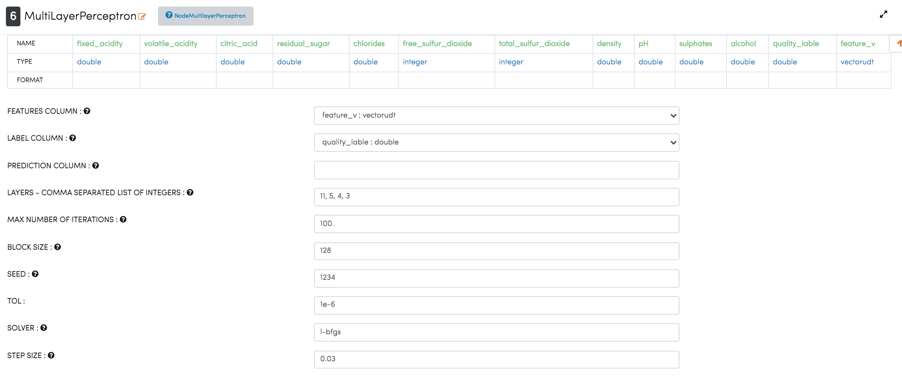
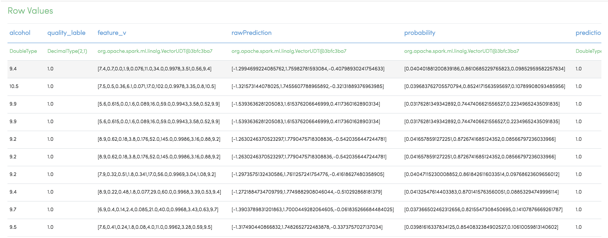
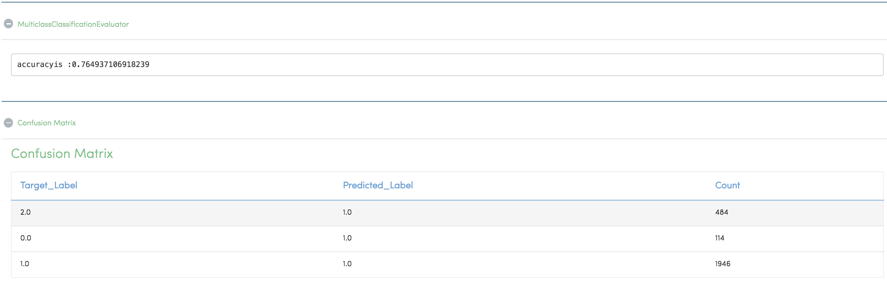

MultilayerPerceptronClassifier - WineQuality
============================================

This workflow read the dataset, perform MLPC on the text content, predict and print the result.

A feedforward neural network is an artificial neural network wherein connections between the units do not form a cycle. As such, it is different from recurrent neural networks.

The feedforward neural network was the first and simplest type of artificial neural network devised. In this network, the information moves in only one direction, forward, from the input nodes, through the hidden nodes (if any) and to the output nodes. There are no cycles or loops in the network.

Multilayer perceptron classifier (MLPC) is a classifier based on the feedforward artificial neural network. MLPC consists of multiple layers of nodes. Each layer is fully connected to the next layer in the network. Nodes in the input layer represent the input data.

The number of nodes N  in the output layer corresponds to the number of classes.

MLPC employs backpropagation for learning the model. We use the logistic loss function for optimization and L-BFGS as an optimization routine.

Specify layers for the neural network:

 Input layer of size 11 (features), two intermediate of size 5 and 4 and output of size 3 (classes).

Workflow
-------

The below workflow:

* Read CSV - Read the dataset.
* SQL - Select columns based on quality.
* Vector Assembler - Merge multiple columns into a vector column.
* Split - Split the incoming dataframe into 2. It takes the fraction for splitting the data.
* MultiLayerPerceptron - Supports creation of a fully connected neural network
* MulticlassClassificationEvaluator - Evaluator for multiclass classification, which expects 2 input columns: score and label.
* Predict - Takes a dataframe and a model and predicts the result.
* PrintNRows - Print the final result.

   
 
MultilayerPerceptronClassifier Configuration
--------------------------------------------

   

Results - Row Values
--------------------------------------------

   

Results - Matrix
--------------------------------------------

   
