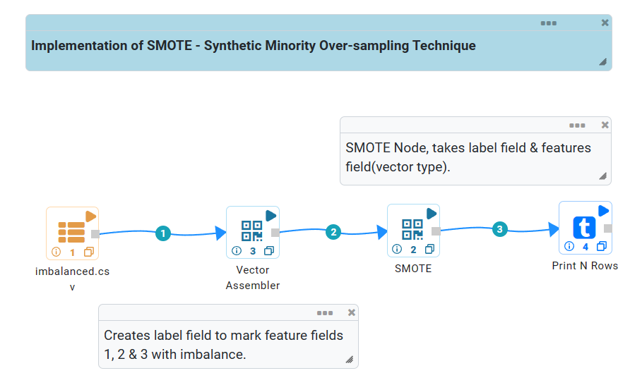
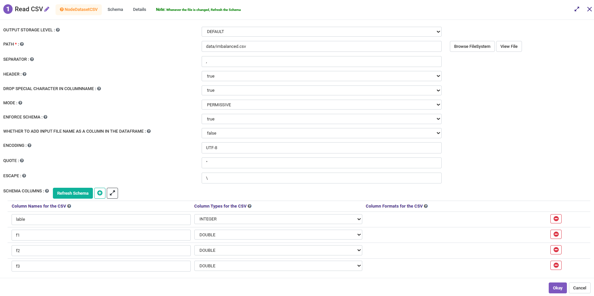
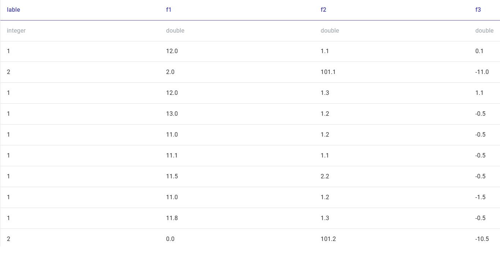
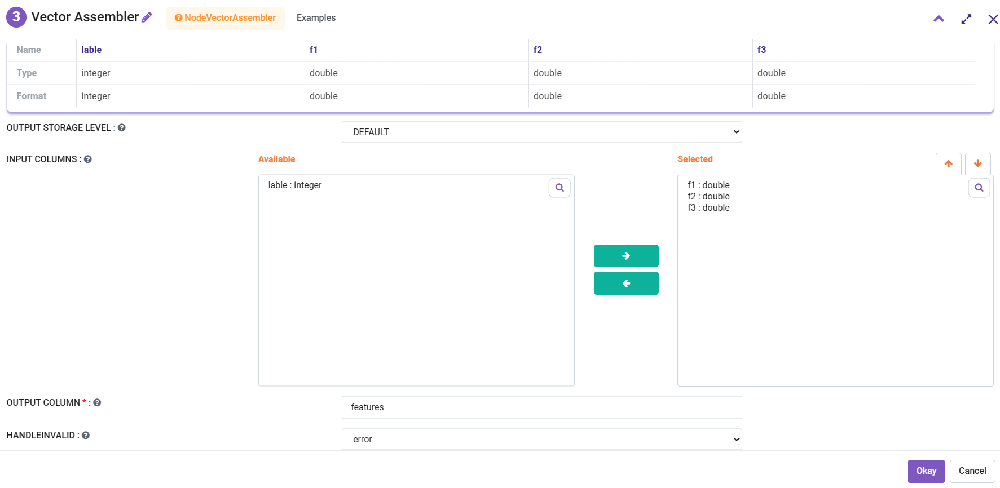
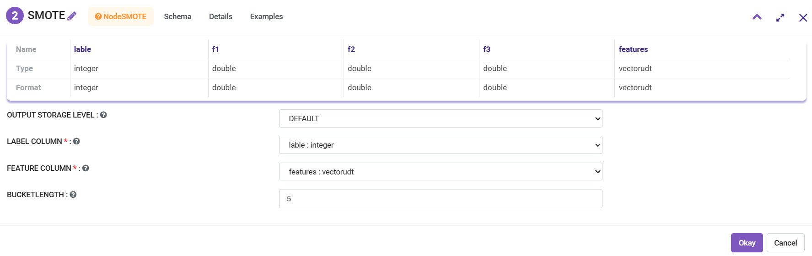
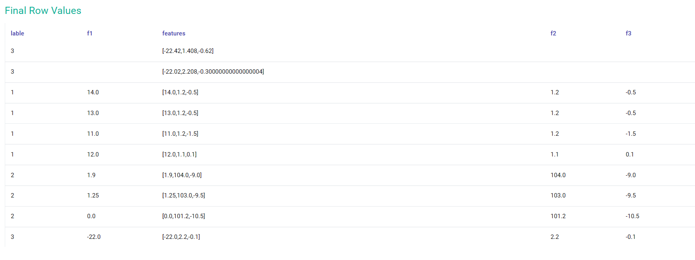

SMOTE: Synthetic Minority Oversampling Technique
================================

The challenge of working with imbalanced datasets is that most machine learning techniques will ignore, and in turn have poor performance on,
the minority class, although typically it is performance on the minority class that is most important.

One approach to addressing imbalanced datasets is to oversample the minority class. The simplest approach involves duplicating examples in the minority class,
although these examples don’t add any new information to the model. Instead, new examples can be synthesized from the existing examples.
This is a type of data augmentation for the minority class and is referred to as the Synthetic Minority Oversampling Technique, or SMOTE for short.

In this tutorial, you will discover the SMOTE for oversampling imbalanced data in Fire Insights. Fire Insights provides Node SMOTE.

Workflow
--------

Below is the workflow to create oversampling.

   
The workflow:

- Reads in the dataset from a comma separated file.
- Applies VectorAssembler on the fields to create the vector.
- Use SMOTE by selecting the label field & feature field of type vector.

Read CSV
+++++++++++++++

In the ReadCSV, select the path by browse.

Input Data.
++++++++++

VectorAssembler
+++++++++++++++

In the VectorAssembler, select the fields you want to include as a features. As the VectorAssembler supports only the numeric fields, only the numeric fields are displayed.

SMOTE
+++++++++++++++

In the SMOTE, select the lable field & feature field.

  
RESULT
+++++++++++++++  

