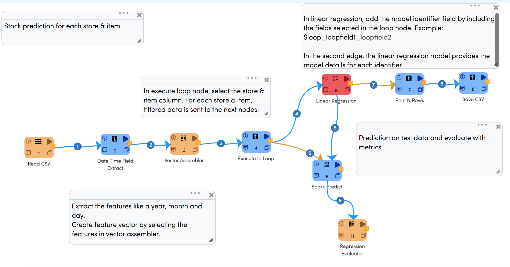
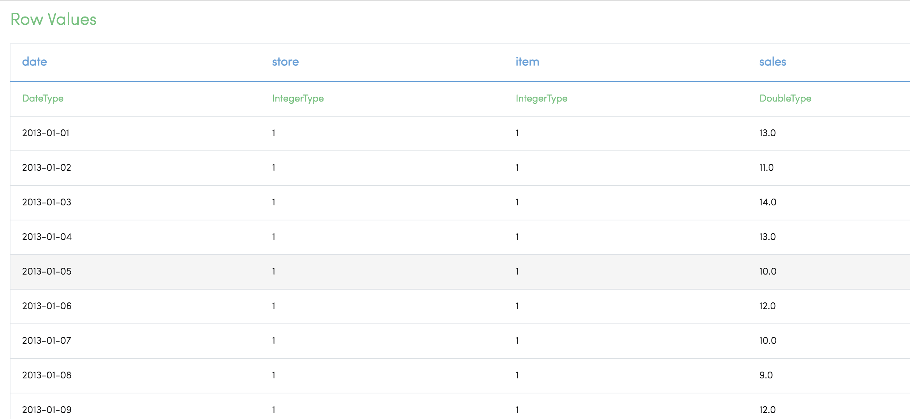
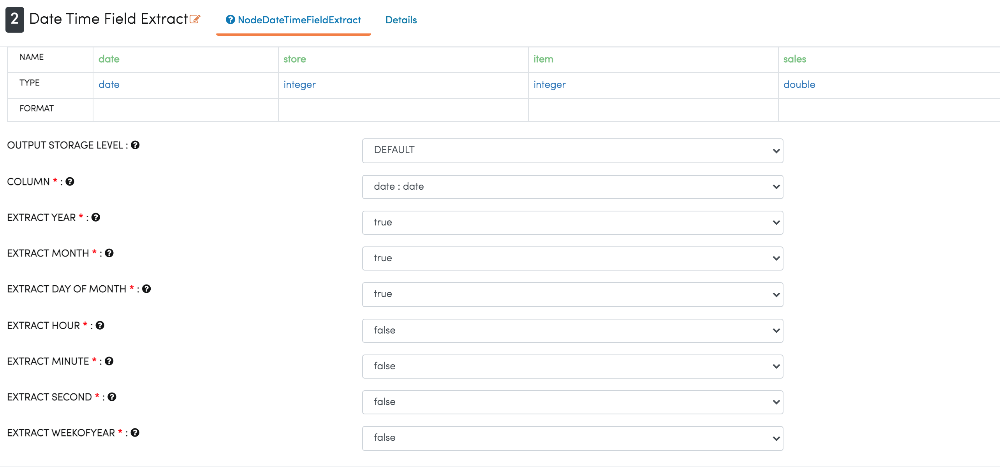
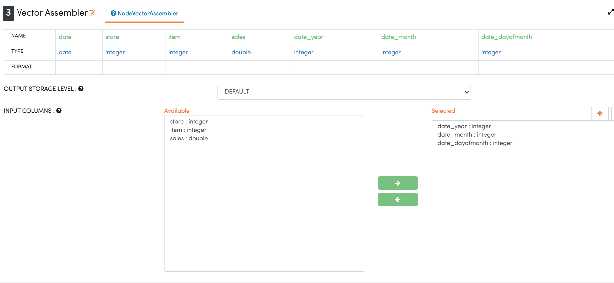
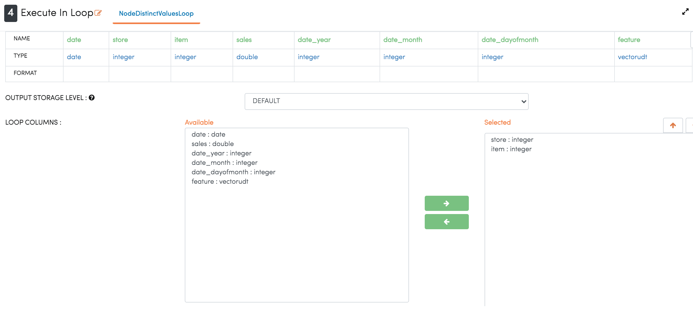
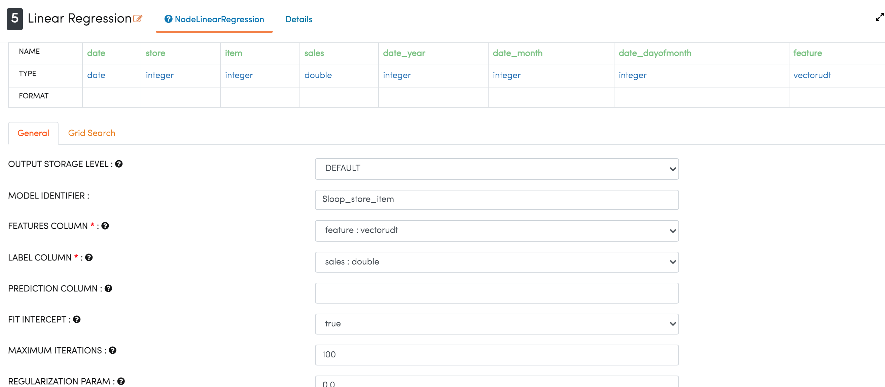
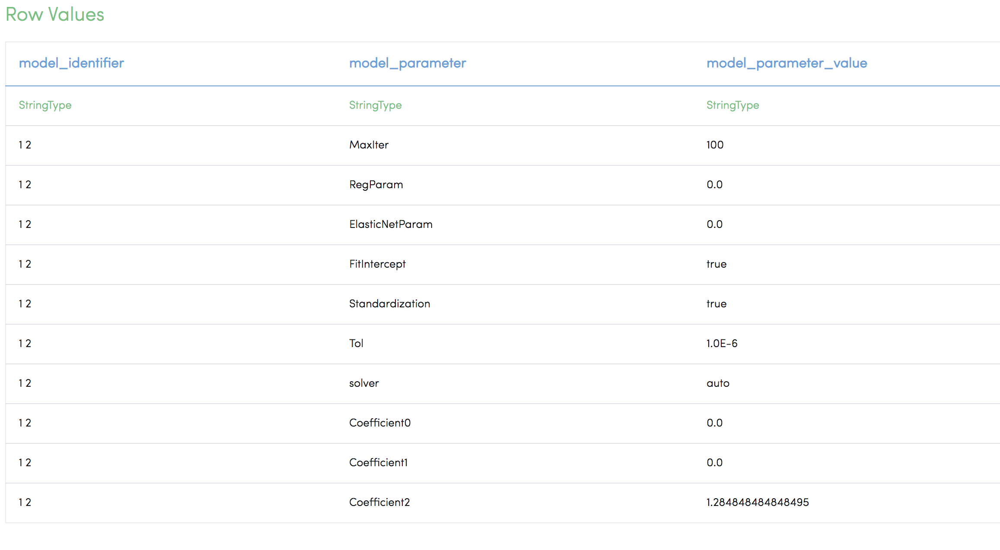
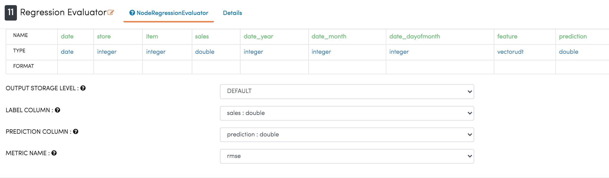

Stock Prediction For Each Store & Item
======================================

This workflow to predict the stock for each store & iteam by using linear regression & loop nodes.
Loop nodes takes in store & item fields and pass the data to liner regression model in a loop.

Workflow
--------

The below workflow:

* Reads data from a given path.
* Extracts day, month & year from date.
* Assembles features for modelling.
* select the store & item field in loop node to filter the data for each store & item and pass the data to model node.
* Splits the dataset.
* Uses LinearRegression Node.
* Makes prediction on future data.
* Uses RegressionEvaluator Node.
* ModelSummary for each combination of store & item.

Reading from Dataset
---------------------

It reads the sample Dataset File.

Processor Configuration
^^^^^^^^^^^^^^^^^^^^^^^

.. figure:: ../../../_assets/tutorials/machine-learning/stock-prediction-store-iteam/2.png
   :alt: Stock Prediction
   :width: 100%
   
Processor Output
^^^^^^^^^^^^^^^^

  
  
Date and Time Field Extract
^^^^^^^^^^^^^^^^^^^^^^^^^^^

VectorAssembler
^^^^^^^^^^^^^^^^^^^^^^^^^^^

LoopDistinctValue
^^^^^^^^^^^^^^^^^^^^^^^^^^^
Node to loop through the data for distinct values in the selected columns.

   
LinearRegression
^^^^^^^^^^^^^^^^^^^^^^^^^^^
Fitting the line with Regression model.

   
ModelSummary
^^^^^^^^^^^^^
ModelSummary for each combination of values in the selected fields.
Summary can be saved and analyzed.

ModelPrediction and Evalaution
^^^^^^^^^^^^^^^^^^^^^^^^^^^^^
Precdcit on test data & evaluate.

