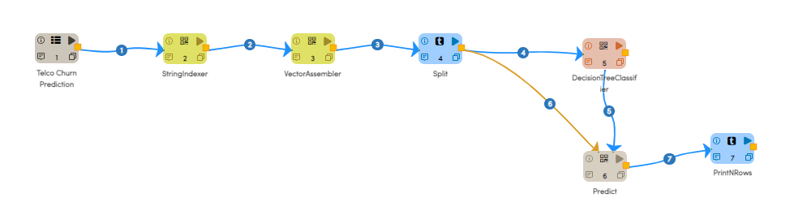
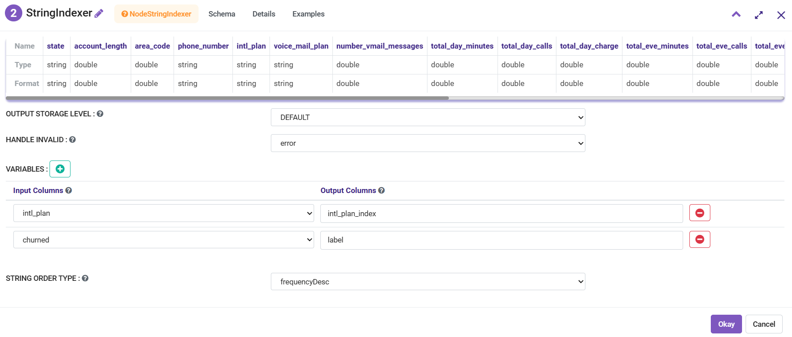
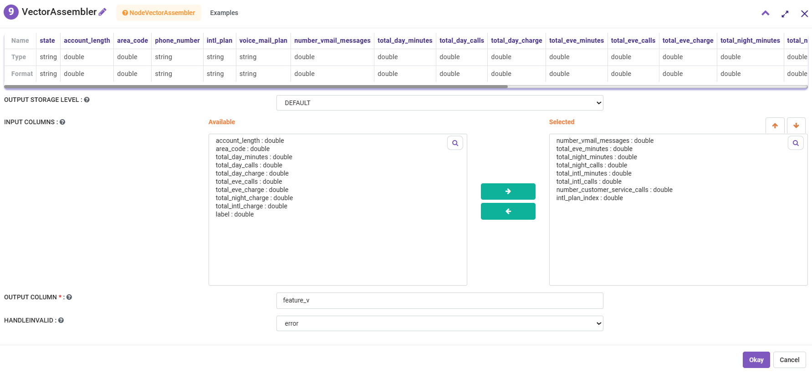
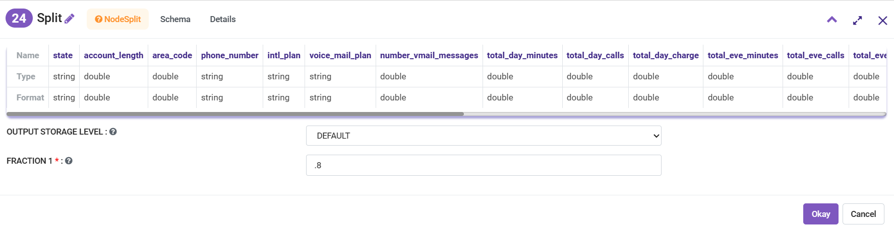
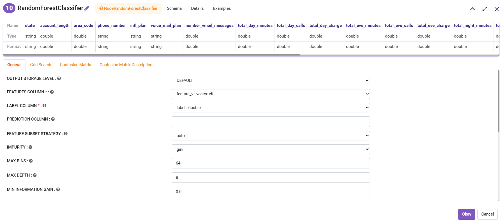
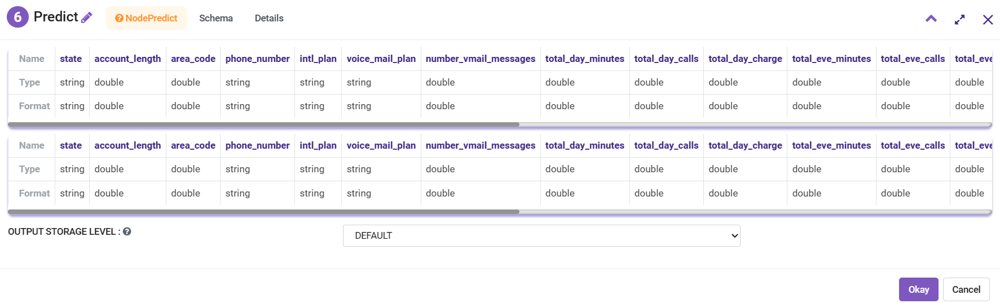
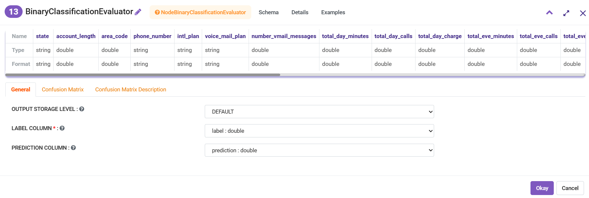
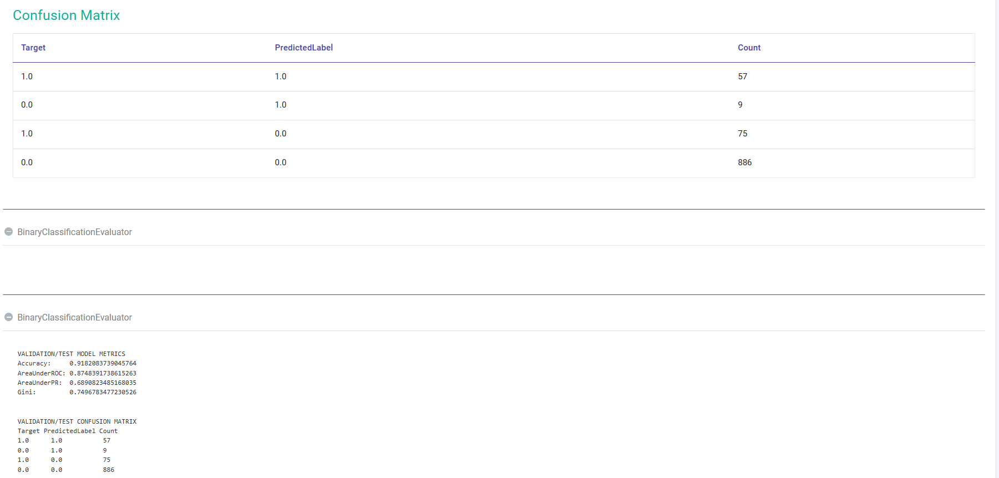

Telco Churn Prediction
======================

Fire Insights enables us to create a Random Forest Model to predict churn and evaluate the result.

The dataset is artificial Churn Data based on claims, similar to the real world. It is taken from the below locations: 

- https://www.sgi.com/tech/mlc/db/
- https://www.sgi.com/tech/mlc/db/churn.all
- https://www.sgi.com/tech/mlc/db/churn.name
   
   
Workflow
--------

Below is the workflow for creating a model for Churn Prediction.

   
The workflow:

- Reads in the dataset from a tab separated file.
- Applies StringIndexer on the field "intl_plan".
- Applies VectorAssembler on the fields we want to model on.
- Splits the dataset into (.8, .2).
- Performs Random Forest Classification.
- Performs prediction using the model generated on the remaining 20% dataset.
- Finally evaluates the prediction result.

VectorAssembler
+++++++++++++++

In the VectorAssembler, select the fields you want to include in the model. As the VectorAssembler supports only the numeric fields, only the numeric fields are displayed.

Split
+++++

You can split the dataset into training and test datasets. We split it into (.8, .2).

RandomForestClassifier
++++++++++++++++++++++++

You can use a RandomForestClassifier for predicting churn. We use 20 trees.

Predict
+++++++

You can predict using the model on the test dataset.

Evaluate
++++++++

You can evaluate the quality of our result.

   
Execute Workflow
----------------

Next, you can execute the workflow. 
   
From the evaluator, you get the below result:

   

