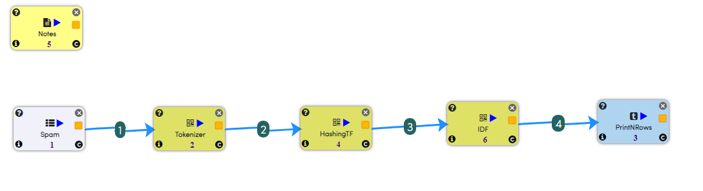
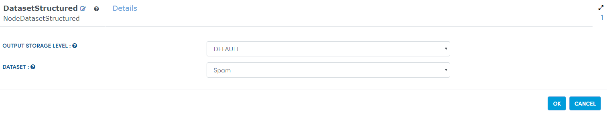
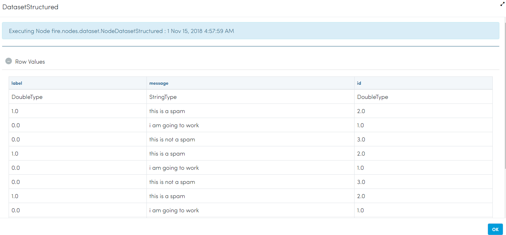
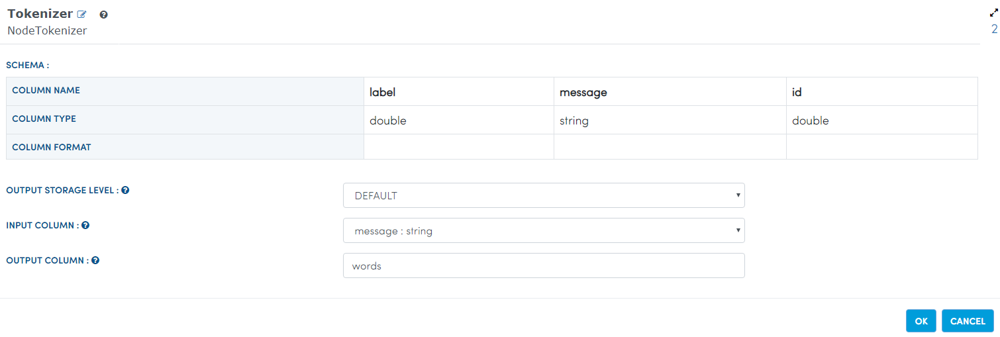
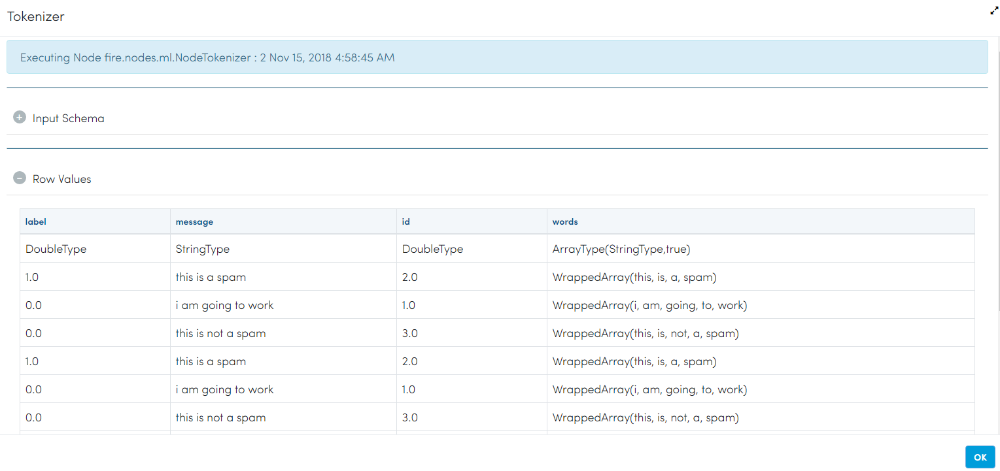
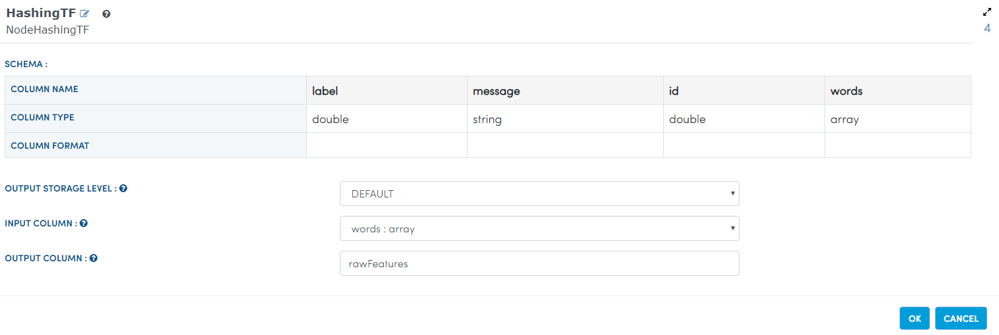
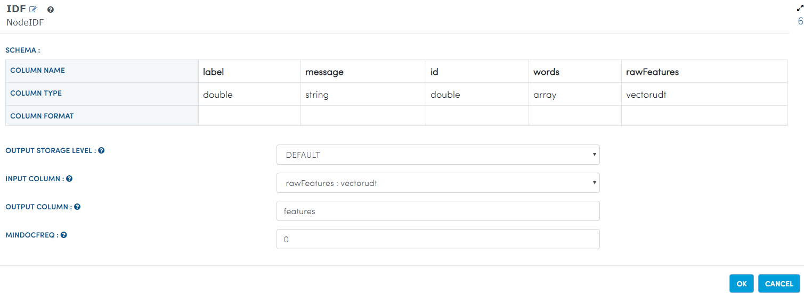
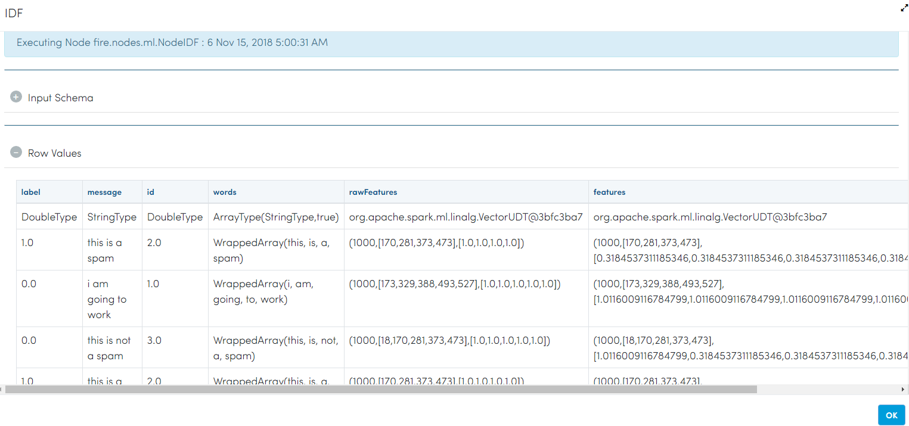
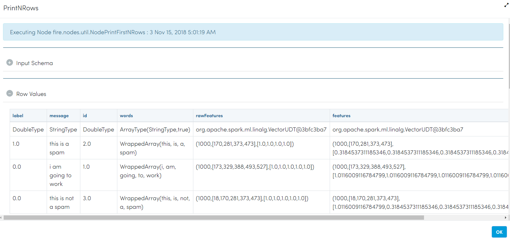

TF-IDF
=====

This workflow reads in a dataset. It then Tokenizes and performs TF/IDF on text content.

Workflow
-------

The below workflow:

* Reads data from a sample dataset.
* Tokenizes message column.
* Performs TF.
* Performs IDF.
* Prints the result.

Reading from Dataset
---------------------

It reads sample Dataset File.

Processor Configuration
^^^^^^^^^^^^^^^^^^

   
Processor Output
^^^^^^

   
Tokenizes message column
------------------------
It Tokenizes message column generated by sample dataset file using Tokenizer Node.

Processor Configuration
^^^^^^^^^^^^^^^^^^

   
Processor Output
^^^^^^

   
Perform TF
----------

It performs TF on text column using HashingTF Node.

Processor Configuration
^^^^^^^^^^^^^^^^^^

   
Processor Output
^^^^^^

.. figure:: ../../../_assets/tutorials/machine-learning/tfidf/4a.png
   :alt: TFIDF
   :width: 100%
   
Perform IDF
-----------

It performs IDF on text column using IDF Node.

Processor Configuration
^^^^^^^^^^^^^^^^^^

   
Processor Output
^^^^^^

   
Prints the result
------------------

It will print the result after performing TF/IDF on text content.

