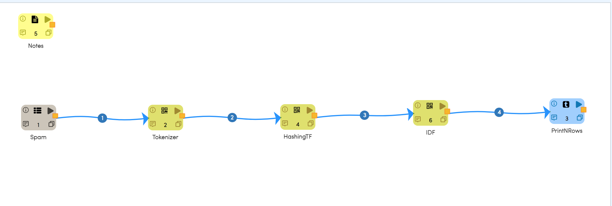
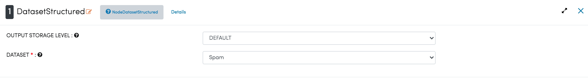
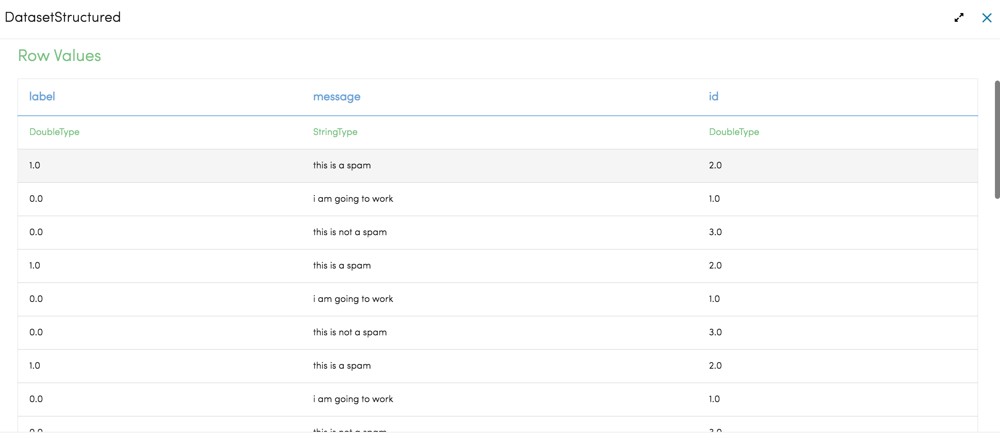
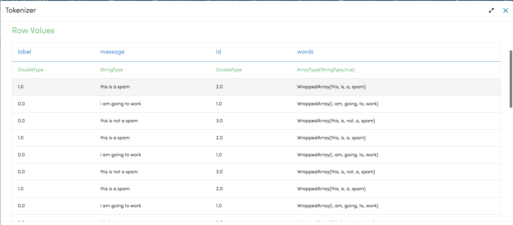
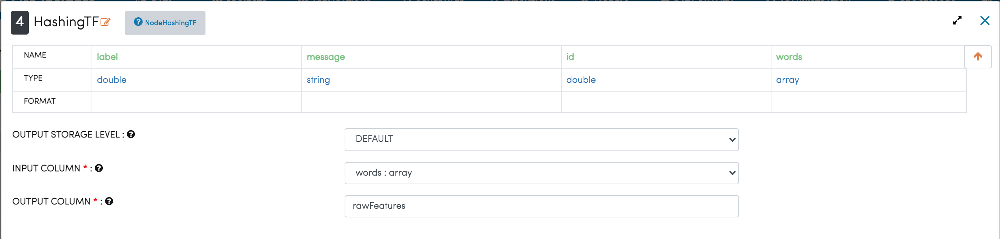
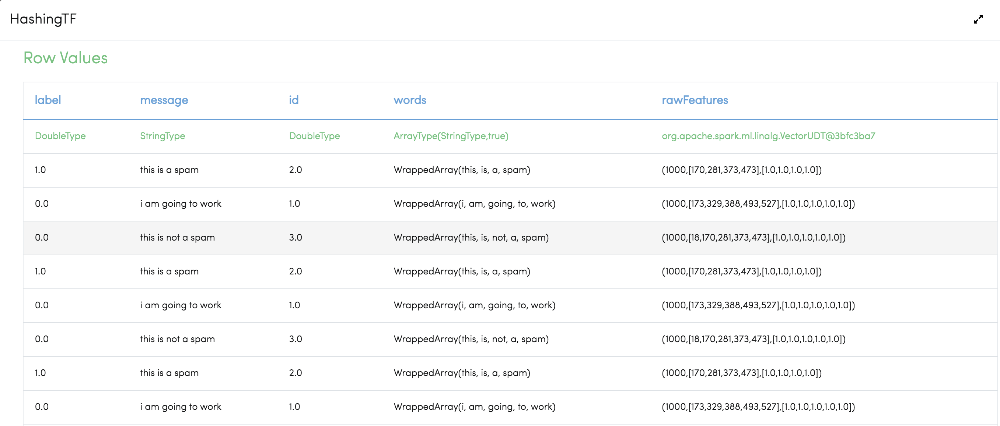
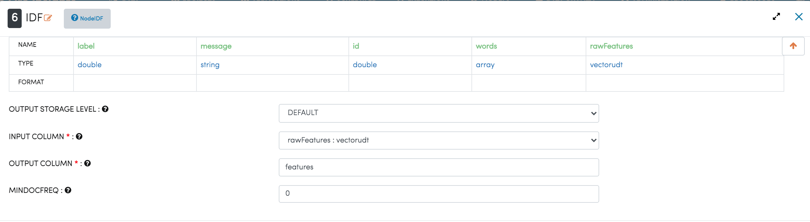
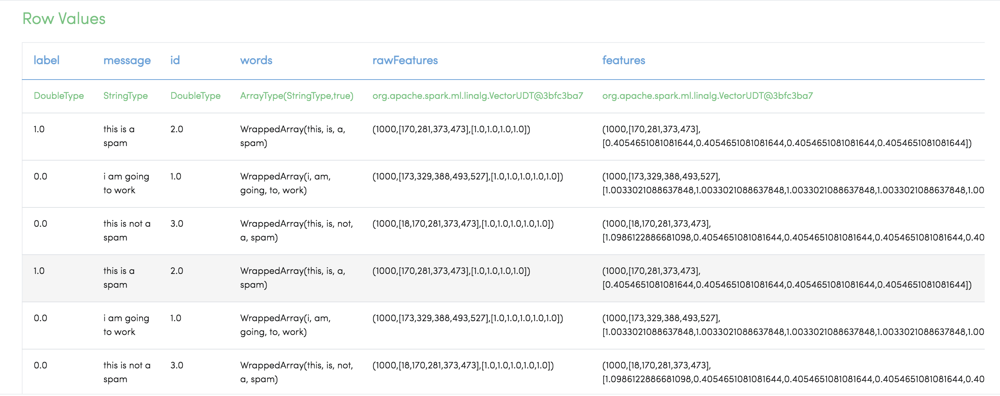
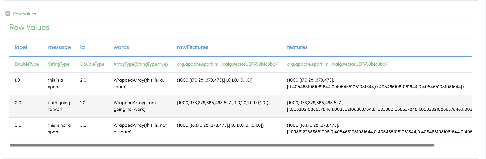

TFIDF
=====

This workflow reads in a dataset. It then Tokenizes and then performs TF/IDF on text content.

Workflow
-------

Below is the workflow. It does the following:

* Reads data from a sample dataset.
* Tokenizes message column.
* Performs TF.
* Performs IDF.
* Prints the results.

Reading from Dataset
---------------------

It reads sample Dataset file.

Processor Configuration
^^^^^^^^^^^^^^^^^^

   
Processor Output
^^^^^^

   
Tokenizes message column
------------------------
It Tokenizes message column generated by sample dataset file using Tokenizer Node.

Processor Configuration
^^^^^^^^^^^^^^^^^^

.. figure:: ../../_assets/tutorials/machine-learning/tfidf/3.png
   :alt: TFIDF
   :width: 100%
   
Processor Output
^^^^^^

   
Perform TF
----------

It performs TF on text column using HashingTF Node.

Processor Configuration
^^^^^^^^^^^^^^^^^^

   
Processor Output
^^^^^^

   
Perform IDF
-----------

It performs IDF on text column using IDF Node.

Processor Configuration
^^^^^^^^^^^^^^^^^^

   
Processor Output
^^^^^^

   
Prints the results
------------------

It will print the result after performing TF/IDF on text content.

