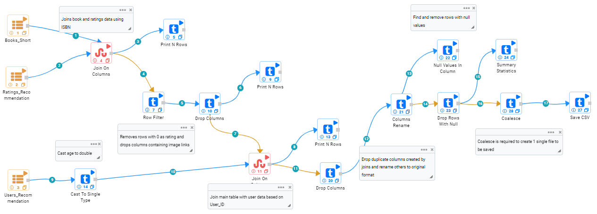
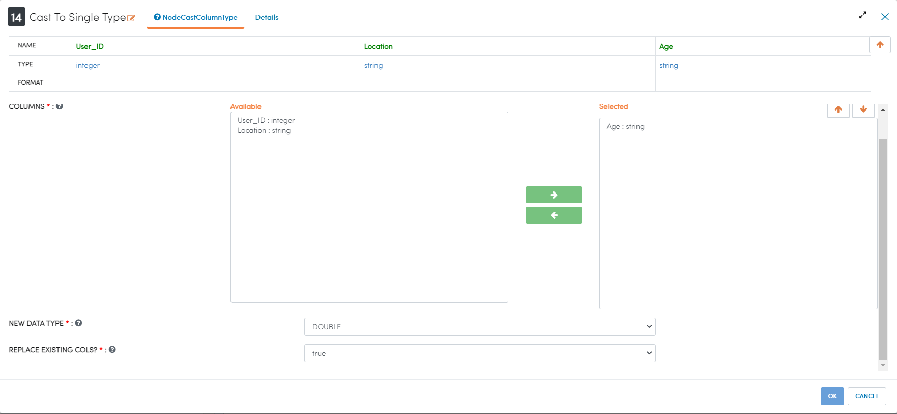
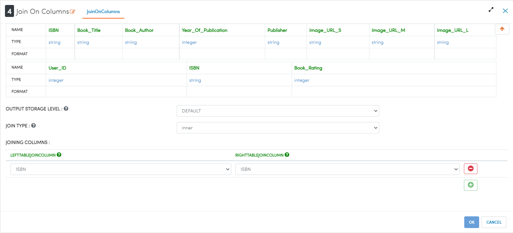
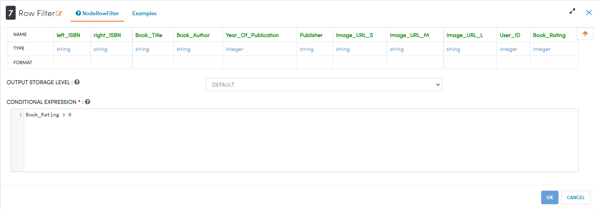
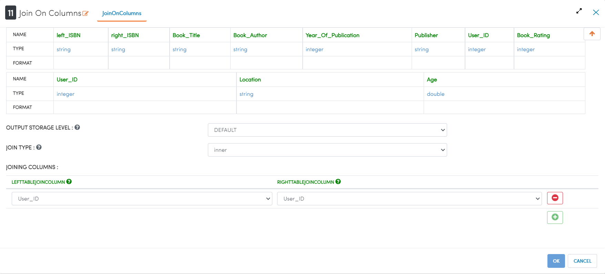
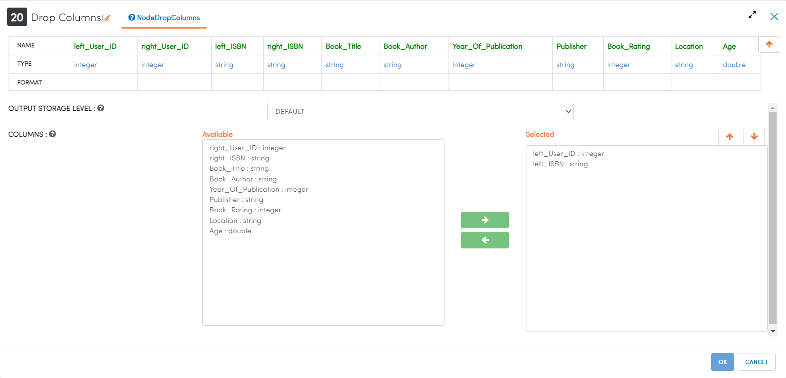
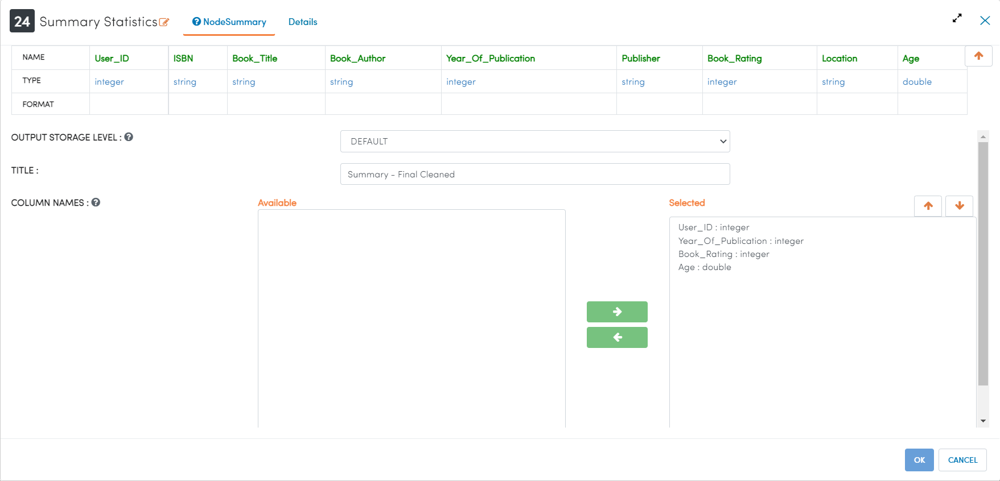
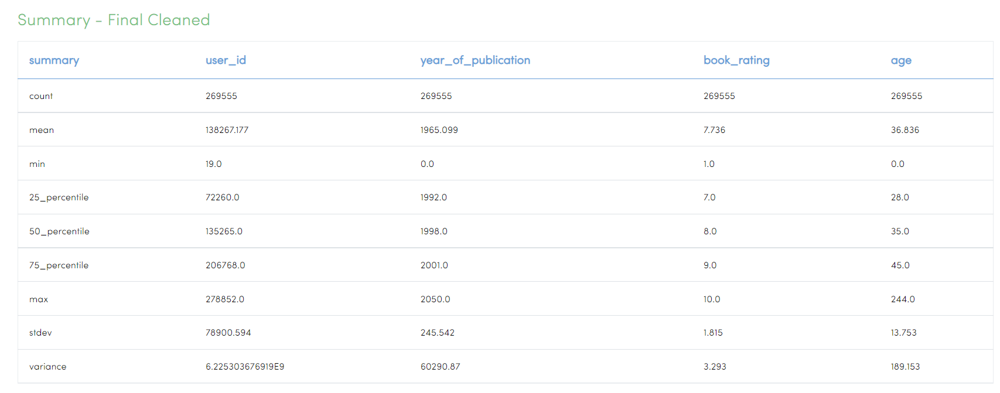
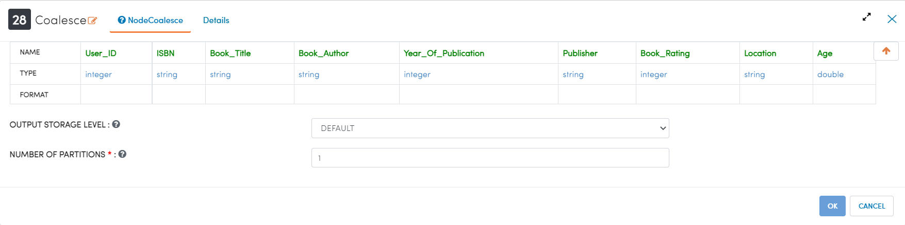
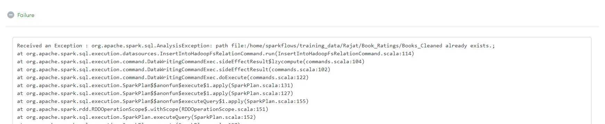

Data Cleaning Book Recommendations
=================================

This tutorial will cover how to clean data related to book sales. The data has been taken from Kaggle courtesy of the BookCrossing project.  

.. contents::
   :depth: 2

Workflow Overview
-------------------
The below workflow: 

* Casts a string columns to a double type column.
* Joins the Books and Ratings datasets.
* Filters out rows that will be detrimental to modelling.
* Joins the Users with other datasets.
* Drops unnecessary columns.
* Calculates summary statistics.
* Coalesces data for export.
* Saves data to HDFS for later use.

   
Casting String to Double
----------------------------
We use the ``Cast to Single Type`` processor to cast the selected columns to a different data type. In this case we are using this processor to a correct an issue with our data ingest, and casting the Age column from a string type to a double type. 

Processor Configuration
^^^^^^^^^^^^^^^^^^^^^^^^

   
   
Joining Books and Ratings Datasets
--------------------------------------------
We use the ``Join on Columns`` processor to create a new dataset from 2 other datasets using SQL-style joins. In this case we are using an inner join to only capture the intersection of the 2 datasets. 

Processor Configuration
^^^^^^^^^^^^^^^^^^^^^^^^

   
   
Filtering Rows
-------------------
We use the ``Row Filter`` to filter out rows based on a conditional statement. In this dataset a zero ratings can represent either an implicit or explicit ratings. Since there is no way to split these 2 sources, zero ratings introduce ambiguity in the dataset. In order to preserve data quality and not hinder model performance we remove zero ratings. 

Processor Configuration
^^^^^^^^^^^^^^^^^^^^^^^^

   
   
Joining Users and Other Datasets
----------------------------------
We use the ``Join on Columns`` processor to create a new dataset from 2 other datasets using SQL-style joins. In this case we are using an inner join to only capture the intersection of the 2 datasets. 

Processor Configuration
^^^^^^^^^^^^^^^^^^^^^^^^

   
   
Dropping Useless Columns
--------------------------
We use the ``Drop Columns`` processor to remove columns from the dataset. Due to the implementation of joins in Spark, when using an inner join, duplicate columns may be created that should be removed. 

Processor Configuration
^^^^^^^^^^^^^^^^^^^^^^^^

   
   
Calculating Summary Statistics
---------------------------------

We use the ``Summary Statistics`` processor to calculate basic summary statistics about the selected numeric columns. After joining multiple datasets and transforming datasets, it is always prudent to spot check the basline statistics of the final dataset. In the case of joins it is especially important to pay attention to the count of rows in each columns to make sure they are equivelant for modelling. 

Processor Configuration
^^^^^^^^^^^^^^^^^^^^^^^^^

   
Processor Output
^^^^^^^^^^^^^^^^^

   
   
Coalesce Data
----------------
We use the ``Coalesce`` processor with 1 partition to create a single dataset in storage prior to export. Due to the way Spark distributes data for processing, it is necessary to coalesce the data before export to create a single data file. If ``Coalesce`` is not used, the data will be split into multiple data files during export. 

Processor Configuration
^^^^^^^^^^^^^^^^^^^^^^^^

   
   
Saving Data to CSV
---------------------

We use the ``Save CSV`` to save the dataset to the HDFS as a CSV file. An important option is the Save Mode, which tells the processor what to do if a file with the same name already exists in the specified location. This is especially important when a workflow is expected to be executed multiple times and for version control. In this case the workflow has been executed in the past and we do not want the saved file to be overwritten, so we use the ErrorIfExists save mode to intentionally error out the workflow when it reaches this stage. 

Processor Configuration
^^^^^^^^^^^^^^^^^^^^^^^^^

.. figure:: ../../../_assets/tutorials/data-engineering/books-recommendations/BDP_Save_Config.PNG
   :alt: titanic-data-cleaning
   :width: 90%

   
Processor Output
^^^^^^^^^^^^^^^^^

