Data Exploration
================

This tutorial will cover how to explore data related to book sales. The data has been taken from Kaggle courtesy of the BookCrossing project. 

.. contents::
   :depth: 2

Exploring Books Dataset
-------------------------

The below workflow: 

* Graphs the distribution of books by the year published
* Calculates the cardinality of the string columns

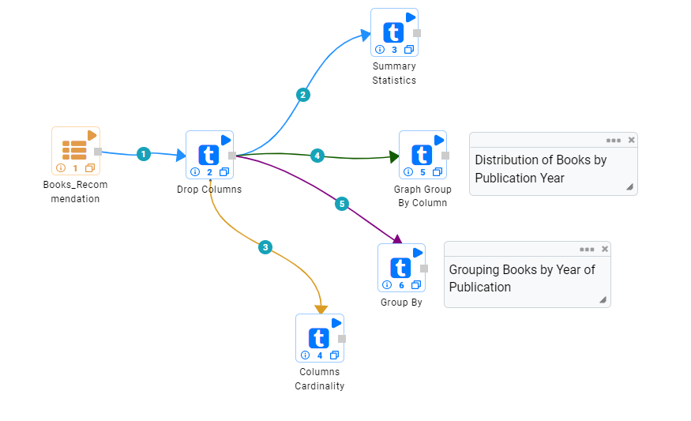
   

Grouping Books by Year Published
-----------------------------------

We use the ``Graph Group by Column`` processor to visually gauge the profile of our data. 

Processor Configuration
^^^^^^^^^^^^^^^^^^^^^^^^^

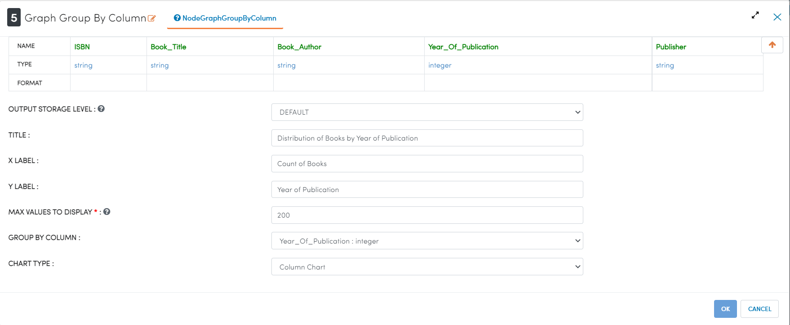

   
Processor Output
^^^^^^^^^^^^^^^^^

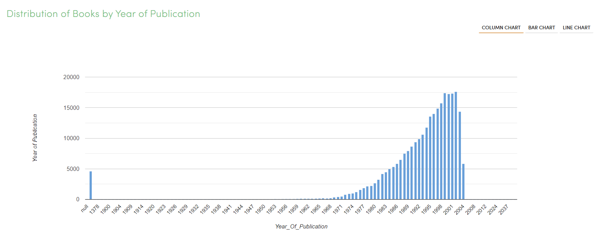

   
Columns Cardinality
-----------------------

We use the ``Columns Cardinality`` node to find the number of unique values in a string variable. In this case we are using cardinality to gauge the relationship between publishers, authors, and books. We can see that publishers on average publish 14 books, while authors on average write 2.4 books. 

Processor Configuration
^^^^^^^^^^^^^^^^^^^^^^^^^

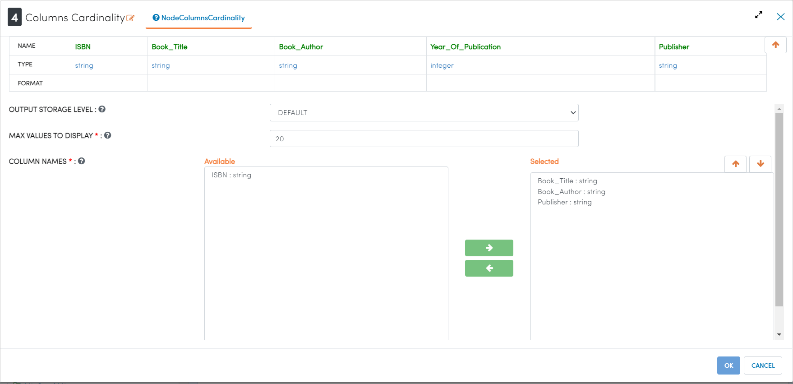

   
Processor Output
^^^^^^^^^^^^^^^^^

.. figure:: ../../../_assets/tutorials/data-engineering/books-recommendations/BE_Cardinality_Output.PNG
   :alt: titanic-data-cleaning
   :width: 90%

Exploring Users Dataset
------------------------
The below workflow: 

* Graphs a count of the users grouped by age
* Finds the number of NULL values in each column

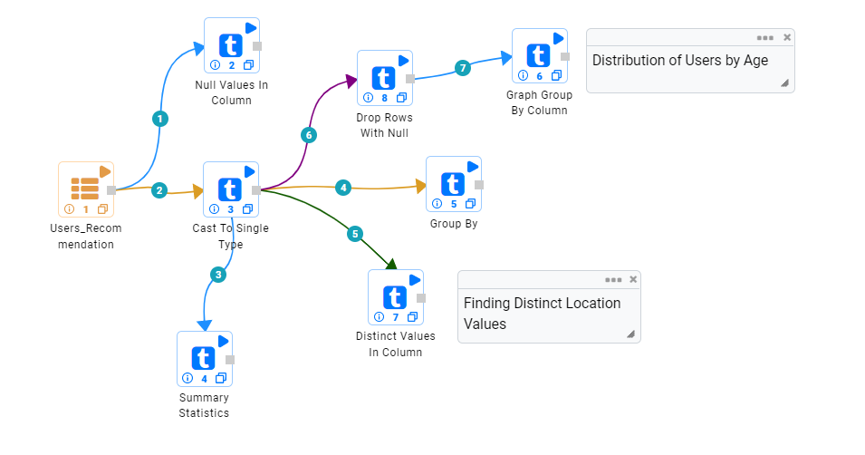
   

Grouping Users by Age
------------------------

We use the ``Graph Group by Column`` processor to visually gauge the profile of our data. 

Processor Configuration
^^^^^^^^^^^^^^^^^^^^^^^^^

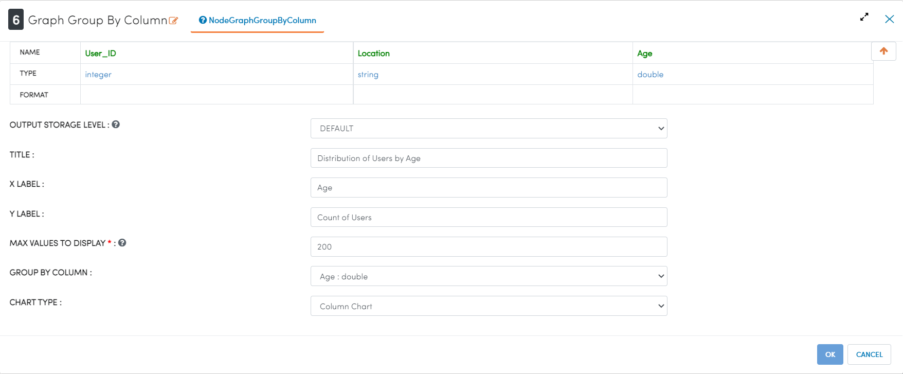

   
Processor Output
^^^^^^^^^^^^^^^^^

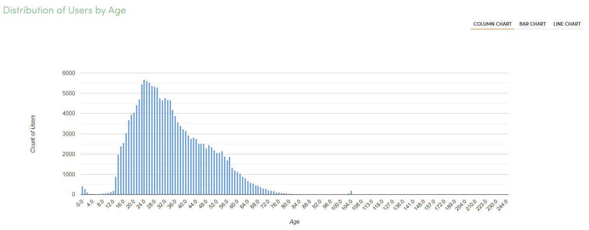

   
Finding Number of NULL Values in Columns
----------------------

We use the ``Null Values in Column`` processor counts the number and percentage of NULL values in the selected columns. In this case we can see that the Age column has a significant number of NULL values that will need to be dealt with in successive data cleaning steps. 

Processor Configuration
^^^^^^^^^^^^^^^^^^^^^^^^^

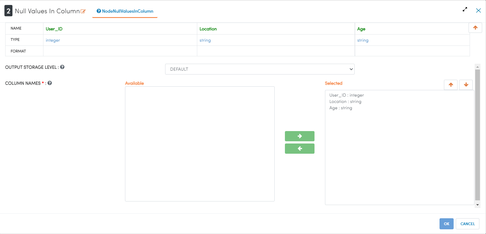

   
Processor Output
^^^^^^^^^^^^^^^^^

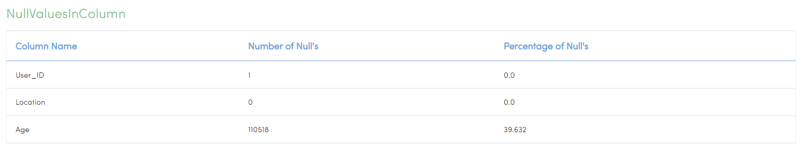

Exploring Ratings Dataset
-------------------
The below workflow: 

* Graphs the distribution of reviews by rating, excluding the zero rating
* Prints a sample of the dataset out

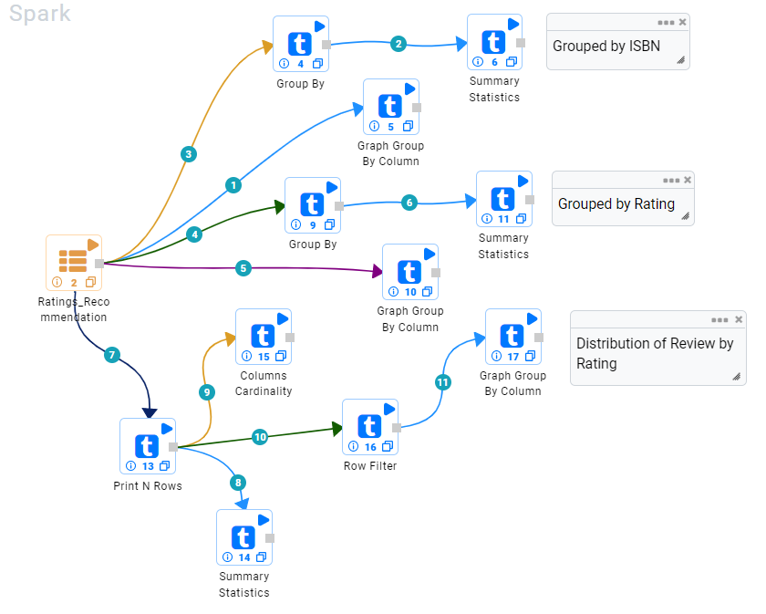
   

Grouping Reviews by Rating
------------------------------

We use the ``Graph Group by Column`` processor to visually gauge the profile of our data. 

Processor Configuration
^^^^^^^^^^^^^^^^^^^^^^^^^

.. figure:: ../../../_assets/tutorials/data-engineering/books-recommendations/RE_Graph_Group_Config.PNG
   :alt: titanic-data-cleaning
   :width: 90%

   
Processor Output
^^^^^^^^^^^^^^^^^

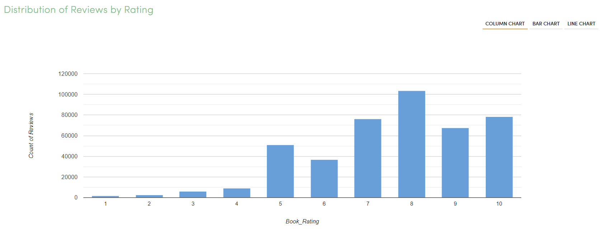

   
Printing Row Values
-----------------------

We use the ``Print N Rows`` to print a sample of the data for inspection. An important thing to note is that while an ISBN is usually a numeric, there are some books which are identified by an ISBN which is alphanumeric in nature. This is important to know for data modelling, because many models require only numeric values. 

Processor Configuration
^^^^^^^^^^^^^^^^^^^^^^^^^

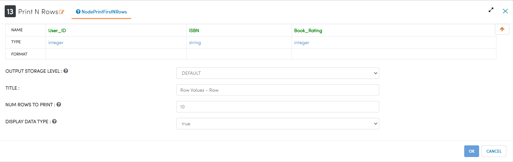

   
Processor Output
^^^^^^^^^^^^^^^^^

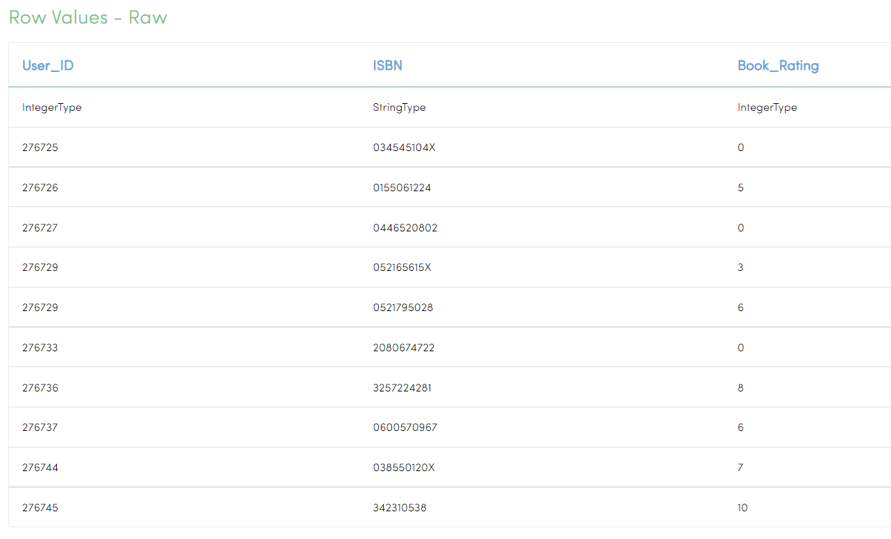
