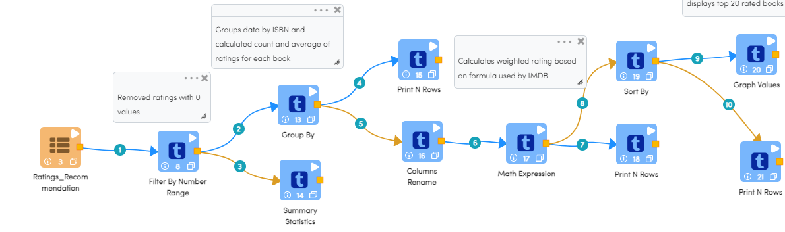
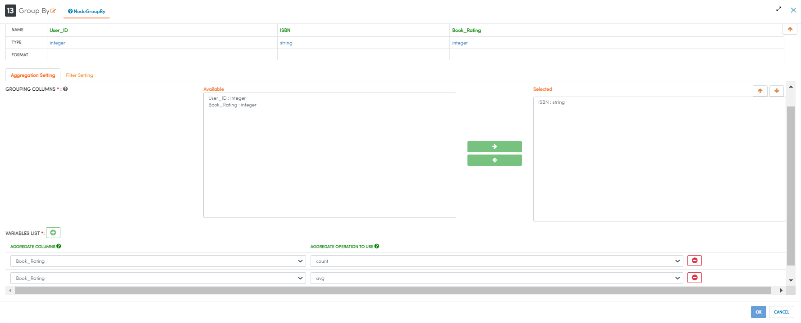
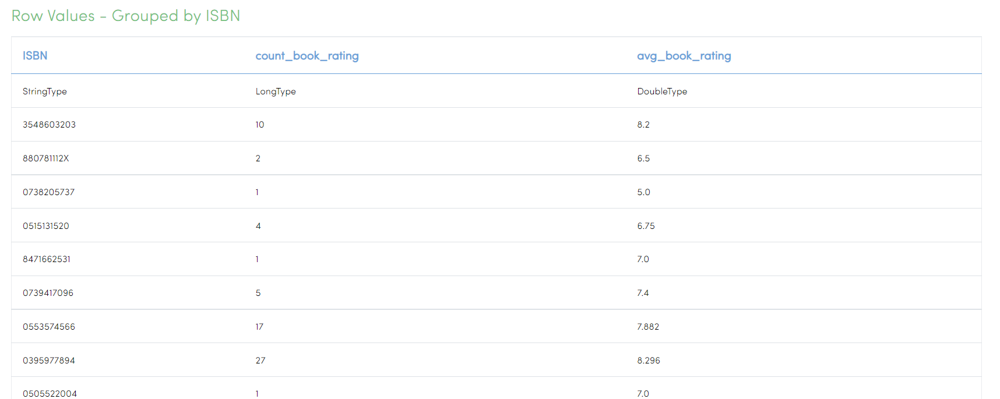
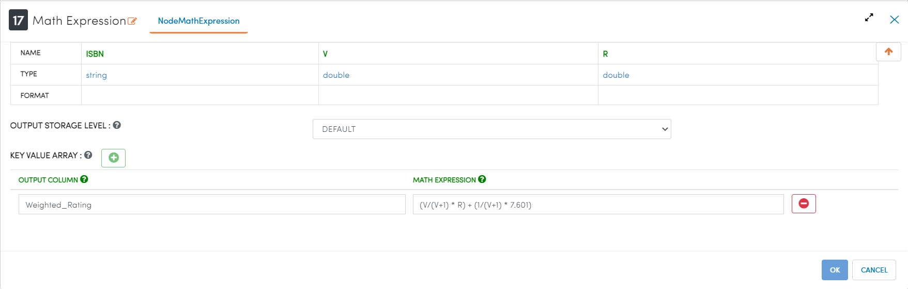
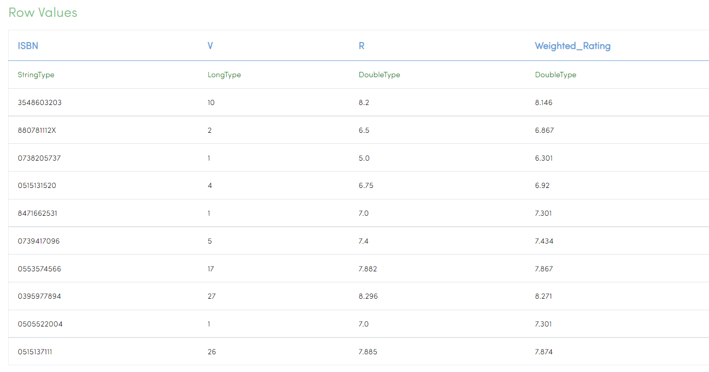
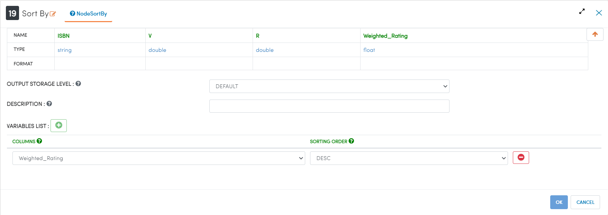
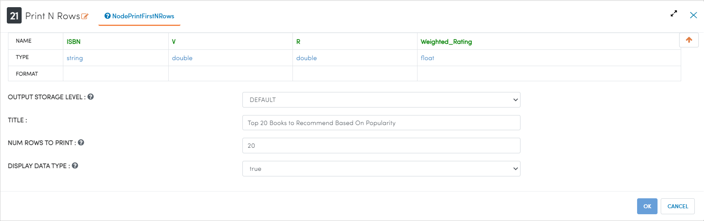

End-to-End Book Recommendations
*********************************

This tutorial will cover how to explore, clean, and model data related to book sales. The data has been taken from Kaggle courtesy of the BookCrossing project. 

The data for this project is split into 3 datasets. One dataset contains data related to the users, one dataset contains data related to the books, and the final dataset contains all of the user-generated ratings of the books. 

To more accurately represent how data analysis would be done in Sparkflows, different tasks have been split up into different workflows. This keeps the project more organized, allows for more expansion in the future, and will provide performance benefits during testing and execution. 

.. contents::
   :depth: 2

Data Modelling
******************

Modelling Books Dataset
-------------------------
The below workflow: 

* Graphs the distribution of books by the year published
* Calculates the cardinality of the string columns

   

Grouping Ratings by ISBN
-----------------------------------

We use the ``Graph Group by Column`` processor to visually gauge the profile of our data. 

Processor Configuration
^^^^^^^^^^^^^^^^^^^^^^^^^

   
Processor Output
^^^^^^^^^^^^^^^^^

   
Calculating Weighted Ratings
-----------------------

We use the ``Columns Cardinality`` node to find the number of unique values in a string variable. In this case we are using cardinality to gauge the relationship between publishers, authors, and books. We can see that publishers on average publish 14 books, while authors on average write 2.4 books. 

Processor Configuration
^^^^^^^^^^^^^^^^^^^^^^^^^

   
Processor Output
^^^^^^^^^^^^^^^^^

Sorting Books by Weighted Ratings
------------------------

We use the ``Graph Group by Column`` processor to visually gauge the profile of our data. 

Processor Configuration
^^^^^^^^^^^^^^^^^^^^^^^^^

   
Printing Top 20 Books to Recommend
----------------------

We use the ``Null Values in Column`` processor counts the number and percentage of NULL values in the selected columns. In this case we can see that the Age column has a significant number of NULL values that will need to be dealt with in successive data cleaning steps. 

Processor Configuration
^^^^^^^^^^^^^^^^^^^^^^^^^

   
Processor Output
^^^^^^^^^^^^^^^^^

.. figure:: ../../../_assets/tutorials/data-engineering/books-recommendations/BRP_Print_Output.PNG
   :alt: titanic-data-cleaning
   :width: 90%

