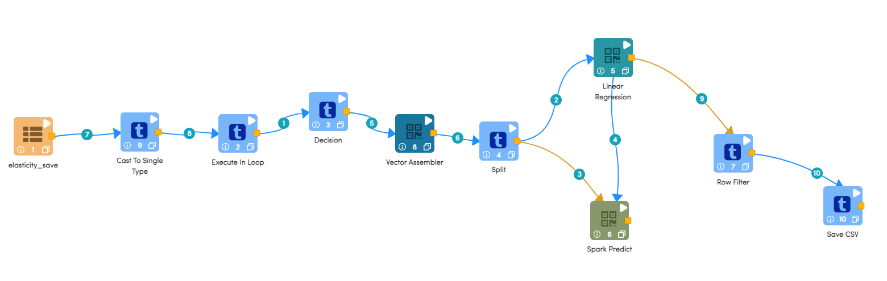
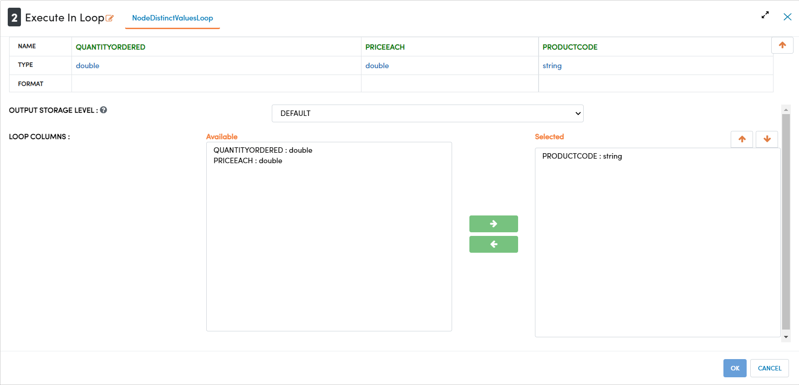
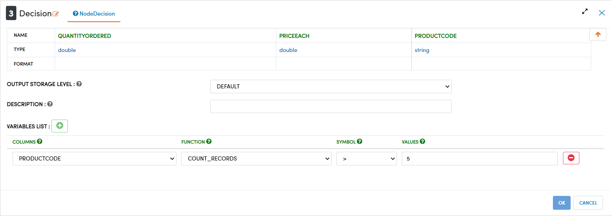
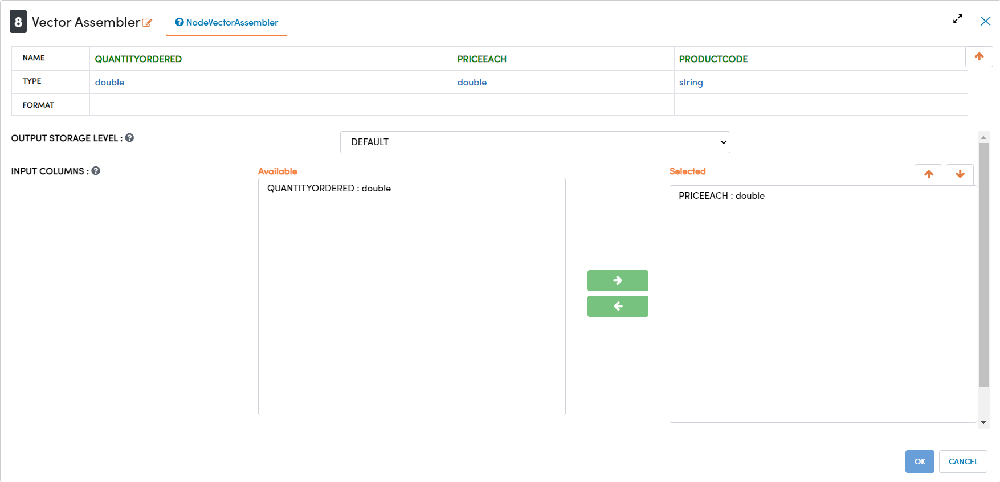
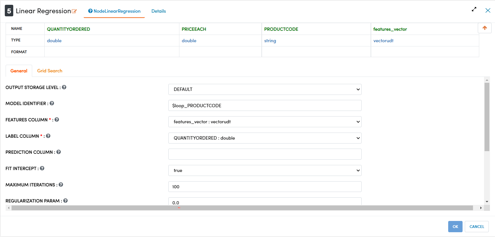
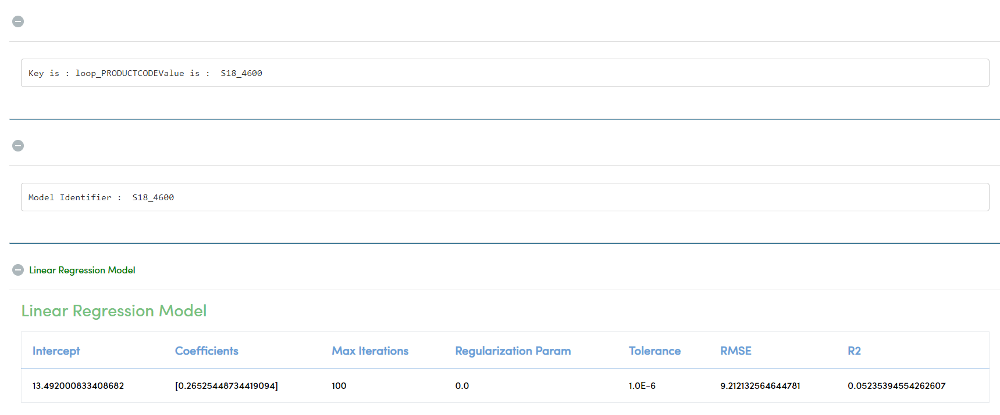
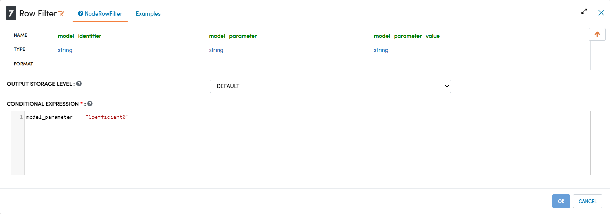
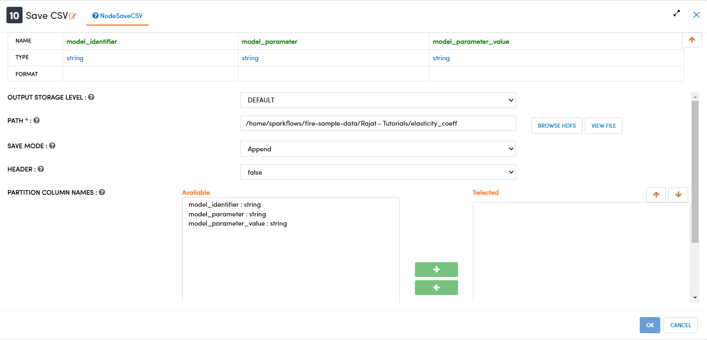

Data Modelling - Price Elasticity
=================================

This tutorial will cover how to model price elasticity using an example sales data. The data has been taken from Kaggle courtesy of Assert Solutions.  

.. contents::
   :depth: 2

Workflow Overview
-------------------
The below workflow: 

* Creates a loop to create models for each Product Code
* Filters the data based on the number of records for each Product Code
* Assembles features for modelling
* Builds a linear regression model to find price elasticity
* Filters model results to remove unecesary data
* Saves the model results to CSV

   
Creating Loop
----------------------------
We use the ``Cast to Single Type`` processor to cast the selected columns to a different data type. In this case we are using this processor to a correct an issue with our data ingest, and casting the Age column from a string type to a double type. 

Processor Configuration
^^^^^^^^^^^^^^^^^^^^^^^^

   
   
Filter Product Code by Count
--------------------------------------------
We use the ``Join on Columns`` processor to create a new dataset from 2 other datasets using SQL-style joins. In this case we are using an inner join to only capture the intersection of the 2 datasets. 

Processor Configuration
^^^^^^^^^^^^^^^^^^^^^^^^

   
   
Assembling Features for Modelling
-------------------
We use the ``Row Filter`` to filter out rows based on a conditional statement. In this dataset a zero ratings can represent either an implicit or explicit ratings. Since there is no way to split these 2 sources, zero ratings introduce ambiguity in the dataset. In order to preserve data quality and not hinder model performance we remove zero ratings. 

Processor Configuration
^^^^^^^^^^^^^^^^^^^^^^^^

   
   
Building the Linear Regression Model
----------------------------------
We use the ``Join on Columns`` processor to create a new dataset from 2 other datasets using SQL-style joins. In this case we are using an inner join to only capture the intersection of the 2 datasets. 

Processor Configuration
^^^^^^^^^^^^^^^^^^^^^^^^

   
   
Processor Output
^^^^^^^^^^^^^^^^^^^^^^^^

   
   
Dropping Unnecessary Data for Export
--------------------------
We use the ``Drop Columns`` processor to remove columns from the dataset. Due to the implementation of joins in Spark, when using an inner join, duplicate columns may be created that should be removed. 

Processor Configuration
^^^^^^^^^^^^^^^^^^^^^^^^

   
   
   
Saving Data to CSV
---------------------

We use the ``Save CSV`` to save the dataset to the HDFS as a CSV file. An important option is the Save Mode, which tells the processor what to do if a file with the same name already exists in the specified location. This is especially important when a workflow is expected to be executed multiple times and for version control. In this case the workflow has been executed in the past and we do not want the saved file to be overwritten, so we use the ErrorIfExists save mode to intentionally error out the workflow when it reaches this stage. 

Processor Configuration
^^^^^^^^^^^^^^^^^^^^^^^^^

