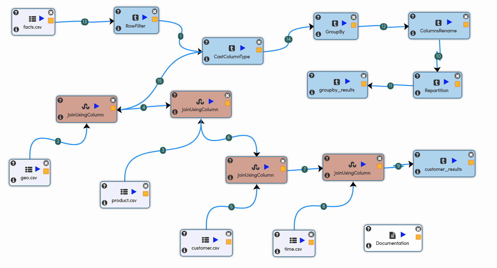

ETL Workflow
------------

In this tutorial we would build an ETL Workflow.

We would take the transaction dataset, clean it and then join it with other dimensional datasets.

We would finally save the results into CSV files.

The steps involved in creating a workflow are:

- Go to Create New Workflow
- Click on the nodes on the LHS to create them in the workflow canvas
- Connect the nodes
- Save the workflow

Workflow
========

