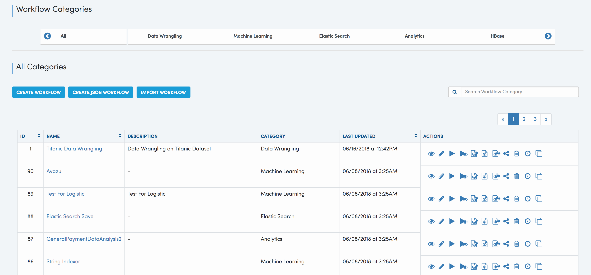
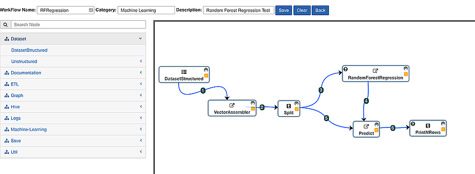

Creating Workflows
------------------

Sparkflows enables users to define end-to-end workflows for data pipelining leveraging pre-packaged nodes for common ETL and Machine Learning models. Workflows are then saved and executed to produce results. Sparkflows provides a a very intuitive and user friendly editor to achieve the same.
 
**Selecting Nodes for Workflow Steps**
 
  * Workflows editor has a list of Nodes menu. Clicking on any of the Nodes creates it in the workspace.
 
**Creating Edges**
 
  * Nodes can be connected by edges.
 
**Deleting Edges**
 
  * Nodes can be deleted by double clicking on them.

**View, Edit, Execute Existing Worklows**

**Define New Workflows**

