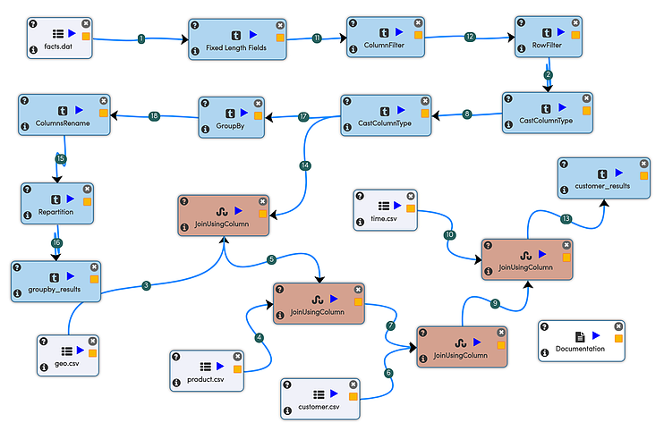

Joining Multiple Datasets
=========================

Fire Insights allows to quickly do very complex data preparation and ETL on Big Data.

Fire Insights has a number of features for enabling it including: 

- Data Cleaning 
- oins, GroupBy, Cube, SQL etc.
- Reading data from multiple sources and writing results to various sinks.

Fire Insights also gives you detailed control over your Spark jobs with Repartition, Coalesce, Cache etc.

Overview
---------

Here we started with 5 datasets, read them in & understand their schema in the process, perform data cleaning and then certain aggregations and joins.

The final results are written to HDFS as CSV files. They can as well we written as Parquet, Avro, JSON, XML files or to HIVE/Relational tables.

Datasets
--------

- facts.dat : Contains fixed length records of products sold to customers
- geo.csv : Contains mapping of geo ids to geo names  
- product.csv : Contains mapping of product ids to product names
- customer.csv : Contains mapping of customer ids to customer names
- time.csv : Contains mapping of various time interval ids to corresponding names 

Workflow
--------

The workflow achieves the following tasks: 

- Parses the facts data and performs various cleanup operations on it. 
- Performs groupby with aggregations operations and saves it to a file.  
- Joins the fact data with various dimensions to create a large table and saves it to a CSV file.

The workflow is shown below:

   
Data Parsing and Cleaning
--------------------------

While the various dimension data is available as CSV files, the fact data is in fixed field size format. 

Each record has a fixed number of characters. In each record each field consists of fixed number of characters. The steps for data parsing and cleaning are as follows: 

- Read in the fixed length record
- Filter out invalid records
- Cast some columns to numeric values 

Group By and Aggregates
-----------------------

The data is then aggregated and counted and averages calculated. It is then saved as CSV file.

Joins with various Dimension Data
---------------------------------

The fact data is then joined with various dimension data. These include: 

- Geo  
- Product  
- Customer  
- Time 

The final dataset is saved as CSV file.
   
   

