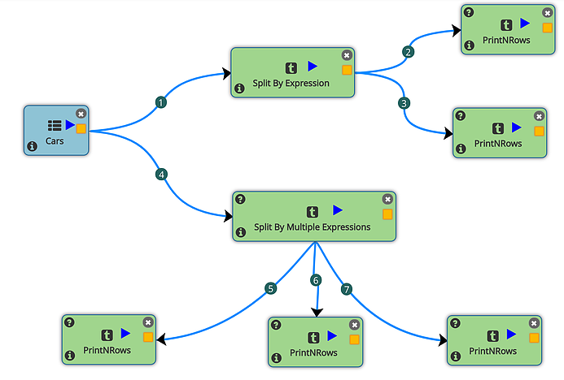
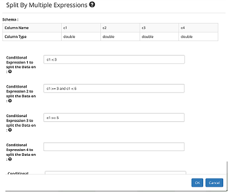
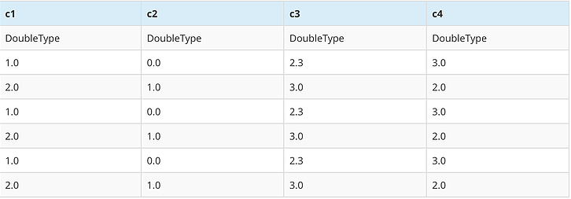
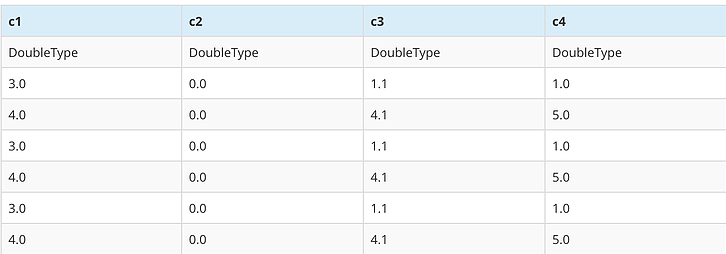
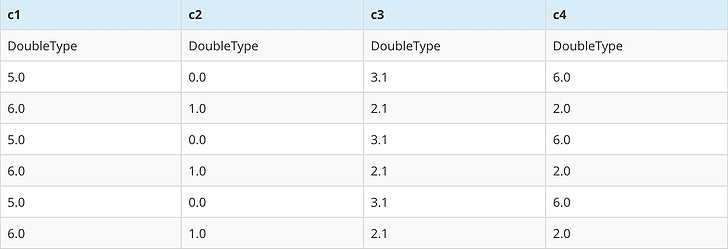

Split Dataset By Expression
===========================

In Fire Insights you can split the incoming DataFrame. Based on your need, use the processors descripbed below: 

- 'SplitByExpression': This processor splits the incoming dataset based on an expression. Rows satisfying the expression go into one dataframe and the rest go into another dataframe.
- 'SplitByMultipleExpressions': This processor splits the incoming dataset into multiple dataframes based on up to five conditional expressions.The output of each expression is routed to a separate output path.
- 'Split': This processor splits the incoming dataframe into two based on the percentage specified for the split. Split processor is especially useful in machine learning workflows.

Workflow
--------

   
   
In the example workflow above, 'Split By Multiple Expressions' processor splits the incoming dataframe into 3 output dataframes. As mentioned earlier, 'SplitByMultipleExpressions' can split incoming dataframe into up to five dataframes. 

   
Output
------

For the example workflow, the three output dataframes are shown below:

   

