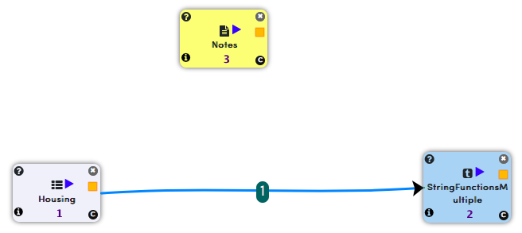

String Functions
================

String functions are useful to tranform strings in your dataframe. The "StringFunction" processors allows you to apply common string operations such as 'trim', 'upper', 'lower', 'lefttrim', 'righttrim' etc. to strings.

In the example below, different string functions are applied to input dataset.

Workflow
--------

The example workflow below, read data from HDFS/Hive and applies different string functions on different columns of the dataset.

   
Read data from HDFS
-------------------

The "Housing" processor above, reads an existing dataset on HDFS.

Processor Configuration
^^^^^^^^^^^^^^^^^^^^^^^

.. figure:: ../../_assets/tutorials/etl/string-functions-multiple/2.png
   :alt: String Functions Multiple
   :align: center
   :width: 60%

Processor Output
^^^^^^^^^^^^^^^^

.. figure:: ../../_assets/tutorials/etl/string-functions-multiple/3.png
   :alt: String Functions Multiple
   :align: center
   :width: 60%

Apply string functions
----------------------

The 'StringFunctionMultiple' processor below, converts contents of 'driveway' column to upper case and trims contents of 'gashw' column.

Processor Configuration
^^^^^^^^^^^^^^^^^^^^^^^

.. figure:: ../../_assets/tutorials/etl/string-functions-multiple/4.png
   :alt: String Functions Multiple
   :align: center
   :width: 604
   
Processor Output
^^^^^^^^^^^^^^^^

.. figure:: ../../_assets/tutorials/etl/string-functions-multiple/5.png
   :alt: String Functions Multiple
   :align: center
   :width: 60%
   
   
   
   
