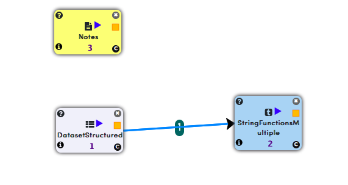

string-functions-multiple.rst
=============================

This example shows how we can apply different string functions on input dataset.

workflow
--------

Below is the workflow which does the following:

* Reads structuted data.
* Applies different string functions on different columns in dataset.

