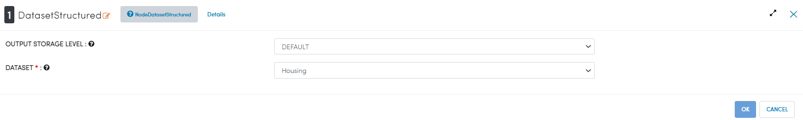
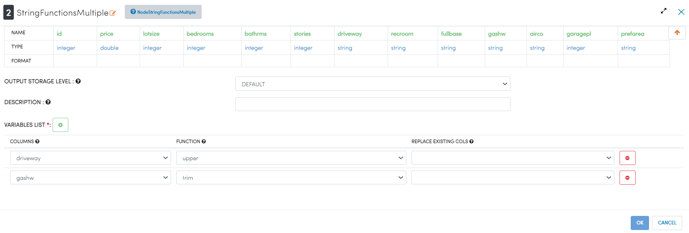

String Functions
================

This example shows how we can apply different string functions on input dataset.

Workflow
--------

Below is the workflow which does the following:

* Reads data from hdfs/hive etc.
* Applies different string functions on different columns in dataset.

.. figure:: ../../_assets/tutorials/etl/string-functions-multiple/1a.png
   :alt: String Functions Multiple
   :align: center
   :width: 60%
   
Read data from HDFS
-------------------

It reads data from the existing dataset on HDFS.

Processor Configuration
^^^^^^^^^^^^^^^^^^^^^^^

Processor Output
^^^^^^^^^^^^^^^^

Apply string functions
----------------------

It applies different string functions like upper,trim etc on selected columns.

Processor Configuration
^^^^^^^^^^^^^^^^^^^^^^^

   
Processor Output
^^^^^^^^^^^^^^^^

   
   
   
   
