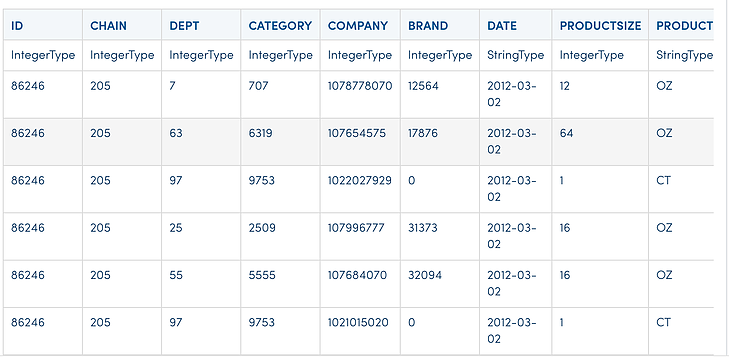
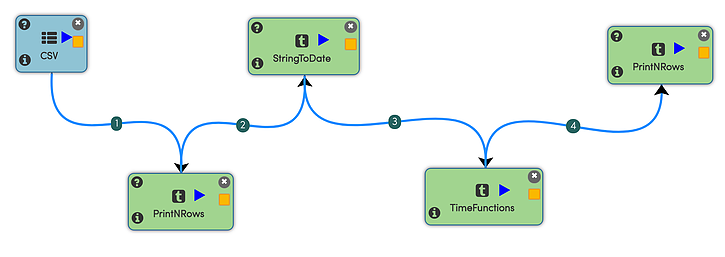
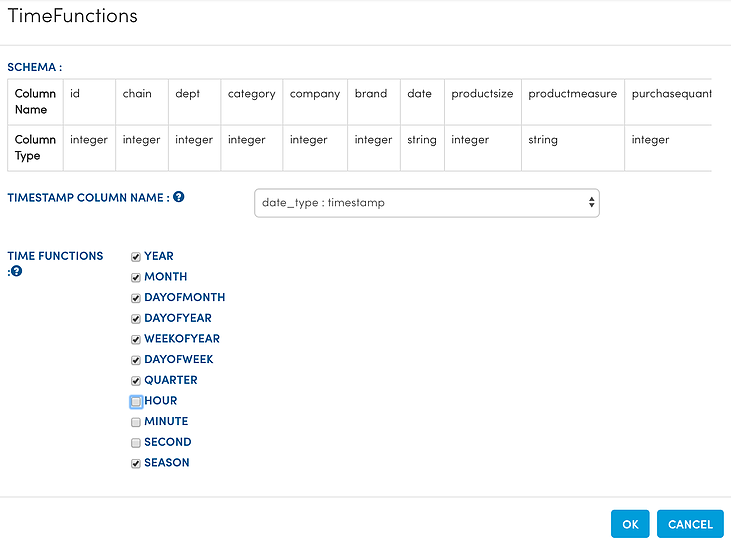

Time Function
=============

Date Time features with TimeFunctions Operator

There are many instances when we want to do time-series analysis.

Creating additional features from the timestamp column helps us to know more about the data and run modeling algorithms on them. Fire Insights has NodeTimeFunctions for creating these time series features.

Dataset
--------

Let us take a Transaction Dataset which is in CSV format on HDFS. The dataset has a date column.

   
Workflow for applying TimeFunctions
-----------------------------------

Below is the workflow for transforming the transaction dataset and creating additional date time features for the date column.

   
In the above workflow: 

- The 'CSV' Node reads in the CSV data from HDFS.
- The 'StringToDate' Node converts the column Date, which is in string format to 'timestamp'. 
- The 'TimeFunctions' Node takes in the timestamp column and then applies various timefunctions to it to generate additional output columns.

The below diagram shows the dialog box for the TimeFunctions Processor. We selected the timestamp column as the input, and various time functions to be applied to it.

   
   
Workflow Execution
------------------

When we execute the Workflow, below is the result produced. We have left out the initial list of columns in the Dataframe from the display below.

A number of additional columns are produced for the various time functions we selected.

.. figure:: ../../_assets/tutorials/dataset/31.PNG
   :alt: Dataset
   :align: center
   :width: 60%

