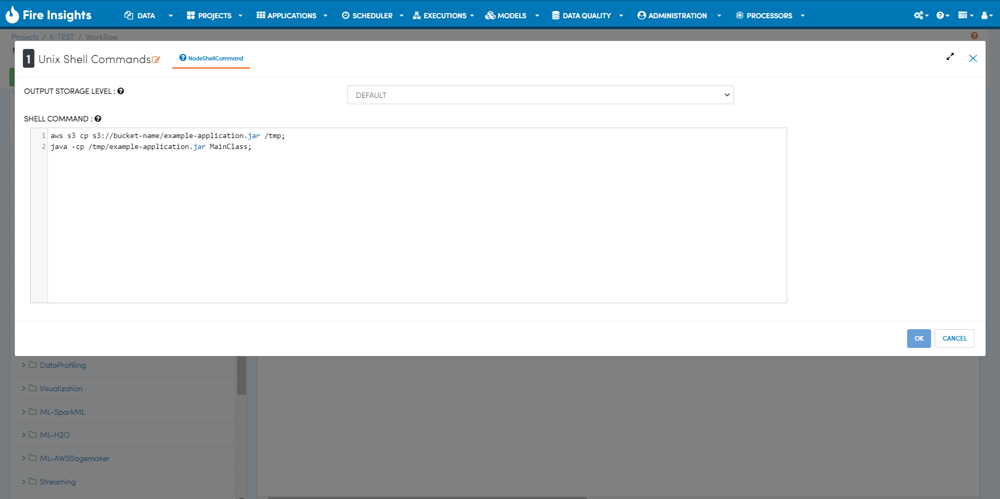

JAR File Execution Examples
-----------------------------------

Let's take a scenario where through CI or CD pipeline, the application JAR file is built successfully and pushed into the S3 bucket.

Below are steps to execute the JAR file:

Step 1: Copy Jar File from S3 Path to /tmp Directory.
====================================================
::
    
      aws s3 cp s3://bucket-name/example-application.jar /tmp
      
      
Step 2: Execute JAR File from /tmp Directory.
============================================
::
    
      java -cp /tmp/example-application.jar MainClass

  
  
In Sparkflows, both steps can be run with UnixShellCommands Node.

    
    
    
