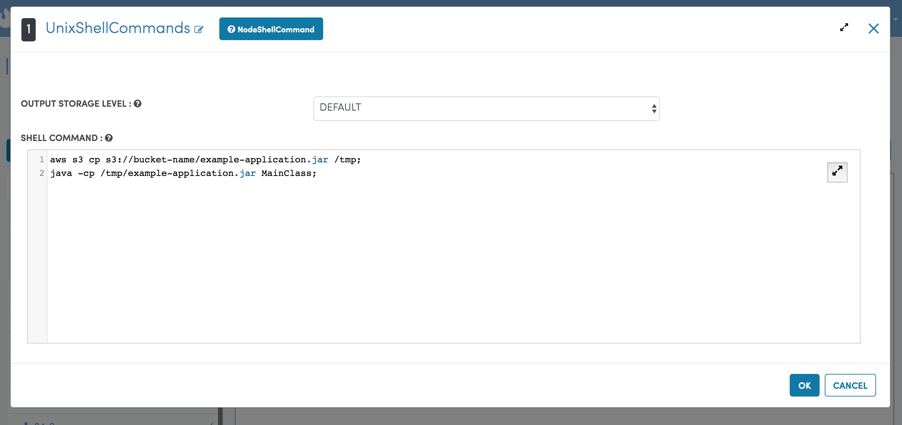

Jar File Execution Example in Fire
-----------------------------------

Let's take a scenario where through CI/CD pipeline, the application jar file is built successfully and pushed into the S3 bucket.

Below are steps to execute the jar file:

Step 1: Copy jar file from s3 path to /tmp directory.
====================================================
::
    
      aws s3 cp s3://bucket-name/example-application.jar /tmp
      
      
Step 2: Execute jar file from /tmp directory.
============================================
::
    
      java -cp /tmp/example-application.jar MainClass

   
In the fire, both steps can be run with UnixShellCommands Node.

    
    
    
