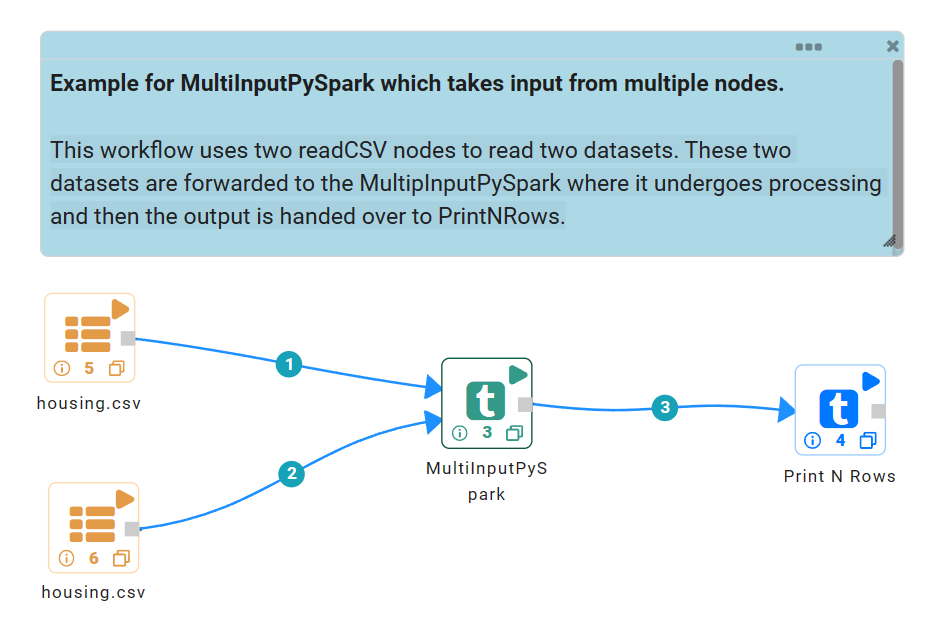
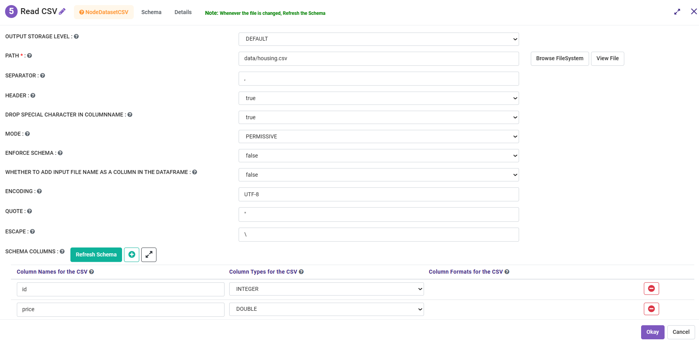
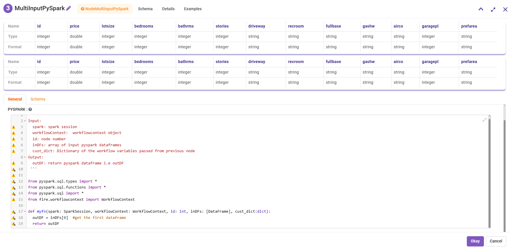

Multi-Input Pyspark Examples
==========================

This workflow reads in multiple datasets and passes them as inputs MultiInputpyspark node.

The below workflow:

* Reads the data.
* MultiInputPySpark node reads multiple input data and performs a join.
* Prints the result.

   
Reading CSV file
---------------------

MultiInputPySpark
---------------------
Custom code by using the multiple inputs.

Example code to join the 2 input DataFrame.

::

    from pyspark.sql.types import StringType
    from pyspark.sql.functions import *
    from pyspark.sql import *
    from fire.workflowcontext import WorkflowContext 
    
    def myfn(spark: SparkSession, workflowContext: WorkflowContext, id: int, inDFs:[DataFrame], cust_dict:dict):
      df1 = inDFs[0]  #get the first dataframe
      df2 = inDFs[1]	#get the second dataframe
      outdf = df1.join(df2, ['id'])
      return outdf
      

   
   

