Clustering Houses
=================

This workflow reads in a dataset. It then performs KMeans Clustering on the Housing Dataset.

Workflow
-------

Below is the workflow. It does the following:

* Reads data from a sample dataset.
* Prints the results.
* Assembles the features for predictions.
* Splits it.
* Perform KMeans Clustering.
* ML Model save.
* ML Model Load.
* Prediction.
* Print the prediction results.

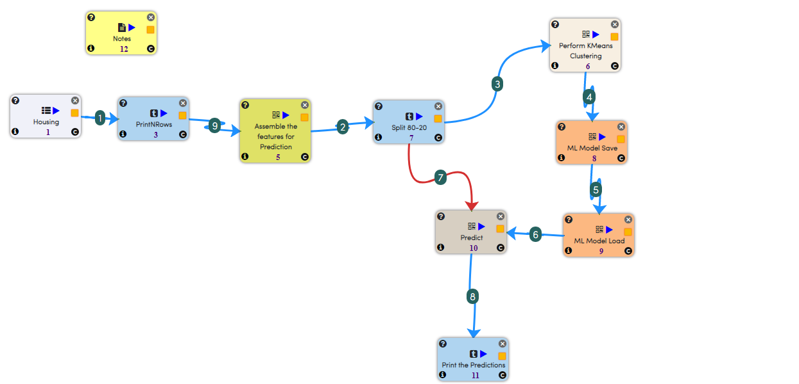

Reading from Dataset
---------------------

It reads sample Dataset file.

Processor Configuration
^^^^^^^^^^^^^^^^^^

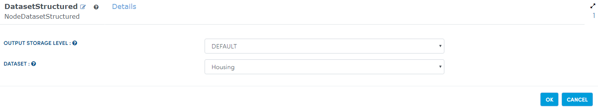
   
Processor Output
^^^^^^

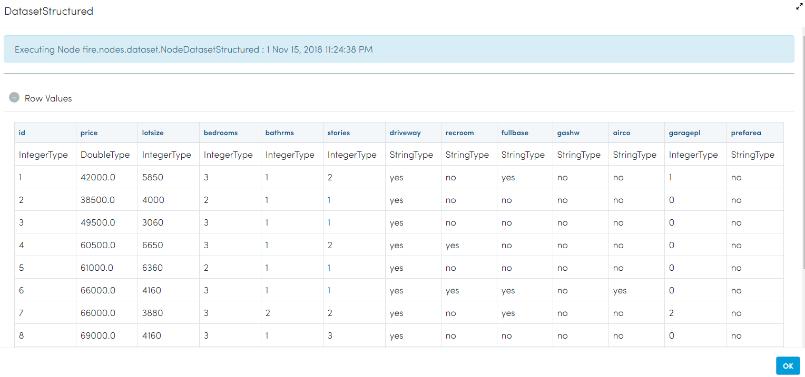
   
Prints the results
------------------

It prints the sample dataset file results.

Processor Configuration
^^^^^^^^^^^^^^^^^^

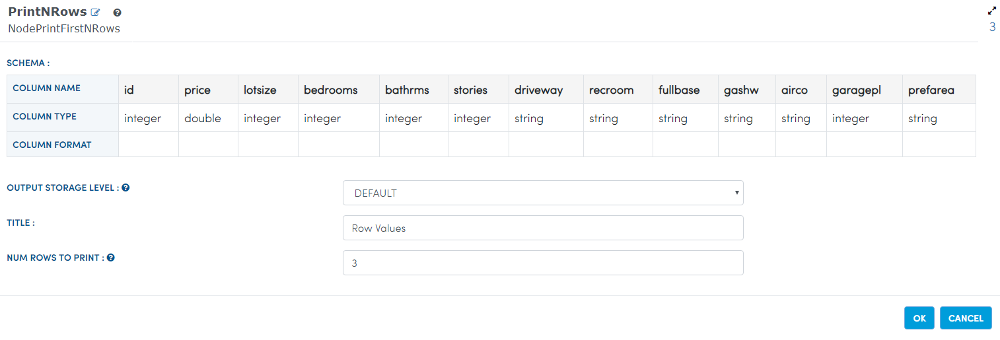
   
Processor Output
^^^^^^

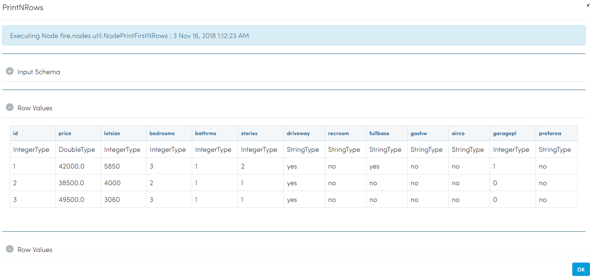
   
Assemble the features for predictions
-------------------------------------

It assembles the features for predictions using VectorAssembler Node.

Processor Configuration
^^^^^^^^^^^^^^^^^^

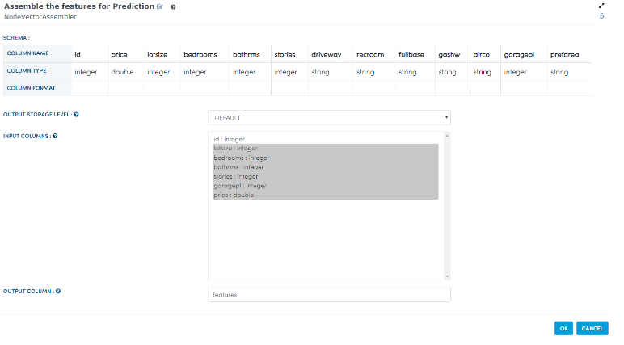
   
Processor Output
^^^^^^

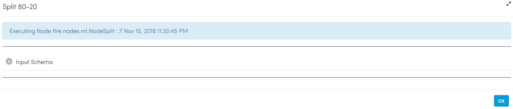
   
Split it
---------

It splits features of prediction using Split Node.

Processor Configuration
^^^^^^^^^^^^^^^^^^

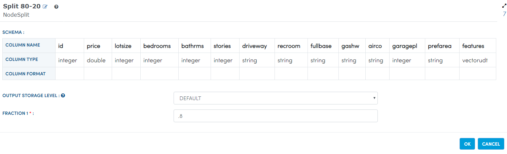
   
Processor Output
^^^^^^

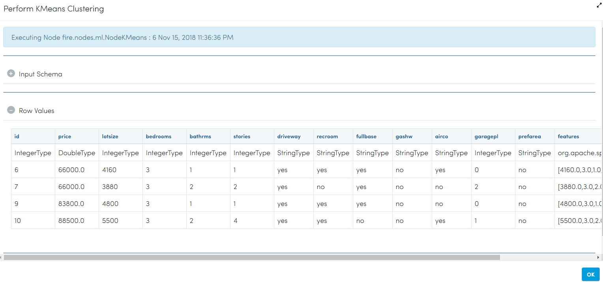
   
Perform KMeans Clustering
-------------------------

It performs KMeans Clustering on the Housing Dataset using KMeans Node.

Processor Configuration
^^^^^^^^^^^^^^^^^^

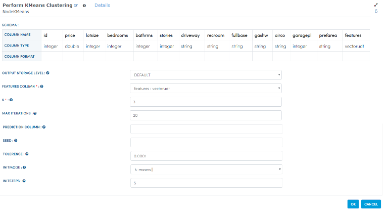
   
Processor Output
^^^^^^

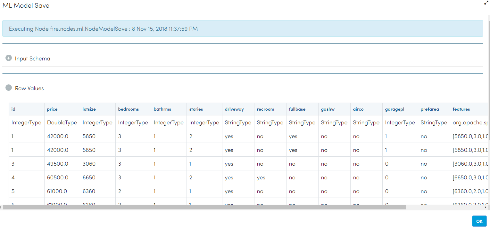
   
ML Model save
---------------

It will save ML Model with given path using ModelSave Node.

Processor Configuration
^^^^^^^^^^^^^^^^^^

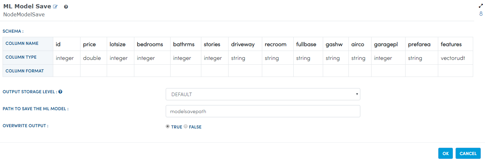
   
Processor Output
^^^^^^

.. figure:: ../../_assets/tutorials/machine-learning/clustering-houses/7a.PNG
   :alt: Clustering Houses
   :align: center
   :width: 60%
   
ML Model Load
--------------

It will Load ML Model with given path using ModelSave Node.

Processor Configuration
^^^^^^^^^^^^^^^^^^

.. figure:: ../../_assets/tutorials/machine-learning/clustering-houses/8.PNG
   :alt: Clustering Houses
   :align: center
   :width: 60%
   
Processor Output
^^^^^^

Prediction
-----------

It predicts features updated using Predict Node.

Processor Configuration
^^^^^^^^^^^^^^^^^^

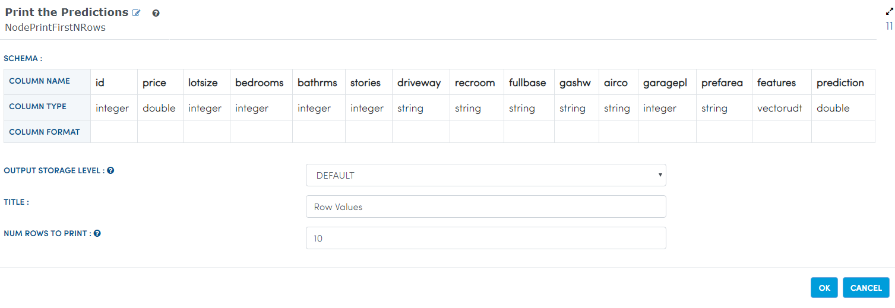
   
Processor Output
^^^^^^

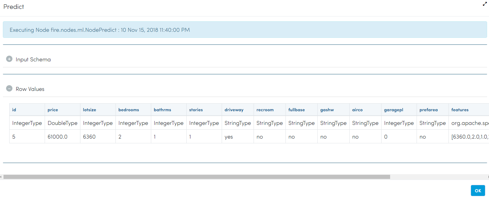
   
Print the prediction results
-----------------------------

It Print the prediction results.

Processor Configuration
^^^^^^^^^^^^^^^^^^

.. figure:: ../../_assets/tutorials/machine-learning/clustering-houses/10.PNG
   :alt: Clustering Houses
   :align: center
   :width: 60%
   
Processor Output
^^^^^^

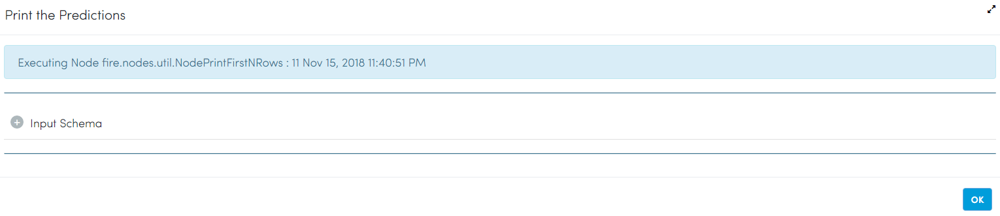
