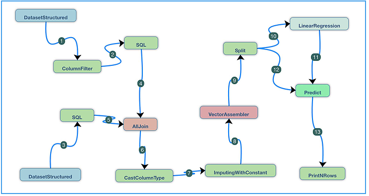
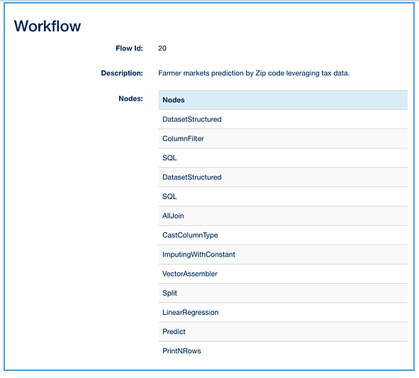
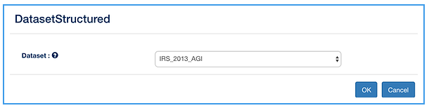
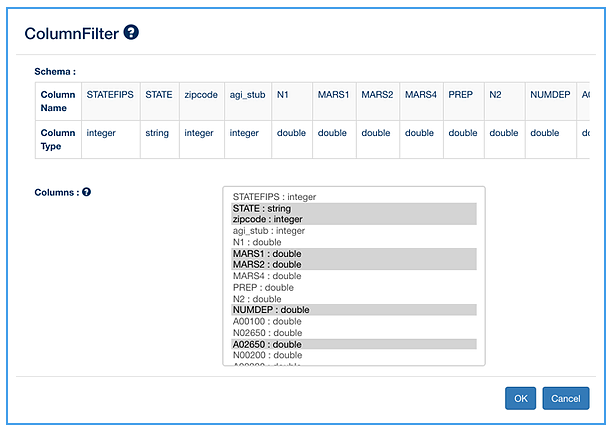
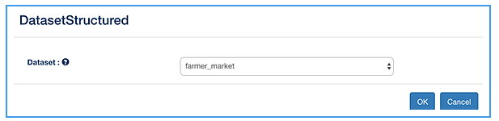
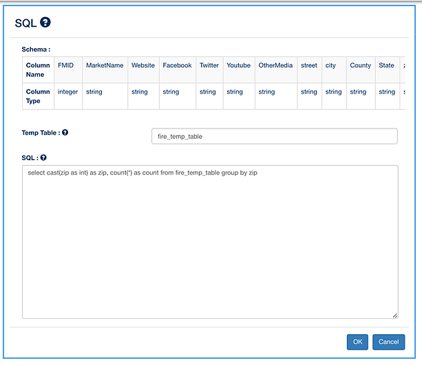
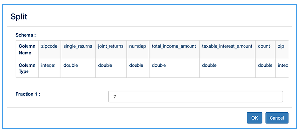
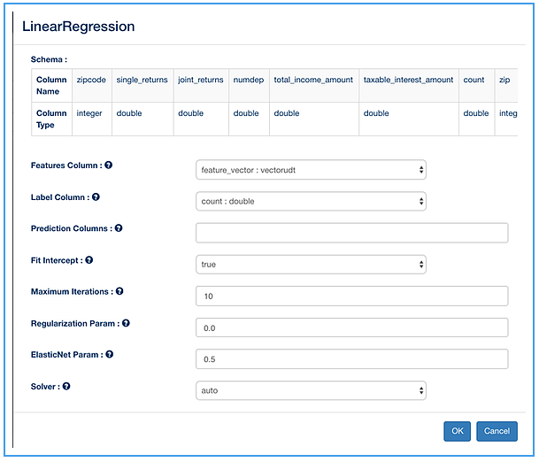
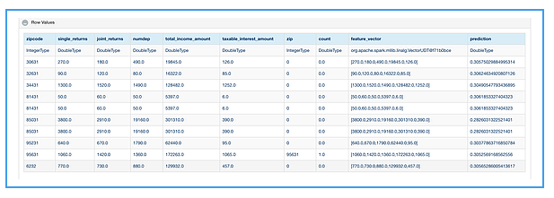

Farmers Market Prediction
=========================

It demonstrate to predict "the number of farmer's markets in a given zip code” based on the income and taxes paid in a given area using the past data.It seems plausible that areas with higher income have more farmer's markets simply because there is more of a market for those goods. Of course there are many potential holes in this idea, but that's part of the desire to test it.

DataBricks has published a clean approach to build this use case. It feature a Python notebook that demonstrates how to create ML Pipeline to preprocess a dataset, train a Machine Learning model, and make predictions.

Using Fire Insights visual designer, you can try to execute this approach visually and declaratively. This note speaks to that.

As the DataBricks link highlights:

- The first of the two datasets that you can work is the Farmers Markets Directory and Geographic Data. This dataset contains information on the longitude and latitude, state, address, name, and zip code of Farmers Markets in the United States. The raw data is published by the Department of Agriculture. The version on the data that is found in Databricks (and is used in this tutorial) was updated by the Department of Agriculture on Dec 01, 2015.

- The second you can work is the SOI Tax Stats - Individual Income Tax Statistics - ZIP Code Data (SOI). This study provides detailed tabulations of individual income tax return data at the state and ZIP code level and is provided by the IRS. This repository only has a sample of the data: 2013 and includes "AGI". The ZIP Code data show selected income and tax items classified by State, ZIP Code, and size of adjusted gross income. Data are based on individual income tax returns filed with the IRS and are available for Tax Years 1998, 2001, 2004 through 2013. The data include items, such as:

   - Number of returns, which approximates the number of households
   - Number of personal exemptions, which approximates the population
   - Adjusted gross income
   - Wages and salaries
   - Dividends before exclusion
   - Interest received

Below is an overview of the workflow. You can create using the Fire Insights Visual Designer.

This workflow was simply created via the drag and drop capabilities of the Fire Insightss Designer UI. This ability to construct this data processing pipeline (or any DAG - Distributed Acyclic Graph, for that matter) in a WYSIWYG Plug-and-Play manner is a key innovation to continue our community's collective march to on-demand-instant-analytics. Benefits include:

- It opens up the power of ETL and ML (such pre-packaged functionality is available as a catalog of "Nodes") to a wider audience of analysts and semi-technical resources.
- The actual execution can either be local (testing) or can be submitted to a Apache Spark cluster.
- You can see during the adoption that a single workbench improves collaborative iteration across data engineers, data scientists and analysts, which in turn accelerates time-to-market.
- As one might observe, the visual approach doubles up as workflow documentation and hence contributes to solving the data-lineage problem.

   
This workflow consists of the following steps:

- Using the DatasetStructured Nodes: Read in the data from 2 different datasets - Farmers_Markets and Income Tax Return Data per Zip Code (both comma separated files:
- Instead of a CSV, one can easily read it from a data-lake or a Persistence Store (HDFS/RDBMS/NoSQL).
- Using the ColumnFilter node: Filter out the following columns from the Income Tax Return dataset and pass it to a SQL query node, so we can do further computation.
  
  - State
  - Zipcode
  - MARS1 - Single Returns
  - MARS2 - Joint Returns
  - NUMDEP - Number of Dependents
  - A02650 - Tota Income Amount
  - A00300 - Taxable Interest Amount
  - A00900
  - A01000
  
- Using the SQL Node: Execute the following SQL to get the various aggregates from the filtered data from the Income Tax Return dataset
  
  - select zipcode, sum(MARS1) as single_returns, sum(MARS2) as joint_returns, sum(NUMDEP) as numdep, sum(A02650) as total_income_amount, sum(A00300) as taxable_interest_amount from fire_temp_table group by zipcode
  

- Using another SQL Node: Extract certain columns from the Farmers_Market dataset using the below SQL query:
  
  - select cast(zip as int) as zip, count(*) as count from fire_temp_table group by zip
  
- Using the AllJoin node - Join the two filtered datasets using the following query:
  
  - select  a.zipcode , a.single_returns, a.joint_returns, a.numdep, a.total_income_amount, a.taxable_interest_amount, b.count, b.zip from  fire_temp_table1 a LEFT OUTER JOIN fire_temp_table2 b ON(a.zipcode=b.zip)
  
- Using the CastColumnType Node - change the column type of the count column from Long to Double

- Using the ImputingWithConstant node, fill the blanks across all columns with constants.

- Using the VectorAssembler node, concatenate columns single_returns, joint_returns, numdep, total_income_amount, taxable_interest_amount into a feature vector feature_vector

- Using Split node: Split the dataset into (.7, .3)

  - 70% rows are used for training and 30% are used for prediction
  
- The model is evaluated based on how it predicts on the remaining 30%.

- Using the LinearRegression Node - Perform LinearRegression:

- This is a Spark MLLib provided algorithm that Sparkflows exposes to you as a plug-and-play “node”. LinearRegression from SparkML.
- Using Predict Node: Perform prediction using the model generated on the remaining 30% dataset
- Finally evaluate the result using the PrintNRows node.

   

First Dataset
--------------

Column Filter
-------------

   
SQL
---

.. figure:: ../../_assets/tutorials/machine-learning/farmer-market-prediction/5.PNG
   :alt: Fire Market Prediction
   :align: center
   :width: 60%
   
Second Dataset
--------------

   
SQL
---

   
AllJoin - Join the two datasets
-------------------------------

.. figure:: ../../_assets/tutorials/machine-learning/farmer-market-prediction/8.PNG
   :alt: Fire Market Prediction
   :align: center
   :width: 60%
   
CastColumnType
--------------

.. figure:: ../../_assets/tutorials/machine-learning/farmer-market-prediction/9.PNG
   :alt: Fire Market Prediction
   :align: center
   :width: 60%
   
ImputingWithConstant
--------------------

.. figure:: ../../_assets/tutorials/machine-learning/farmer-market-prediction/10.PNG
   :alt: Fire Market Prediction
   :align: center
   :width: 60%
   
VectorAssembler
---------------

.. figure:: ../../_assets/tutorials/machine-learning/farmer-market-prediction/11.PNG
   :alt: Fire Market Prediction
   :align: center
   :width: 60%
   
Split
-----

   
LinearRegression
----------------

   
Predict
--------

.. figure:: ../../_assets/tutorials/machine-learning/farmer-market-prediction/14.PNG
   :alt: Fire Market Prediction
   :align: center
   :width: 60%

Print N Rows
-------------

.. figure:: ../../_assets/tutorials/machine-learning/farmer-market-prediction/15.PNG
   :alt: Fire Market Prediction
   :align: center
   :width: 60%

Next you can execute the workflow and it come up with predictions for number of farmers markets in a zip code.

   
   
 
 

   

  
