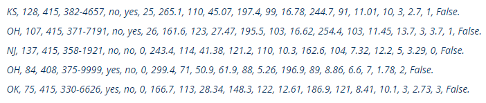
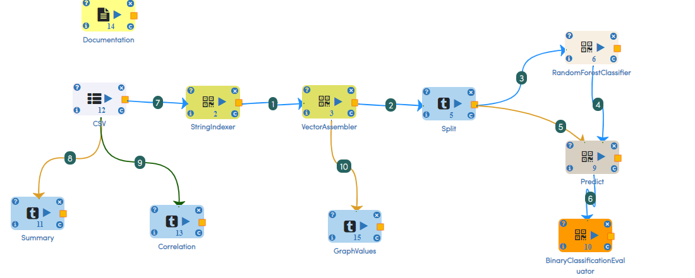
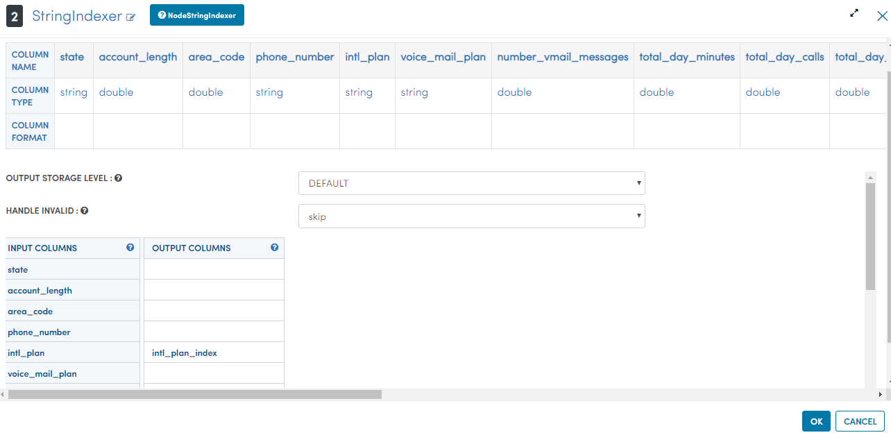
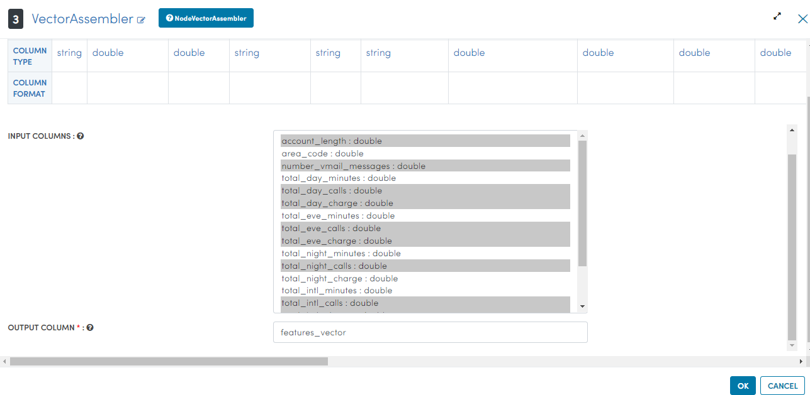
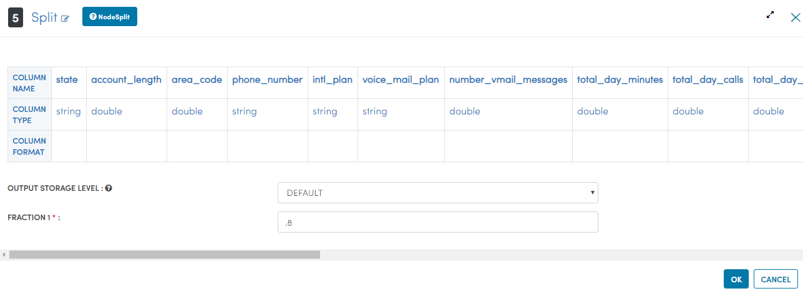
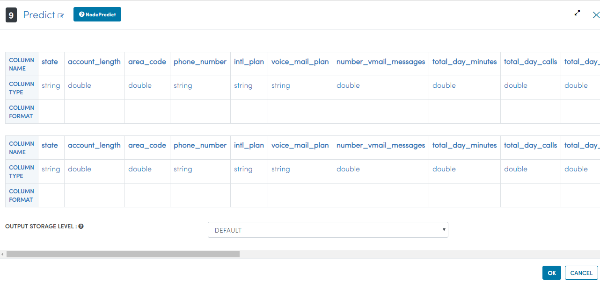
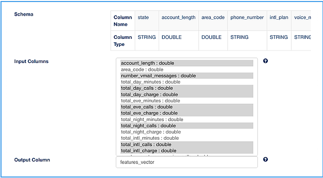
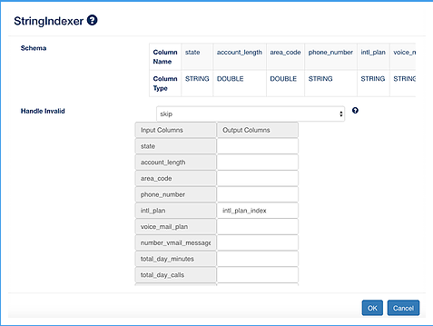
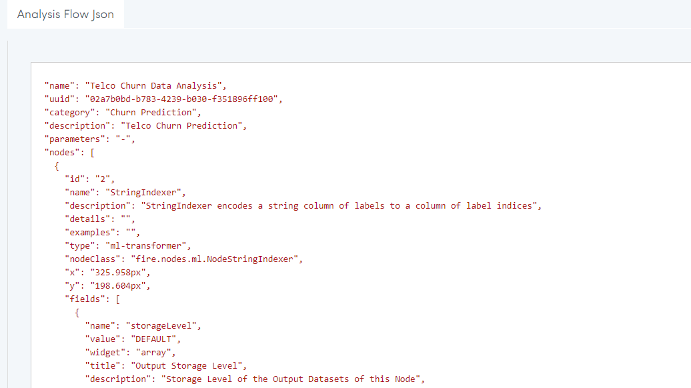

Telco Churn Prediction
======================

Fire Insights enable us to create a Random Forest Model to predict churn and evaluate the results.

The dataset is artificial Churn Data based on claims, similar to real world. It is taken from the following location. 

- https://www.sgi.com/tech/mlc/db/
- https://www.sgi.com/tech/mlc/db/churn.all
- https://www.sgi.com/tech/mlc/db/churn.name

   
   
Below is the workflow you can use for creating the model for Churn Prediction.

   
The workflow performs the following steps:

- Reads in the dataset from a tab separated file
- Applies StringIndexer on the field "intl_plan"
- Applies VectorAssembler on the fields we want to model on
- Splits the dataset into (.8, .2)
- Performs Random Forest Classification
- Performs prediction using the model generated on the remaining 20% dataset
- Finally evaluates the prediction results

   
In the VectorAssembler, select the fields you want to include in the model. Only the numeric fields are displayed as VectorAssembler supports only the numeric fields.

   
You can split the dataset into training and test datasets. We split it into (.8, .2)

   
You can use a RandomForestClassifier for predicting churn. We use 20 trees.

.. figure:: ../../_assets/tutorials/machine-learning/telco-churn-prediction/7.PNG
   :alt: Machine Learning
   :align: left
   :width: 60%
   
You can predict using the model on the test dataset.

   
You can evaluate the quality of our results.

   
Next, You can execute the workflow. 
   
From the evaluator You get the following results:

   
The workflow consists of the below JSON. The workflow can be run interactively from the Fire UI, or it can be easily scheduled with spark-submit with any scheduler.

   
   

