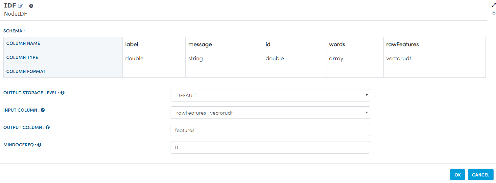

TFIDF
=====

This workflow reads in a dataset. It then Tokenizes and then performs TF/IDF on text content.

Worklow
-------

Below is the workflow. It does the following:

* Reads data from a sample dataset.
* Tokenizes message column.
* Perform TF.
* Perform IDF.
* prints the results.

.. figure:: ../../_assets/tutorials/machine-learning/tfidf/1.PNG
   :alt: TFIDF
   :align: center
   :width: 60%

Reading from Dataset
---------------------

It reads sample Dataset file.

Processor Configuration
^^^^^^^^^^^^^^^^^^

.. figure:: ../../_assets/tutorials/machine-learning/tfidf/2.PNG
   :alt: TFIDF
   :align: center
   :width: 60%
   
Processor Output
^^^^^^

.. figure:: ../../_assets/tutorials/machine-learning/tfidf/2a.PNG
   :alt: TFIDF
   :align: center
   :width: 60%
   
Perform TF
----------

It  performs TF on text column using HashingTF Node.

Processor Configuration
^^^^^^^^^^^^^^^^^^

.. figure:: ../../_assets/tutorials/machine-learning/tfidf/3.PNG
   :alt: TFIDF
   :align: center
   :width: 60%
   
Processor Output
^^^^^^

.. figure:: ../../_assets/tutorials/machine-learning/tfidf/3a.PNG
   :alt: TFIDF
   :align: center
   :width: 60%
   
Perform IDF
-----------

It performs IDF on text column using IDF Node.

Processor Configuration
^^^^^^^^^^^^^^^^^^

.. figure:: ../../_assets/tutorials/machine-learning/tfidf/4.PNG
   :alt: TFIDF
   :align: center
   :width: 60%
   
Processor Output
^^^^^^

.. figure:: ../../_assets/tutorials/machine-learning/tfidf/4a.PNG
   :alt: TFIDF
   :align: center
   :width: 60%
   
prints the results
------------------

It will print the result after performing TF/IDF on text content.

   
Processor Output
^^^^^^

.. figure:: ../../_assets/tutorials/machine-learning/tfidf/5a.PNG
   :alt: TFIDF
   :align: center
   :width: 60%
