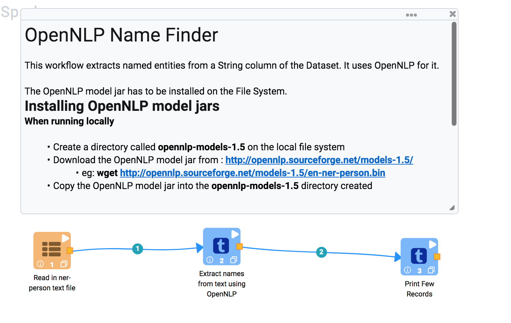
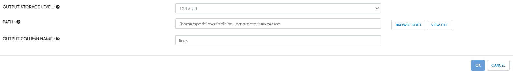
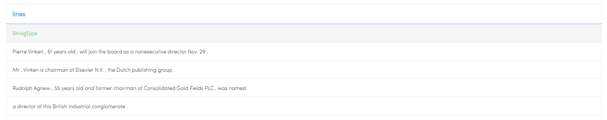
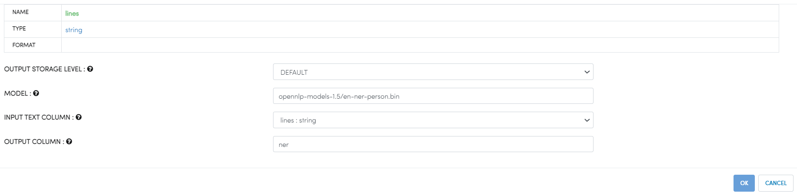

Name Finder
===========

Fire provides NameFinder Processor to easily detect named entities and numbers in text. It takes in a column name in the input DataFrame containing text. It then detects the entities and stores them into a new column.

To be able to detect entities the Name Finder needs a model. The model is dependent on the language and entity type it was trained for.

https://opennlp.apache.org/documentation/1.6.0/manual/opennlp.html#tools.namefind.recognition.cmdline

 
The OpenNLP project offers a number of pre-trained name finder models which are trained on various freely available corpora. They can be downloaded at the OpenNLP download page.

http://opennlp.sourceforge.net/models-1.5/

 
Steps for installing the OpenNLP models in Fire are covered here : http://docs.sparkflows.io/en/latest/operating/installing-opennlp.html

Workflow
--------

Below is a workflow which uses the NameFinder Processor.

   
It consists of 3 Processors:

* TextFiles - It reads in the input text file and creates a row from each line of text.
* OpenNLPNameFinder - It extracts the entities from each line of text.
* PrintNRows - It prints the first 10 rows of the result.

Textfiles
---------

It reads in the input files from the directory data/ner-person. It places each line in the column 'line'.

Processor Configuration
++++++++++++++++++

   
Processor Output
++++++++++++++++

.. figure:: ../../_assets/tutorials/nlp/namefinder/2a.png
   :alt: Workflow
   :align: center
   :width: 60%   
   
OpenNLPNameFinder
-----------------

It extracts entities from the text in the input column 'line' and stores them in the output column 'ner'. When running on the Hadoop Cluster, the model file has to be on HDFS and users have to have access to it.

   
PrintNRows
----------

It prints the first 10 rows from the result.

   

