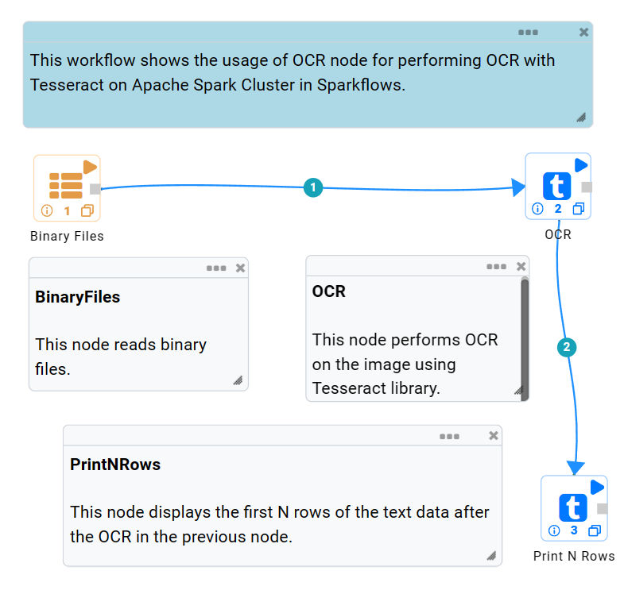
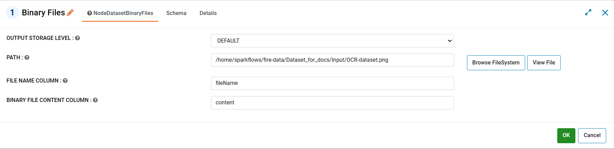
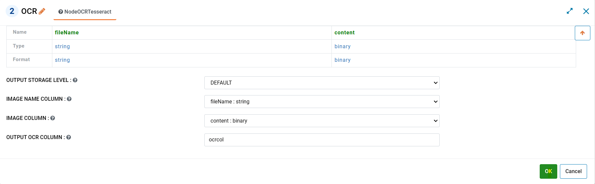
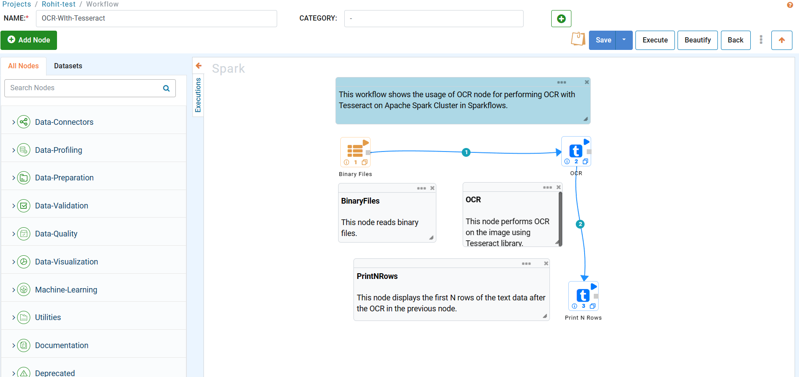
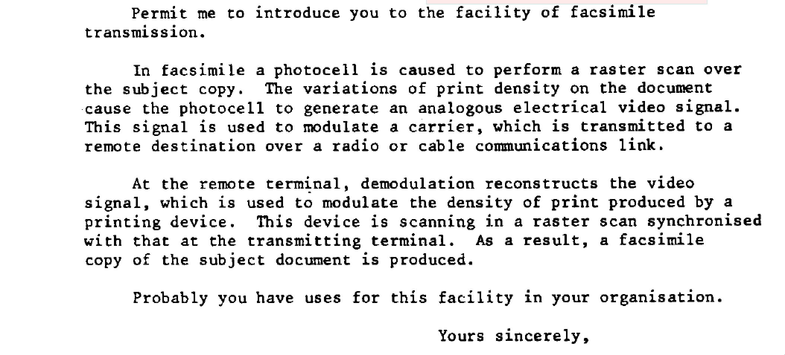

OCR with Tesseract
==================

Sparkflows provides OCR node for performing OCR with Tesseract. The good thing is that Sparkflows runs it in distributed mode on the Apache Spark cluster which allows you to perform OCR on tens to millions of files at a time. 

Prerequisites
+++++++++

Ensure that your machine is equipped with the following before performing OCR:

* Tesseract language data files.
* Rightly configured set up.

For detailed information on the above, visit: https://docs.sparkflows.io/en/latest/operations/installing-tesseract.html?highlight=tesseract

Workflow
++++++++

Below is a workflow which performs OCR using Tesseract library.

 
**BinaryFiles Node:** It reads in the binary file **OCR-dataset.png** from File System. It places the filename into the column 'fileName' and the content of the binary file into the column 'content' of the DataFrame it generates.

**OCR Node:** It performs OCR using Tesseract. It reads in the content of the binary file from the column 'content'. After performing OCR, it places the result into the column 'ocrcol'. Its output DataFrame contains 'fileName' and 'ocrcol'.

**PrintNRows:** It prints the first N rows from the result after the OCR in the previous node.

Steps to perform OCR
+++++++++

Follow the steps given below to perform OCR using the above workflow:

1. Upload File
-----

* Double-click on the Binary File node. A new window will pop up.
* Click on ``Browse FileSystem`` to browse available files.
* Select the file on which OCR is to be performed and click on the ``OK`` button.
* Fill in rest of the parameters as per your preference or similar to the below image.

2. Set Parameters for OCR node
------

* Double-click on the OCR node. A new window will pop up.
* Set all the parameters as per your preference or similar to the below image.
* Click on the ``OK`` button. Refer the below image.

   

3. Execute the workflow
------

* Click on the ``Execute`` button located on the top right side to reach the next page. Refer the below image.

* On reaching the next page click on the ``Execute`` button (as shown below) located at the right hand side to execute the workflow and print the result.

.. figure:: ../../_assets/ocr/OCR-3.png
   :alt: OCR
   :width: 60%

Input and Output
+++++

The input file uploaded (OCR-dataset.png) looks similar to the below image:

The resulting output after executing the workflow looks similar to the below image:

For more details, visit: https://www.sparkflows.io/post/OCR-with-Tesseract-in-Sparkflows

