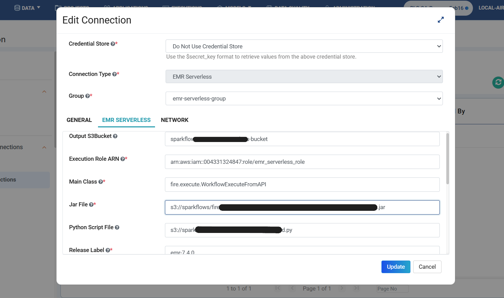
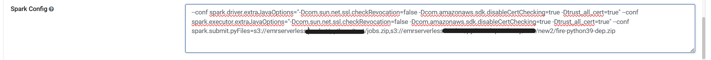
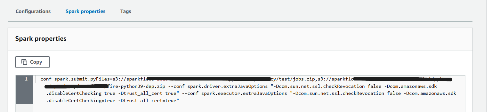
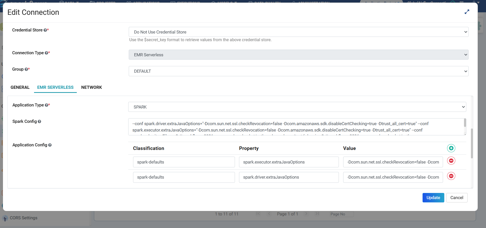
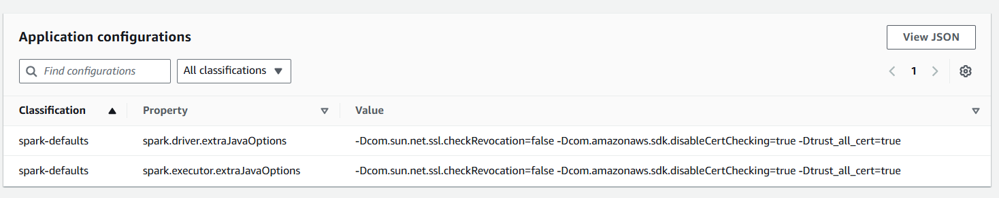
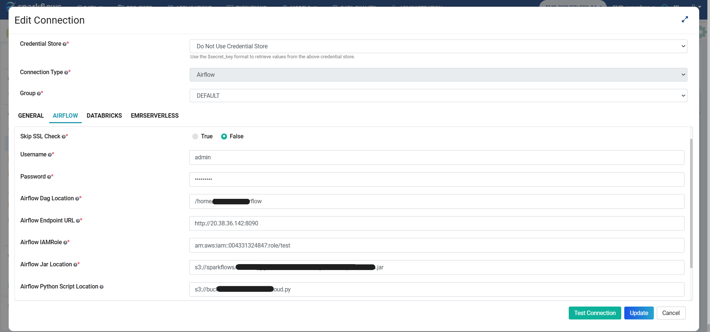
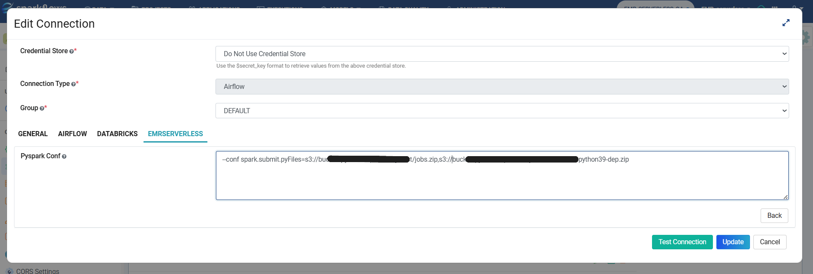

EMRServerless Support in Workflow and Pipeline
==============================================

This document outlines how Sparkflows enables running workflows on EMR Serverless using a configured connection. It also explains how to create EMR Serverless applications and associate workflows as jobs within a pipeline.

Overview
--------

Sparkflows enables running workflows on EMR Serverless through a selected connection. The platform also allows you to create EMR Serverless applications and associate workflows as jobs with either new or existing applications within a pipeline. Additionally, multiple workflows can be linked to the same application in a pipeline and executed sequentially, one after another.

Workflow
--------

**Connection Configuration**
~~~~~~~~~~~~~~~~~~~~~~~~~~~~~~~

In the EMR Serverless connection, add the following configurations:

- **Jar File**: The main JAR file location is required to run Spark/Scala workflows.  
- **Python Script File**: The main Python script file location is required to run PySpark workflows.  

**Spark Configuration**
~~~~~~~~~~~~~~~~~~~~~~~~~

Add the required Spark configurations.

**Example:**

::

   --conf spark.driver.extraJavaOptions="-Dcom.sun.net.ssl.checkRevocation=false -Dcom.amazonaws.sdk.disableCertChecking=true -Dtrust_all_cert=true" \
   --conf spark.executor.extraJavaOptions="-Dcom.sun.net.ssl.checkRevocation=false -Dcom.amazonaws.sdk.disableCertChecking=true -Dtrust_all_cert=true" \
   --conf spark.submit.pyFiles=s3://<your-bucket>/python-dependencies/jobs.zip,s3://<your-bucket>/python-dependencies/dependency.zip

In the above example, ``--conf spark.submit.pyFiles`` is used to pass comma-separated Python package dependencies. 
  
For external JAR dependencies, use ``--conf spark.jars`` with comma-separated JAR paths, for example:

::

   --conf spark.jars=s3://<your-bucket>/jars/dependency1.jar,s3://<your-bucket>/jars/dependency2.jar

**Application Configuration**
~~~~~~~~~~~~~~~~~~~~~~~~~~~~~~

Add the application-level configurations as required.

**Running Workflow**
~~~~~~~~~~~~~~~~~~~~~~~~~

Select the correctly configured connection and submit the workflow. This will create the application and attach the workflow as a job.

**Spark/Scala Workflow**
^^^^^^^^^^^^^^^^^^^^^^^^^

1. Create the workflow and select the connection before execution.  

   .. figure:: ../../../_assets/tutorials/pipeline/scala_wf.png
      :alt: EMR Serverless in Workflow and Pipeline
      :width: 70

2. After submitting the workflow to EMR Serverless.

   .. figure:: ../../../_assets/tutorials/pipeline/scala_wf_exe.png
      :alt: EMR Serverless in Workflow and Pipeline
      :width: 70

**PySpark Workflow**
^^^^^^^^^^^^^^^^^^^^^^^

1. Create the workflow and select the connection before execution.  

   .. figure:: ../../../_assets/tutorials/pipeline/py_wf.png
      :alt: EMR Serverless in Workflow and Pipeline
      :width: 70

2. After submitting the workflow to EMR Serverless.

   .. figure:: ../../../_assets/tutorials/pipeline/py_wf_exe.png
      :alt: EMR Serverless in Workflow and Pipeline
      :width: 70

Pipeline
--------

In the pipeline, you can use the EMR Serverless application created and attach multiple workflows as jobs to the application.

**Connection Configuration**
~~~~~~~~~~~~~~~~~~~~~~~~~~~~~~~~~~~

In the Airflow connection, the configured JAR file path will be used to run the Spark/Scala workflow, and the PySpark configuration tab in EMR Serverless will be used.

**Airflow**
~~~~~~~~~~~~~~~~~~~

The JAR and Python main file paths are defined in the Airflow connection. These details will be used in EMR Serverless workflows within the pipeline.

**EMR Serverless**
~~~~~~~~~~~~~~~~~~~~~~~~

In the EMR Serverless tab, add the additional Spark configurations required for execution. For example, ``--conf spark.submit.pyFiles`` is used to pass comma-separated Python package dependencies. For external JAR dependencies, use ``--conf spark.jars`` with comma-separated JAR paths.

**Pipeline Configuration**
~~~~~~~~~~~~~~~~~~~~~~~~~~~~~~~~

1. Add application configuration by creating an EMR Serverless Application node in the pipeline.

   .. figure:: ../../../_assets/tutorials/create-emrserverless-app-node.png
      :alt: EMR Serverless in Workflow and Pipeline
      :width: 70

2. Attach the EMRServerlessWorkflow pipeline node and select the workflow.

   .. figure:: ../../../_assets/tutorials/pipeline/pipeline_py_wf_node.png
      :alt: EMR Serverless in Workflow and Pipeline
      :width: 70

   .. figure:: ../../../_assets/tutorials/pipeline/pipeline_py.png
      :alt: EMR Serverless in Workflow and Pipeline
      :width: 70

   .. figure:: ../../../_assets/tutorials/pipeline/pipeline_py_wf_execut.png
      :alt: EMR Serverless in Workflow and Pipeline
      :width: 70

