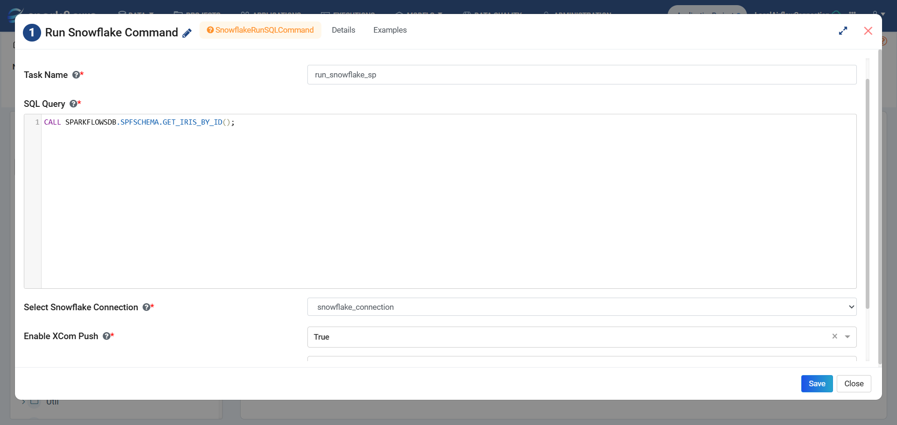
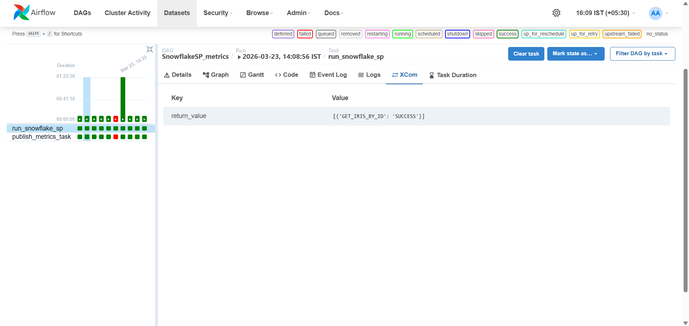
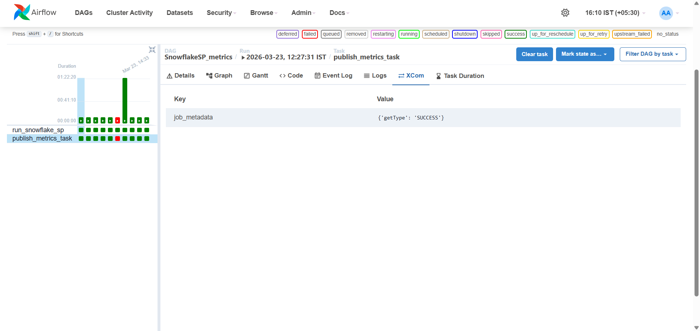
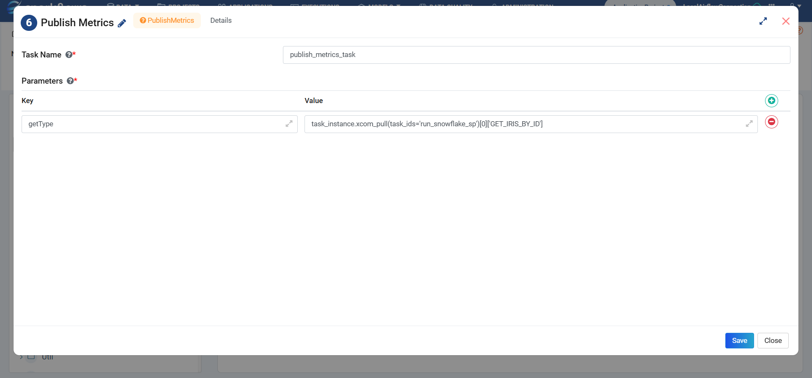
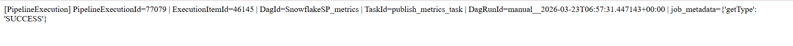

Pipeline Publish Metrics
========================

This document outlines a detailed guide on configuring a pipeline to execute a Snowflake command, capture its output using XCom, and publish the results as metrics within the pipeline.

Overview
--------

This example provides a detailed guide on configuring a pipeline to execute a Snowflake command, capture its output using XCom, and publish the results as metrics within the pipeline.

Follow the steps below:

Step 1: Configure Snowflake Command Node
----------------------------------------

Add a node named **"Run Snowflake Command"** to the pipeline. This node is responsible for executing SQL queries or stored procedures in Snowflake.

**Configuration Details:**

- Ensure proper Snowflake connection credentials are configured  
- Provide the SQL query or command to execute  
- Enable **"XCom Push"** to store the output for downstream tasks  

**Purpose of XCom Push:**

XCom (Cross Communication) allows tasks to exchange data. By enabling XCom Push, the output of the Snowflake command becomes available to subsequent nodes in the workflow.

**Expected Output:**

The Snowflake execution result (such as row count, status, or computed values) will be stored in XCom.

Step 2: Publish Metrics Node
----------------------------

Add a node named **"Publish Metrics."** This node retrieves the output from XCom and publishes it to a monitoring or logging system.

**Configuration Details:**

- Configure the node to pull data from XCom  
- Reference the previous task (Snowflake command node)  
- Map the retrieved values to metric fields  

**Purpose:**

This step ensures that important execution results are tracked as metrics, enabling better visibility into pipeline performance and outcomes.

**Expected Output:**

The processed metrics will be published in logs by default. Optionally, users can retrieve them via API.

**Endpoint:**

::

   {hosturl}/api/v1/pipelineExecution/{pipelineExecutionId}/metrics

Sample Log
----------

