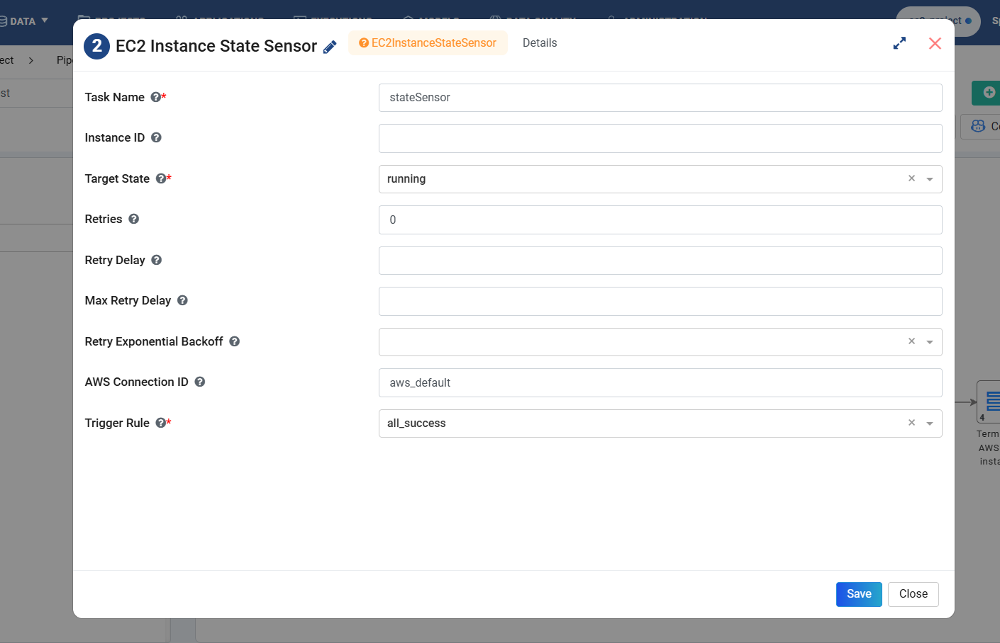
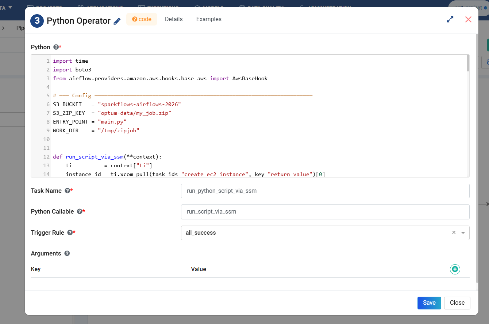
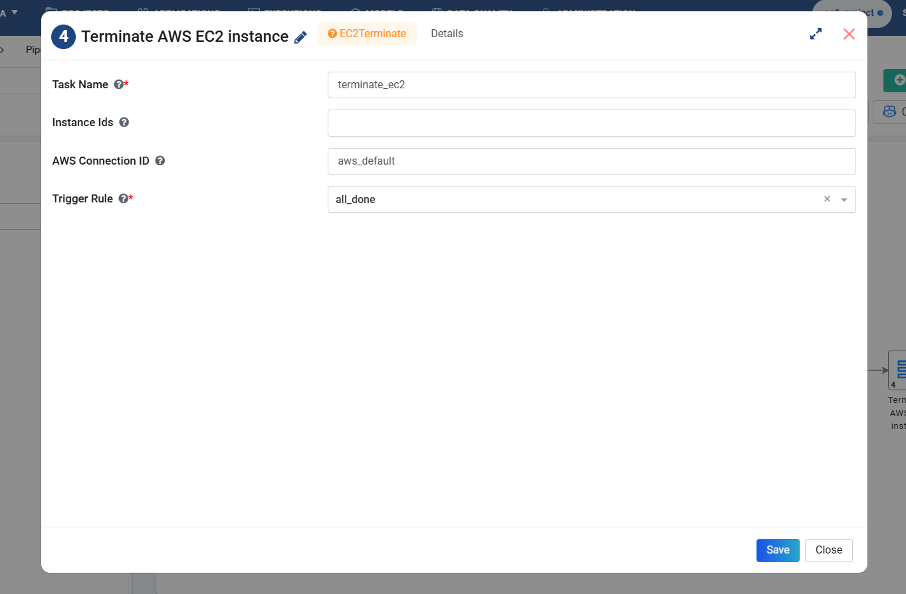

Run Python / JAR Applications on EC2 using Airflow and SSM
=============================================================

This tutorial outlines how to run Python scripts, Python packages, and JAR files on an Amazon EC2 instance using Apache Airflow and AWS Systems Manager (SSM), without requiring direct SSH access.

Architecture
----------------------

.. code-block::

  Airflow Worker
  │
  ├── EC2CreateInstanceOperator  → Creates EC2 instance
  ├── EC2InstanceStateSensor     → Waits for EC2 to be running
  ├── PythonOperator             → Uploads/runs script via SSM
  └── EC2TerminateInstanceOperator → Terminates EC2 (always)

Step 1: Create an EC2 Instance
--------------------------------
#. In the General and Configuration tabs, specify the required AWS settings, such as the AMI, subnet, security group, and instance type.
#. In the Advanced tab, add the bootstrap commands to the UserData field.

   The following example installs Java, Python, and the required Python packages during EC2 instance initialization.

   .. figure:: ../../../_assets/tutorials/pipeline/create-ec2-instance.png
      :alt: Pipeline execution on EC2 using Airflow
      :width: 70%

   .. code-block::

      #!/bin/bash

        set -e
        yum update -y
        yum install -y java-17-amazon-corretto-headless python3 python3-pip unzip
    
        # ── Find actual Java 17 path dynamically ──────────────────────────────
        JAVA_BIN=$(find /usr/lib/jvm -name "java" -type f | grep "17\|corretto-17" | head -1)
        echo "Found Java: $JAVA_BIN"
        JAVA_HOME_DIR=$(dirname $(dirname $JAVA_BIN))
        echo "JAVA_HOME=$JAVA_HOME_DIR"
    
        # ── Set as default ─────────────────────────────────────────────────────
        alternatives --set java $JAVA_BIN || true
        echo "JAVA_HOME=$JAVA_HOME_DIR" >> /etc/environment
        echo "PATH=$JAVA_HOME_DIR/bin:$PATH" >> /etc/environment
        export JAVA_HOME=$JAVA_HOME_DIR
        export PATH=$JAVA_HOME/bin:$PATH
    
        # ── Confirm Java 17 ────────────────────────────────────────────────────
        java -version
    
        # ── Install Python packages ────────────────────────────────────────────
        pip3 install pyspark boto3 pandas -q
    
        # ── Signal UserData complete ───────────────────────────────────────────
        touch /tmp/userdata_done
        echo "UserData complete"

Step 2: Wait for the EC2 Instance to Start
------------------------------------------------

Wait for the EC2 instance to reach the Running state before proceeding to the next task.

Step 3: Upload and Run Application via SSM (PythonOperator)
---------------------------------------------------
Use a Python Operator to execute a Python script or Java application on the EC2 instance through AWS Systems Manager (SSM).

The following Python Operator example executes a Python script or JAR application on the EC2 instance. 

The script includes polling logic and waits for the execution to complete before proceeding.

.. code-block::

    import time
    import boto3
    from airflow.providers.amazon.aws.hooks.base_aws import AwsBaseHook
    
    # ─── Config ────────────────────────────────────────────────────────────────────
    S3_BUCKET   = "sparkflows-airflows-2026"
    S3_ZIP_KEY  = "optum-data/my_job.zip"
    ENTRY_POINT = "main.py"
    WORK_DIR    = "/tmp/zipjob"
    
    
    def run_script_via_ssm(**context):
        ti          = context["ti"]
        instance_id = ti.xcom_pull(task_ids="create_ec2_instance", key="return_value")[0]
    
        # ── Generate presigned URL on Airflow (no EC2 role needed) ────────────────
        s3  = boto3.client("s3", region_name="us-east-1")
        url = s3.generate_presigned_url(
            "get_object",
            Params={"Bucket": S3_BUCKET, "Key": S3_ZIP_KEY},
            ExpiresIn=3600,
        )
        print("Presigned URL generated")
    
        ssm = AwsBaseHook(aws_conn_id="aws_default", client_type="ssm").get_conn()
    
        # ── Wait for SSM agent ─────────────────────────────────────────────────────
        print(f"Waiting for SSM agent on {instance_id}...")
        for attempt in range(30):
            time.sleep(20)
            try:
                resp = ssm.describe_instance_information(
                    Filters=[{"Key": "InstanceIds", "Values": [instance_id]}]
                )
                info = resp.get("InstanceInformationList", [])
                if info and info[0].get("PingStatus") == "Online":
                    print(f"SSM agent Online ")
                    break
                print(f"Attempt {attempt+1}: SSM not ready yet...")
            except Exception as e:
                print(f"Attempt {attempt+1}: error: {e}, retrying...")
        else:
            raise Exception(f"SSM agent never came online for {instance_id}")
    
        # ── Send command ───────────────────────────────────────────────────────────
        response = ssm.send_command(
            InstanceIds=[instance_id],
            DocumentName="AWS-RunShellScript",
            Parameters={
                "commands": [
                    # ── Wait for UserData to finish ────────────────────────────────────────
                    "for i in $(seq 1 60); do [ -f /tmp/userdata_done ] && break; echo \"Waiting... $i\"; sleep 10; done",
                    "[ -f /tmp/userdata_done ] && echo 'UserData done ' || echo 'Timed out, continuing...'",
    
                    f"mkdir -p {WORK_DIR}",
    
                    f'curl -fsSL -o {WORK_DIR}/my_job.zip "{url}" && echo "DOWNLOAD OK" || {{ echo "DOWNLOAD FAILED"; exit 1; }}',
                    f"cd {WORK_DIR} && unzip -o my_job.zip -d job/",
    
                    # ── Run using dynamic Java path (same logic as UserData) ──────────────
                    f"""bash -c '
                        JAVA_BIN=$(find /usr/lib/jvm -name "java" -type f | grep "17\|corretto-17" | head -1)
                        export JAVA_HOME=$(dirname $(dirname $JAVA_BIN))
                        export PATH=$JAVA_HOME/bin:$PATH
                        echo "Using JAVA_HOME=$JAVA_HOME"
                        java -version
                        cd {WORK_DIR}/job/my_job
                        python3 {ENTRY_POINT}
                    '"""
                ]
            },
        )
        command_id = response["Command"]["CommandId"]
    
        # ── Poll until done ────────────────────────────────────────────────────────
        print(f"Command sent: {command_id}, waiting for result...")
        for _ in range(40):
            time.sleep(15)
            try:
                result = ssm.get_command_invocation(
                    CommandId=command_id,
                    InstanceId=instance_id,
                )
            except ssm.exceptions.InvocationDoesNotExist:
                print("Invocation not registered yet, retrying...")
                continue
    
            status = result["Status"]
            print(f"Status: {status}")
            if status in ("Success", "Failed", "Cancelled", "TimedOut"):
                break
    
        # ── Print output ───────────────────────────────────────────────────────────
        print("=== STDOUT ===")
        print(result["StandardOutputContent"])
        print("=== STDERR ===")
        print(result["StandardErrorContent"])
    
        if result["Status"] != "Success":
            raise Exception(f"SSM command failed: {result['StandardErrorContent']}")
    
        return result["StandardOutputContent"]

Step 4: Terminate the EC2 Instance
------------------------------------

Terminate the EC2 instance after the application execution completes.

Application Package Structure
----------------------------------

**Expected ZIP Structure:**

.. code-block::

    my_job.zip
    ├── my_job/
    │   ├── main.py           ← ENTRY_POINT
    │   ├── utils.py          ← helper functions

Sample Application
-------------------
Example applications used in this tutorial:

**main.py**

.. code-block::

    from pyspark.sql import SparkSession
    from utils import add_numbers, multiply_numbers, format_message
    
    def main():
        spark = SparkSession.builder \
            .appName("ZipFileExample") \
            .getOrCreate()
    
        data = [(1, "Alice", 10, 5),
                (2, "Bob",   20, 4),
                (3, "Carol", 30, 3),
                (4, "Dave",  40, 2)]
    
        df = spark.createDataFrame(data, ["id", "name", "val1", "val2"])
        df.show()
    
        for row in df.collect():
            added      = add_numbers(row.val1, row.val2)
            multiplied = multiply_numbers(row.val1, row.val2)
            msg        = format_message(row.name, added)
            print(msg)
            print(f"  add={added}, multiply={multiplied}")
    
        spark.stop()
    
    if __name__ == "__main__":
        main()
    
**utils.py**

.. code-block::

    def add_numbers(a, b):
        return a + b
    
    def multiply_numbers(a, b):
        return a * b
    
    def format_message(name, value):
        return f"{name} result: {value}"
    

Pipeline Execution Flow
-------------------------------

The following flow illustrates the execution process:

.. code-block::

    Airflow triggers DAG
    │
    ├── EC2CreateInstanceOperator
    │   └── EC2 boots → UserData runs:
    │       ├── yum install java-17, python3, unzip
    │       ├── pip3 install pyspark boto3 pandas
    │       └── touch /tmp/userdata_done ✅
    │
    ├── EC2InstanceStateSensor
    │   └── Waits until EC2 state = "running"
    │
    ├── PythonOperator
    │   ├── Generate presigned URL (Airflow worker)
    │   ├── Wait for SSM agent Online (30 x 20s)
    │   ├── Send SSM command to EC2:
    │   │   ├── Wait for /tmp/userdata_done (60 x 10s)
    │   │   ├── curl download ZIP
    │   │   ├── unzip → job/my_job/
    │   │   ├── pip3 install requirements.txt
    │   │   └── bash -c 'JAVA_HOME=... python3 main.py'
    │   └── Poll result (80 x 15s) → print STDOUT/STDERR
    │
    └── EC2TerminateInstanceOperator (ALL_DONE — always runs)

